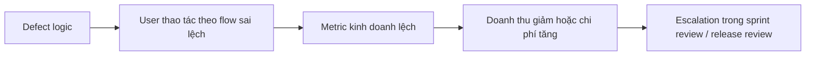

# Test Pass, Tiền Vẫn Bay

> ai-testing,business-analytics,defect-leakage,project-manager,qa-metrics,roi,testcase

## Vì sao test pass vẫn có thể làm doanh nghiệp mất tiền?

Cuối sprint, cảnh quen thuộc là:

- Dashboard test xanh lè
- Test case pass gần hết
- Release đúng lịch

Nhưng rồi sau đó:

- Conversion tụt
- Refund tăng
- Support ticket bùng lên
- Sếp hỏi: **“Vì sao test pass mà tiền vẫn bay?”**

Vấn đề nằm ở chỗ: **pass trong test chưa chắc pass ngoài đời thực**.

### 3 lớp rất dễ bị nhầm với nhau

- **Test execution pass**
  - Tester chạy test theo spec, expected result khớp
  - Nghĩa là: “hệ thống làm đúng cái đã được mô tả”

- **Business outcome fail**
  - Hệ thống vẫn chạy, không lỗi đỏ màn hình
  - Nhưng KPI kinh doanh bị ảnh hưởng: doanh thu, lợi nhuận, conversion, refund

- **Decision-making fail**
  - Report nhìn đẹp, số có vẻ hợp lý
  - Nhưng số sai bản chất, làm PM/PO/CEO ra quyết định sai

> Lỗi nguy hiểm nhất thường không phải lỗi app sập.  
> Nguy hiểm nhất là **logic vẫn chạy bình thường nhưng làm sai chỉ số kinh doanh**.

### Bảng so sánh: “Pass trong test” vs “Mất tiền ngoài thực tế”

| Pass trong test | Mất tiền ngoài thực tế |
|---|---|
| Form đăng ký submit thành công | Tracking sai nguồn traffic, team đổ tiền quảng cáo vào kênh kém hiệu quả |
| Giá hiển thị đúng format | Công thức discount sai, biên lợi nhuận giảm âm thầm |
| Report load nhanh, không crash | Aggregation sai, sếp nhìn báo cáo đẹp nhưng quyết định sai |
| Checkout hoàn tất đơn hàng | Phí ship/fí nền tảng tính thiếu, mỗi đơn lỗ một ít nhưng cộng lại rất lớn |
| Popup khuyến mãi hiển thị đúng | Incentive đặt sai nhóm user, tặng nhầm người không cần tặng |
| AI trả kết quả nhanh | Nội dung hợp lý bề ngoài nhưng sai business rule, kéo theo rework và support cost |

### Mini-case: report đẹp nhưng quyết định sai

Một lỗi rất “êm” nhưng cực đắt:

- Team cần tính **margin % toàn danh mục**
- Logic đúng phải là **weighted average**
- Nhưng hệ thống lại lấy **simple average**

Kết quả:

- Report vẫn có số
- Dashboard vẫn lên biểu đồ đẹp
- Không ai thấy “đỏ màn hình”
- Nhưng sếp tin rằng nhóm sản phẩm A đang lời tốt hơn thực tế

Hậu quả:

- Đẩy ngân sách vào sai nhóm
- Giữ giá bán sai
- Đánh giá sai hiệu quả campaign
- Cuối cùng: **mất tiền không phải vì app hỏng, mà vì quyết định dựa trên dữ liệu sai**

### Tóm ngắn một câu

- **Test pass** = đúng với kịch bản đã kiểm
- **Kinh doanh pass** = đúng với mục tiêu tiền bạc ngoài thực tế

Hai thứ này **không phải lúc nào cũng trùng nhau**.

<multiple-choice correct="C" select="single">
Điều nào nguy hiểm hơn trong thực tế kinh doanh?
- A: App lỗi giao diện nhỏ nhưng KPI không đổi
- B: Một test case bị fail nhưng chưa ảnh hưởng user thật
- C: Logic chạy bình thường nhưng làm sai doanh thu/lợi nhuận
- D: Màu nút CTA hiển thị lệch 2px
</multiple-choice>

---

## 3 metric khiến sếp hiểu ngay nên fix gì trước

Khi nói chuyện với sếp, đừng dừng ở:

- Có bao nhiêu bug
- Severity là High hay Medium
- Bao nhiêu test case fail

Thứ sếp cần là:

- **Lỗi này ảnh hưởng bao nhiêu người?**
- **Làm lệch KPI nào?**
- **Ước tính mất bao nhiêu tiền nếu chưa fix?**

### 3 nhóm metric cốt lõi

1. **ROI impact**
   - Lỗi này đang làm mất doanh thu hay tăng chi phí bao nhiêu?

2. **Defect leakage**
   - Lỗi này vì sao lọt ra production?

3. **User behavior impact**
   - User có đổi hành vi sau khi lỗi xuất hiện không?

### Bảng công thức đơn giản để nói chuyện với sếp

| Metric | Tính thế nào | Nói gì với sếp | Khi nào dễ gây hiểu nhầm |
|---|---|---|---|
| ROI impact | `Số user bị ảnh hưởng x giá trị tiền/1 user x thời gian ảnh hưởng` | “Nếu để thêm 7 ngày, lỗi này có thể làm mất khoảng X” | Ước lượng quá cảm tính, không có baseline |
| Defect leakage | `Số defect lọt production / tổng số defect đã phát hiện` | “Đây là lỗi lọt qua test và đang chạm user thật” | Chỉ nhìn % mà không nhìn mức độ thiệt hại |
| User behavior impact | So sánh trước/sau lỗi: conversion, refund, drop-off, ticket | “Sau khi lỗi xuất hiện, conversion giảm Y%” | Nhầm tương quan với nguyên nhân nếu không đối chiếu thời điểm |

### Ví dụ thật dễ hình dung

#### 1) ROI impact

Ví dụ lỗi pricing:

- 3.000 user nhìn thấy giá sai
- 8% trong số đó đi tới checkout
- Mỗi đơn trung bình hụt 20.000đ lợi nhuận
- Trong 3 ngày chưa fix

Ước tính nhanh:

- 3.000 x 8% = 240 đơn bị ảnh hưởng
- 240 x 20.000đ = **4.800.000đ lợi nhuận hụt**

Nói với sếp kiểu này sẽ rõ hơn nhiều so với câu:
- “Bug pricing severity high”

#### 2) Defect leakage

Dữ liệu đã xác minh:

- **Defect leakage ở production thường dưới 5% nếu QA làm tốt**
- Automation có thể giúp giảm tỷ lệ này

Ý nghĩa thực tế:

- Nếu leakage tăng, không chỉ là “lọt bug”
- Mà là **lọt chi phí sửa sau release**, support cost, mất niềm tin user

#### 3) User behavior impact

Dữ liệu đã xác minh:

- Khi lỗi xuất hiện, **conversion có thể giảm 20–30%**

Ví dụ:

- Trước lỗi: conversion 4.5%
- Sau lỗi: còn 3.3%
- Nếu traffic giữ nguyên, phần chênh này chính là tiền bị mất

### Nên ghép thêm các chỉ số phụ nào?

Để báo cáo sát thực tế hơn, nên đi kèm:

- **Conversion drop**
- **Refund rate**
- **Support ticket spike**
- **Rework cost**
- **Time-to-detect**
- **Time-to-fix**
- **Số user exposure**
- **Số đơn hàng/phiên bị ảnh hưởng**

> **Cảnh báo:** Bug count cao chưa chắc đáng sợ bằng **1 lỗi âm thầm làm lệch quyết định kinh doanh**.

### Một cách ưu tiên fix rất đời thường

Đừng hỏi:
- “Bug nào nặng hơn về kỹ thuật?”

Hãy hỏi:
- “Bug nào đang chạm nhiều user hơn?”
- “Bug nào làm lệch KPI tiền bạc?”
- “Bug nào để lâu thì chi phí phình ra nhanh nhất?”

### Bảng ưu tiên theo góc nhìn ROI

| Tình huống | Nên ưu tiên |
|---|---|
| Bug ít gặp nhưng làm sai giá tiền | Rất cao |
| Bug không crash nhưng làm report sai | Rất cao |
| Bug UI dễ thấy nhưng không ảnh hưởng hành vi mua | Trung bình |
| Bug wording nhỏ, ít user gặp | Thấp |
| Bug làm support team phải xử lý tay liên tục | Cao |

---

## Từ test metrics sang ngôn ngữ ROI: cách kể chuyện bằng số

Một báo cáo cuối sprint tốt không cần dài. Chỉ cần **1 trang mà đọc vào là biết nên fix gì trước**.

### Cấu trúc 1 trang nên có

- **Vấn đề**
  - Lỗi gì? nằm ở đâu?

- **Tín hiệu**
  - KPI nào bắt đầu lệch?
  - Có ticket, refund, drop conversion không?

- **Tác động tiền**
  - Ước tính mất doanh thu / tăng chi phí bao nhiêu?

- **Lý do ưu tiên fix**
  - Nhiều user bị ảnh hưởng?
  - Chạm business rule cốt lõi?
  - Đang làm sai quyết định?

- **Đề xuất hành động**
  - Fix ngay
  - Tạm chặn rollout
  - Bổ sung tracking
  - Review lại rule với BA/PO/Data

### Công thức kể chuyện rất dễ nhớ

**Defect x Exposure x User behavior = Business risk**

Trong đó:

- **Defect**: lỗi gì, sai ở đâu
- **Exposure**: bao nhiêu user/phiên/đơn hàng chạm lỗi
- **User behavior**: user bỏ đi, mua ít hơn, refund nhiều hơn, ticket tăng

### Flow từ lỗi đến tiền mất

### Mẫu câu tester nên nói với PM/PO

Thay vì nói:

- “Test case pass theo spec”
- “Em chưa thấy fail case”

Hãy nói:

- **“Test case pass theo spec, nhưng fail theo mục tiêu lợi nhuận vì công thức đang làm hụt margin ở nhóm đơn giá cao.”**
- **“Flow không lỗi kỹ thuật, nhưng đang đẩy user vào hành vi rời bỏ ở bước thanh toán.”**
- **“Report hiển thị đúng màn hình, nhưng số tổng hợp sai nên có rủi ro ra quyết định sai.”**
- **“Bug này chưa làm app sập, nhưng đang làm KPI đỏ âm thầm.”**

### So sánh 2 kiểu báo cáo

| Kiểu báo cáo | Ví dụ | Sếp nghe xong cảm nhận gì? |
|---|---|---|
| Báo cáo kỹ thuật thuần túy | “Có 2 bug high, 5 bug medium” | Biết có lỗi, nhưng chưa biết nên ưu tiên gì |
| Báo cáo gắn tác động kinh doanh | “Lỗi pricing đang ảnh hưởng 12% checkout traffic, ước tính hụt 5–7 triệu/3 ngày” | Biết ngay vì sao phải fix trước |

### Mẫu bảng báo cáo ngắn cuối sprint

| Vấn đề | Exposure | KPI ảnh hưởng | Ước tính tiền | Đề xuất |
|---|---|---|---|---|
| Sai logic discount ở checkout | 12% user vào checkout | Conversion, margin | Hụt ~5–7 triệu/3 ngày | Fix ngay trước release |
| Report margin tính sai average | Toàn bộ dashboard quản trị | Quyết định pricing | Rủi ro quyết định sai ngân sách | Review BA/PO/Data ngay |
| Popup incentive sai nhóm user | 25% traffic campaign | Cost per acquisition | Tăng chi phí khuyến mãi | Tạm dừng incentive rule |

<multiple-choice correct="A" select="single">
Câu nào nói đúng “ngôn ngữ ROI” hơn?
- A: Bug này không làm app sập, nhưng đang làm hụt lợi nhuận trên nhóm đơn hàng giá trị cao
- B: Bug này em đánh severity medium-high
- C: Em đã retest và thấy UI ổn
- D: Hệ thống vẫn response 200
</multiple-choice>

---

## Cách bắt lỗi “không đỏ màn hình nhưng đỏ KPI” sớm hơn

Những lỗi kiểu này thường lọt không phải vì tester lười, mà vì team **chỉ nhìn expected result tĩnh** mà chưa nhìn sâu vào logic kinh doanh.

### Checklist review sớm cùng BA/PO/Data

Trước khi ký pass cho flow liên quan tiền, nên rà lại 5 nhóm sau:

- **Business rule**
  - Rule này phục vụ mục tiêu gì?
  - Có ngoại lệ nào theo nhóm khách hàng, sản phẩm, thời điểm không?

- **Measure type**
  - Đang tính tổng, trung bình, weighted average hay median?
  - Mỗi loại cho ra ý nghĩa khác nhau

- **Edge case tài chính**
  - Làm tròn số thế nào?
  - Thuế, phí, voucher, cashback cộng/trừ theo thứ tự nào?

- **Aggregation logic**
  - Báo cáo đang cộng theo đơn, theo item, theo user hay theo phiên?
  - Có bị đếm trùng không?

- **Fallback behavior**
  - Nếu thiếu dữ liệu thì hệ thống mặc định gì?
  - Default đó có làm KPI đẹp giả không?

### Bảng phân loại lỗi dễ lọt

| Dạng lỗi | Bề ngoài | Bên trong |
|---|---|---|
| UI đúng nhưng số sai | Màn hình đẹp, không crash | Công thức tính sai |
| Flow đúng nhưng incentive sai | User vẫn đi hết flow | Tặng sai người, sai chi phí |
| Report đẹp nhưng aggregation sai | Dashboard xanh | Quyết định kinh doanh lệch |
| AI output nhanh nhưng logic sai | Nhìn có vẻ hợp lý | Sai rule nghiệp vụ, tăng rework |

### Vì sao domain knowledge quan trọng hơn tốc độ AI?

AI có thể:

- sinh test nhanh
- tóm tắt tài liệu nhanh
- gợi ý case nhanh

Nhưng với lỗi business logic, thứ cứu team không phải tốc độ, mà là **hiểu bản chất nghiệp vụ**.

Ví dụ:

- **Simple average**: lấy trung bình đều giữa các nhóm
- **Weighted average**: nhóm nào doanh thu lớn thì trọng số lớn hơn

Nếu không hiểu domain:

- bạn vẫn có thể viết test
- vẫn có thể thấy “số ra rồi”
- nhưng không biết số đó **đúng kiểu tính chưa**

> AI giúp tăng tốc thao tác.  
> Nhưng người tester có giá trị ở chỗ biết hỏi: **“Con số này có phản ánh đúng thực tế kinh doanh không?”**

### Nên thêm gì ngoài expected result tĩnh?

Để bắt lỗi sớm hơn, nên bổ sung:

- **Behavior-based test**
  - Nếu rule này sai, user sẽ phản ứng thế nào?

- **Analytics-based oracle**
  - Ngoài expected trên màn hình, có metric nào cần đối chiếu không?

- **Cross-check với dữ liệu thật**
  - So với baseline lịch sử, số hiện tại có bất thường không?

- **Review cùng BA/PO/Data**
  - Đặc biệt với pricing, report, incentive, commission, wallet

### 5 câu hỏi phải hỏi trước khi ký pass cho bug liên quan tiền

1. **Nếu logic này sai, KPI nào sẽ đỏ đầu tiên?**
2. **Lỗi này ảnh hưởng bao nhiêu user/đơn hàng trước khi bị phát hiện?**
3. **Con số đang hiển thị là đúng công thức hay chỉ đúng format?**
4. **Có case nào “vẫn chạy được” nhưng làm sai lợi nhuận, chi phí hoặc báo cáo không?**
5. **Nếu sếp dùng số này để ra quyết định ngày mai, team có dám chịu trách nhiệm không?**

### Ví dụ testcase cho lỗi “không đỏ màn hình nhưng đỏ KPI”

<table-testcase cols="4" rows="4" headers="ID|Mô tả|Input|Expected">
| 1 | Tính margin theo weighted average | Nhóm A doanh thu 90 triệu, margin 10%; nhóm B doanh thu 10 triệu, margin 50% | Margin tổng phản ánh theo trọng số doanh thu, không lấy trung bình cộng đơn giản |
| 2 | Tính discount khi có nhiều loại voucher | Voucher % + voucher fixed + phí nền tảng | Thứ tự áp dụng đúng rule nghiệp vụ, không âm lợi nhuận |
| 3 | Report doanh thu theo item và order | 1 đơn có nhiều item | Không đếm trùng doanh thu khi aggregate |
| 4 | Fallback khi thiếu dữ liệu cost | Thiếu giá vốn ở một số item | Hệ thống cảnh báo hoặc loại khỏi tính toán theo rule đã thống nhất |
</table-testcase>

---

## Mẫu slide cuối sprint: nói sao để sếp chốt ưu tiên fix ngay

Đây là format rất thực dụng. Chỉ cần 5 cột.

### Bảng 5 cột để chốt ưu tiên

| Defect | User exposure | KPI affected | Estimated money impact | Priority |
|---|---|---|---|---|
| Sai logic pricing ở checkout | ~12% traffic checkout | Conversion, margin | Hụt 5–7 triệu/3 ngày | P1 |
| Report margin dùng simple average | 100% user quản trị xem dashboard | Pricing decision, budget allocation | Rủi ro quyết định sai lớn | P1 |
| Incentive áp sai nhóm user | ~25% campaign users | Promotion cost | Tăng cost acquisition | P1 |
| Tooltip hiển thị sai wording | Một nhóm nhỏ user | Không đáng kể | Thấp | P3 |

### Before – After: cách nói tạo khác biệt

#### Cách tester thường báo
- Bug này severity high
- Đã pass theo spec
- Có thể xem xét fix sprint sau

#### Cách nói theo ngôn ngữ business
- Bug này chưa đỏ màn hình nhưng đang làm sai margin ở nhóm đơn hàng giá trị cao
- Exposure hiện tại khoảng 12% checkout traffic
- Nếu để qua sprint sau, ước tính hụt thêm X triệu
- Đề xuất ưu tiên P1 trước các bug UI không chạm KPI

### Một mẫu nói ngắn gọn trong sprint review

- **Vấn đề:** Logic pricing pass theo màn hình nhưng sai theo rule lợi nhuận
- **Tín hiệu:** Conversion giảm, support hỏi nhiều hơn ở bước checkout
- **Tác động:** Ước tính hụt 5–7 triệu trong 3 ngày nếu chưa fix
- **Đề xuất:** Fix trước release, bổ sung monitor KPI sau deploy

### Điều giá trị nhất của tester thời AI

Tester bây giờ không chỉ là người:

- chạy test
- check expected result
- log bug

Mà là người:

- nối chất lượng với hành vi người dùng
- nối hành vi người dùng với KPI
- nối KPI với quyết định kinh doanh

Nói đơn giản:

- **AI giúp làm nhanh hơn**
- **Tester giỏi giúp doanh nghiệp quyết định đúng hơn**

> Đừng chỉ nói: **“Bug này nghiêm trọng.”**  
> Hãy nói: **“Bug này đang làm mất bao nhiêu tiền, ảnh hưởng ai, và vì sao chưa bị nhìn thấy.”**

---

## Kết bài

Có 3 ý cần nhớ:

- **Test pass không đồng nghĩa business pass**
- Lỗi nguy hiểm nhất thường là lỗi **không làm app sập nhưng làm KPI đỏ**
- Muốn sếp chốt ưu tiên fix nhanh, tester phải biết nói bằng **ROI, exposure và user behavior**

Nếu bạn sắp vào buổi review cuối sprint, hãy thử đổi cách báo cáo từ **“bao nhiêu bug”** sang **“bug nào đang làm mất tiền và vì sao”**.

Nếu bạn đang làm các flow liên quan pricing, report, incentive hay dashboard, hãy thêm checklist business logic và ước tính money impact trước khi ký pass.

Còn bạn, trong các bug từng gặp, bug nào là kiểu **“màn hình không đỏ nhưng KPI đỏ”** làm team đau nhất?
