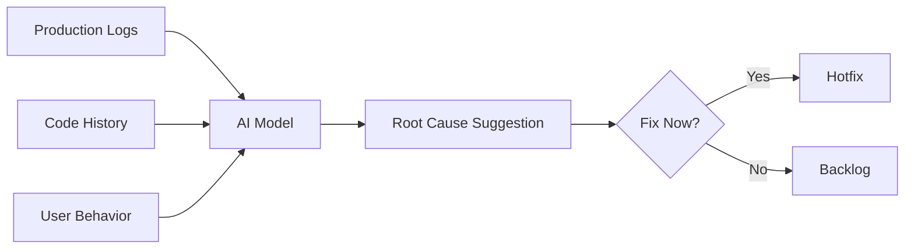
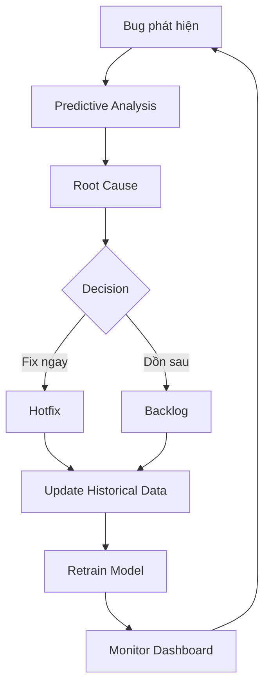

# Điều Tra Hiện Trường Bug Production


> ai-testing,bug-triage-data-driven,business-analytics,predictive-analytics-qa,production-bug-investigation,project-manager,root-cause-analysis,testcase

## Bước 1: Predictive Analytics — Soi Từng Dấu Vết Để Truy Root Cause

Bạn vừa nhận một bug production. Cảm giác đầu tiên? Tim đập nhanh, tay lướt Slack, mắt dán vào log. Đừng vội fix — hãy làm thám tử trước.

Predictive analytics giúp bạn gom **3 nguồn dữ liệu** ngay lập tức:

- **Historical defect log**: Bug nào từng xảy ra ở module này? Tần suất?
- **Code change history**: Ai commit gần đây? File nào bị động?
- **Production feedback**: Logs thời gian thực + hành vi người dùng

Từ đó, AI vẽ **bản đồ nhiệt rủi ro (risk heatmap)**:
- Module **đỏ** → ổ bug, ưu tiên số 1
- Module **xanh** → an toàn, không cần động

> **Mẹo**: Defect clustering — gom các bug giống nhau để tìm pattern chung, thay vì vá từng cái một. Tiết kiệm đến 40% thời gian debug.

Luồng dữ liệu từ production đến quyết định fix trông như thế này:



Tỷ lệ chính xác của AI root cause analysis hiện đạt **70-85%** — đủ tin cậy để bạn không phải đoán mò.

<multiple-choice correct="C" select="single">
Predictive analytics có thể ngăn chặn bao nhiêu % production incidents?
- A: 10-15%
- B: 20-25%
- C: 30-40%
- D: 50-60%
</multiple-choice>

---

## Bước 2: Ghép Với Dữ Liệu Hành Vi Người Dùng Thật


Bug kỹ thuật là chuyện của dev. Còn bạn — QA — cần hiểu **người dùng đã làm gì trước khi bug xảy ra 5 phút**.

**User behavior analytics** cho bạn 2 công cụ mạnh:

| Công cụ | Mục đích | Ví dụ |
|---------|----------|-------|
| **Session replay** | Xem lại hành trình thật của user | User click "Thanh toán" → load 5s → bỏ |
| **Funnel analysis** | Đo tỷ lệ drop ở từng bước | 60% user drop ở bước nhập mã giảm giá |

### Quyết định dựa trên data — không cảm tính

| Bug ở đâu? | Quyết định | Lý do |
|-----------|-----------|-------|
| **Golden path** (checkout, đăng nhập, thanh toán) | **Fix ngay** | Ảnh hưởng doanh thu trực tiếp |
| **Luồng phụ** (profile, settings, màu sắc) | **Chờ sprint sau** | Ít user chạm tới, rủi ro thấp |

> **Ví dụ thực tế**: Bug hiển thị sai giá ở trang checkout có thể khiến **60% user rời bỏ giỏ hàng**. Bug sai màu nút ở profile? Chẳng ai quan tâm. Cái nào đốt tiền hơn — bạn tự trả lời.

---

## Bước 3: Quyết Định Fix Ngay Hay Dồn Sprint Sau — Bằng Data, Không Bằng Cảm Tính

Đây là lúc bạn cần một **ma trận quyết định** — không phải cảm xúc hay áp lực từ BA/PO.

### Ma trận 2x2: Severity × Revenue Impact

|  | **Severity thấp** | **Severity cao** |
|--|------------------|-----------------|
| **Revenue Impact cao** | Fix trong sprint hiện tại | **Fix ngay lập tức** |
| **Revenue Impact thấp** | Backlog | Sprint sau |

### Công thức tính Bug Priority Score

```
Bug Priority Score = (Số user ảnh hưởng × Tần suất × AOV) / Độ phức tạp fix
```

Trong đó:
- **AOV** (Average Order Value) = Tổng doanh thu / Tổng số đơn hàng
- **Độ phức tạp fix** = Số giờ dev ước lượng

> **Khi nào nói "Không" với BA/PO**: Đưa data từ predictive model ra. "Bug này ảnh hưởng 5 user, tần suất 0.1%, AOV 200k. Priority score = 10. Trong khi bug kia score = 5000. Chúng ta fix cái kia trước."

### Case study: Siemens MindSphere

Kết quả từ Siemens MindSphere cho thấy: team giảm **30% escaped defects** nhờ áp dụng data-driven bug triage thay vì cảm tính. Con số này không phải may mắn — nó đến từ việc đo lường mọi quyết định.

---

## Bước 4: Xây "Phòng Điều Khiển" Cho Lần Sau — Từ Một Vụ Bug Thành Hệ Thống


Một vụ bug là chuyện nhỏ. Nhưng nếu bạn biến nó thành **hệ thống phòng ngừa**, đó mới là chiến thắng.

### 3 metrics phải theo dõi hàng ngày

| Metric | Công thức | Ngưỡng cảnh báo |
|--------|-----------|----------------|
| **Defect density trend** | Số bug / KLOC | > 5 → báo động |
| **User impact score** | % user bị ảnh hưởng | > 2% → họp khẩn |
| **Fix response time** | Giờ từ phát hiện → deploy | > 4h → escalate |

### Playbook "Điều tra hiện trường" cho team

Checklist mẫu khi nhận bug production:
1. Gom logs + user behavior data (5 phút)
2. Chạy predictive model → root cause suggestion (2 phút)
3. Tính Bug Priority Score (1 phút)
4. Quyết định: Fix ngay / Sprint này / Backlog
5. Cập nhật historical data → retrain model

### Vòng đời một bug — từ phát hiện đến monitoring



---

### Tóm lại

- **Predictive analytics** giúp bạn truy root cause với độ chính xác 70-85% — không cần đoán mò
- **User behavior data** cho bạn biết bug nào đang đốt tiền thật sự
- **Bug Priority Score** là công cụ để bạn nói "không" với BA/PO bằng data, không bằng cảm tính
- **Xây dashboard monitoring** để lần sau — bug chưa kịp nổ, bạn đã có kế hoạch

> **Nếu bạn đang trong sprint tới**, hãy thử áp dụng ma trận 2x2 và công thức Bug Priority Score cho 3 bug đầu tiên. So sánh kết quả với cách bạn từng quyết định — bạn sẽ thấy sự khác biệt.

**Còn bạn, bạn đang gặp khó ở bước nào nhất?** Là thuyết phục BA/PO bằng data, hay là gom đủ dữ liệu để chạy predictive model? Comment bên dưới để mình hỗ trợ nhé!
