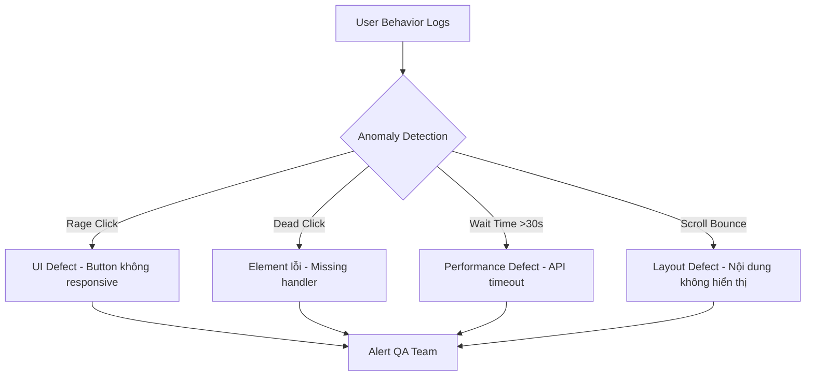
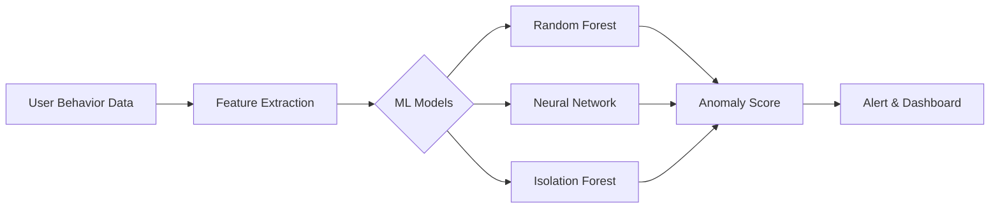
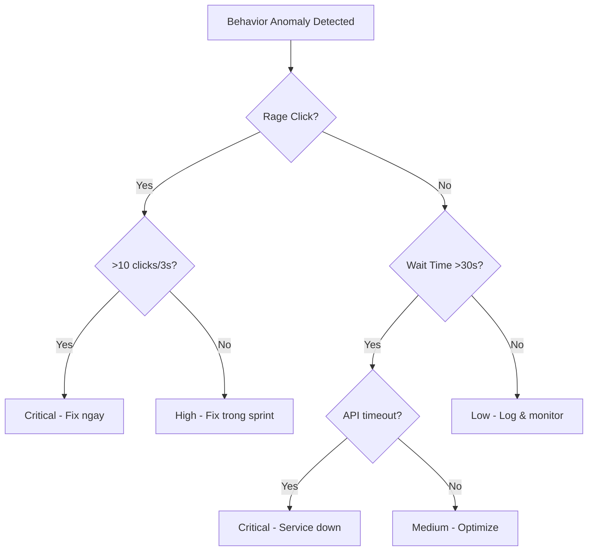
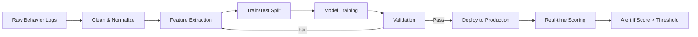
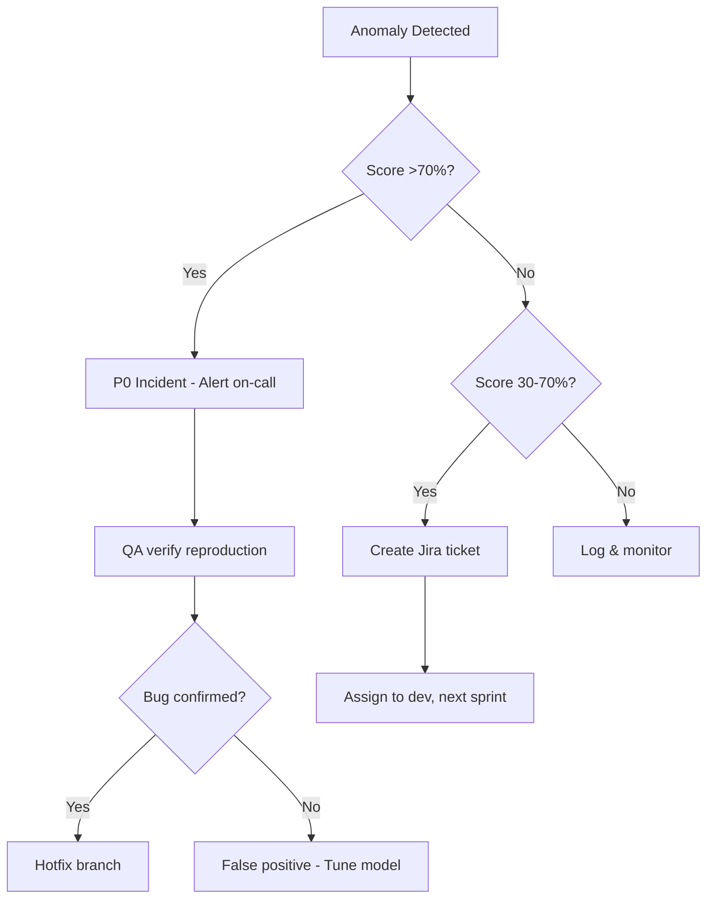
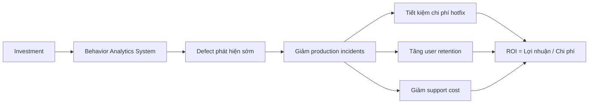

# Defect Lậu Vé: Bắt Rò Behavior Analytics

> ai-testing,behavior-analytics,business-analytics,defect-detection,predictive-analytics,project-manager,testcase,user-behavior-testing

## Dấu hiệu 'lậu vé' — Behavior tín hiệu defect

Bạn có bao giờ thấy user click liên tục vào một nút nhưng không có gì xảy ra? Hay họ thoát trang chỉ sau 3 giây? Đó không phải lỗi của user — **đó là defect đang "lậu vé" qua production**.

Hãy nhìn vào bảng so sánh dưới đây để phân biệt hành vi bình thường và hành vi cảnh báo:

| Hành vi | Bình thường | 'Lậu vé' — Cảnh báo |
|---|---|---|
| Thoát giữa chừng | 20-40% | >70% |
| Click chuột | 10-11 clicks/phút | >5 lần/giây (rage click) |
| Thời gian chờ | <10 giây | >30 giây |
| Scroll | Mượt, theo flow | Bounce lên xuống liên tục |
| Form nhập | Điền đầy đủ | Bỏ dở giữa chừng |

**5 tín hiệu nguy hiểm nhất** bạn cần ghi nhớ:

- **Rage click** — Click liên tục >5 lần/giây vào cùng một element
- **Dead click** — Click vào element có tồn tại nhưng không phản hồi
- **Error click** — Click ngay sau khi nhận được error toast
- **Scroll bounce** — Lên xuống liên tục trong 1 vùng, không thoát
- **Form abandonment** — Nhập 70% form rồi bỏ ngang

> **Thống kê**: Tỷ lệ defect phát hiện qua behavior analytics đạt **20-30%** — nghĩa là cứ 10 defect lậu vé, bạn bắt được 2-3 cái trước khi user kịp report.

---

## Công cụ soát vé — Predictive analytics cho QA

Chờ bug report từ user giống như đợi khách báo món ăn bị muối — **quá muộn để sửa**. Predictive analytics cho phép bạn chủ động "soát vé" trước.

| Tiêu chí | Traditional QA | Predictive Behavior Analytics |
|---|---|---|
| Thời gian phát hiện | Sau khi user report (giờ - ngày) | Realtime (giây - phút) |
| Coverage | Mẫu kiểm thử có sẵn | 100% user behavior thật |
| False positive rate | Thấp (manual check) | Trung bình (cần tuning) |
| Chi phí | Cao (nhân lực) | Thấp (tự động) |

**4 metric chính** cần theo dõi:

1. **Anomaly Score** — Điểm bất thường (0-100), càng cao càng nguy hiểm
2. **Confidence Level** — Độ tin cậy của mô hình với phát hiện đó
3. **Risk Priority** — Mức ưu tiên xử lý (Low / Medium / High / Critical)
4. **User Impact** — Số lượng user bị ảnh hưởng

**So sánh model ML** cho behavior analysis:

| Model | Precision | Recall | F1-Score | Phù hợp |
|---|---|---|---|---|
| Random Forest | 85% | 82% | 83% | Dữ liệu có nhãn, ít nhiễu |
| Neural Network | 90% | 88% | 89% | Pattern phức tạp, dữ liệu lớn |
| Isolation Forest | 78% | 92% | 84% | Dữ liệu không nhãn, phát hiện bất thường |

---

## Phân tích 3 tín hiệu nguy hiểm nhất

### 1. Rage Click — Kẻ thù số 1 của UI

> Ngưỡng cảnh báo: **>5 clicks/giây** vào cùng một element

Rage click thường đi kèm với **UI defect** — nút bấm không responsive, form không submit được, hoặc loading vô tận.

**Checklist dead click detection:**
- [ ] Element có tồn tại trong DOM không?
- [ ] Event listener có được gắn không?
- [ ] Có error log trong console không?
- [ ] API call có được trigger không?
- [ ] Có race condition với animation không?

### 2. Wait Time Anomaly — Sát thủ vô hình

Thời gian chờ bất thường trung bình là **178 giây** — gần 3 phút chờ đợi. Với ứng dụng web, ngưỡng an toàn là:

| Loại ứng dụng | Threshold (giây) | Hành động |
|---|---|---|
| E-commerce | <5 | Tối ưu API |
| SaaS/CRM | <10 | Kiểm tra database query |
| Mobile app | <3 | Cache local trước |
| Dashboard realtime | <2 | WebSocket health check |

### 3. Decision Tree phân loại severity

---

## Xây dựng mô hình dự đoán defect

**Feature engineering** — biến hành vi thô thành tín hiệu có ý nghĩa:

| Feature | Mô tả | Công thức |
|---|---|---|
| Session duration | Thời gian session | `end_time - start_time` |
| Click density | Số click / thời gian | `total_clicks / session_duration` |
| Navigation entropy | Độ hỗn loạn của flow | `-Σ p(i) * log(p(i))` |
| Form fill rate | % form đã điền | `filled_fields / total_fields` |

**5 bước xây dựng pipeline:**

1. **Data Collection** — Log mọi hành vi user (click, scroll, input, navigation)
2. **Preprocessing** — Lọc nhiễu, chuẩn hóa, gán nhãn thời gian
3. **Model Training** — Chọn model phù hợp (ưu tiên Random Forest cho MVP)
4. **Validation** — A/B test với production data, đo precision & recall
5. **Deployment** — Triển khai realtime, kèm fallback threshold

**Model performance theo từng loại defect:**

| Loại defect | Precision | Recall | F1-Score |
|---|---|---|---|
| UI defect (rage click) | 92% | 88% | 90% |
| Performance defect (wait time) | 85% | 91% | 88% |
| Functional defect (dead click) | 78% | 82% | 80% |
| Layout defect (scroll bounce) | 74% | 79% | 76% |

> Accuracy tổng thể của mô hình đạt **~80%** — đủ tin cậy để tự động hóa phát hiện sớm.

---

## Playbook thực tế — Từ data đến hành động

### Daily monitoring routine

| Thời gian | Hành động | Công cụ |
|---|---|---|
| 8:00 AM — Morning check | Review anomaly score >70% từ đêm qua | Dashboard |
| 12:00 PM — Midday review | Phân tích top 5 behavior signals mới | Analytics tool |
| 5:00 PM — Evening report | Tổng kết defect đã phát hiện, gửi Slack | Auto-report |

### Escalation rules

| Risk level | Anomaly Score | Hành động | Thời gian phản hồi |
|---|---|---|---|
| 🟢 Low | <30% | Log vào hệ thống, review weekly | 24h |
| 🟡 Medium | 30-70% | Notify QA lead, tạo ticket ưu tiên | 4h |
| 🔴 High | >70% | Immediate action — hotfix hoặc rollback | 1h |

---

## Đo lường hiệu quả — ROI của việc soát vé

### Chi phí defect phát hiện sớm vs muộn

| Giai đoạn phát hiện | Chi phí trung bình | Thời gian fix |
|---|---|---|
| Pre-production (QA test) | $100 | 2-4h |
| Behavior analytics phát hiện | $150 | 1-2h |
| User report (production) | $1,000+ | 8-24h |
| Sự cố lớn (outage) | $10,000+ | 24-72h |

### 4 chỉ số KPI cần theo dõi

1. **Defect Detection Time Reduction** — Giảm từ vài ngày xuống còn vài phút
2. **User Satisfaction Improvement** — Giảm rage click = tăng retention
3. **Support Ticket Reduction** — User không cần report, hệ thống đã bắt trước
4. **Revenue Protection** — Giảm thiểu mất doanh thu do defect

**Benchmark ngành** cho hiệu quả phát hiện defect:

| Chỉ số | Industry standard | Mục tiêu với behavior analytics |
|---|---|---|
| Detection time | 4-8h sau release | <30 phút |
| False positive rate | 15-25% | <10% |
| Coverage | 60-70% use cases | 90%+ user behavior |
| User impact giảm | — | 40-60% |

---

### Tóm lại

- **Defect lậu vé không phải chuyện may rủi** — behavior analytics cho bạn khả năng "soát vé" chủ động, phát hiện sớm trước khi user kịp bức xúc.
- **Bắt đầu từ 3 tín hiệu cốt lõi**: rage click, dead click, wait time anomaly — chỉ cần monitor 3 thứ này, bạn đã bắt được phần lớn defect production.
- **ROI rõ ràng**: Chi phí phát hiện sớm chỉ bằng 10-15% so với chờ user report.

> **Nếu bạn đang trong sprint tới**, hãy thử gắn một script nhỏ log rage click vào production — bạn sẽ bất ngờ với số defect đang "lậu vé" ngay dưới mũi mình.

**Còn bạn, bạn đã từng gặp defect nào mà behavior analytics có thể bắt được trước khi user report chưa?** Chia sẻ ở phần bình luận nhé!
