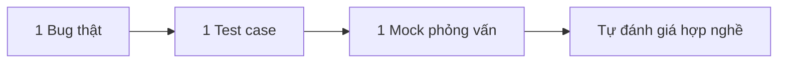

# 7 ngày thử nghề Tester

> Bug report,career-roadmap,fresher,Lộ trình học Tester,Manual Testing,Mock interview,qa,software-testing,tester,Tester cho người mới

## Vì sao đừng lao vào ISTQB ngay?

Với người mới, mục tiêu đầu tiên không phải là “học cho đủ thuật ngữ”, mà là trả lời câu hỏi: **mình có hợp nghề Tester không?**

| Cách bắt đầu | Học để thi | Học để biết có hợp nghề |
|---|---|---|
| Trọng tâm | Syllabus, thuật ngữ, khái niệm | Bug thật, test case, cách nghĩ như Tester |
| Cảm giác 7 ngày đầu | Dễ ngợp | Có việc cụ thể để làm |
| Kết quả thấy ngay | Khó | Rõ mình thích hay không thích |
| Phù hợp với ai | Người đã xác định theo nghề | Người mới, người chuyển ngành |

ISTQB không xấu. Vấn đề là **học sai thời điểm**.

3 rủi ro khi mở màn bằng syllabus dài:

- **Dễ ngợp:** ISTQB Foundation hiện có **13 chapter** trong syllabus v4.0.1.
- **Khó thấy công việc thật:** bạn nhớ định nghĩa nhưng chưa từng tự tìm 1 bug nào.
- **Bỏ cuộc sớm:** thời gian ôn thường rơi vào khoảng **20–40 giờ**, còn bài thi kéo dài **2 giờ**. Với người mới, đây là cục kiến thức khá nặng nếu chưa có trải nghiệm thực tế. Nguồn tham khảo: [ISTQB Foundation](https://www.istqb.org/).

Thay vào đó, 7 ngày đầu chỉ cần 3 mục tiêu rất đời:

- Chạm vào **1 bug thật**
- Viết **1 test case đầu tiên**
- Thử **1 buổi mock phỏng vấn**

> **Hiểu đúng kỳ vọng:** 7 ngày không làm bạn giỏi ngay. Nó chỉ giúp bạn tự trả lời: “Mình có thích soi lỗi, viết rõ ràng và kiên nhẫn với công việc này không?”

Nếu bạn đang cần nền tảng gọn, dễ vào nghề, có thể xem trước khóa [Testing cơ bản](/courses/testing-co-ban) để hiểu Tester thực tế làm gì, nhưng đừng biến tuần đầu thành cuộc đua học thuộc.

## Công thức 1–1–1 giúp bạn thử nghề thế nào?

Công thức 1–1–1 rất đơn giản: làm ít nhưng **đúng chất nghề**.

| Hoạt động | Kỹ năng rèn được | Đầu ra | Dấu hiệu hợp nghề |
|---|---|---|---|
| 1 bug thật | Quan sát, đặt câu hỏi, mô tả lỗi | 1 bug report có bằng chứng | Thích soi chi tiết, không ngại kiểm tra lại |
| 1 test case | Phân tích yêu cầu, viết rõ ràng | 1 bộ test case cơ bản | Biết nghĩ trước các tình huống |
| 1 mock phỏng vấn | Giao tiếp, trình bày logic | 1 video/ghi âm tự trả lời | Nói mạch lạc, không lan man |

Checklist đầu ra tối thiểu sau 7 ngày:

- **5 bug report**
- **100 test case**
- **1 buổi mock phỏng vấn**
- 1 file tổng hợp để tự nhìn lại tiến bộ

So với cách chỉ xem video hoặc đọc lý thuyết, công thức này hơn ở chỗ:

- Có **sản phẩm bàn giao**
- Biết mình vướng ở đâu
- Tạo cảm giác “đang làm nghề”, không phải “đang nghe kể về nghề”

> Thị trường junior tester hiện nay có nơi **ưu tiên** ISTQB, nhưng không phải chỗ nào cũng **bắt buộc**. Nhiều nhà tuyển dụng vẫn đánh giá cao cách bạn viết test case, bug report và giao tiếp hơn bằng cấp đơn lẻ.

<multiple-choice correct="B" select="single">
Trong 7 ngày đầu, mục tiêu hợp lý nhất là gì?
- A: Học hết ISTQB và thi luôn
- B: Chạm bug thật, viết test case, thử mock phỏng vấn
- C: Học automation ngay từ đầu
- D: Cày thật nhiều tool cho oách
</multiple-choice>

## 7 ngày đầu nên làm gì, từng ngày một?

Đừng học theo kiểu “hứng đâu làm đó”. Cứ bám lịch 7 ngày này.

| Ngày | Mục tiêu | Việc phải làm | Sản phẩm cuối ngày |
|---|---|---|---|
| 1 | Chọn nơi để test | Tìm 1 web/app đơn giản, ghi ra chức năng chính | Danh sách 1–2 sản phẩm để test |
| 2 | Soi lỗi thật | Test form, login, search, giỏ hàng | 1–2 bug report đầu tiên |
| 3 | Hiểu cách viết test case | Chọn 1 chức năng nhỏ như login/register | 15–20 test case |
| 4 | Viết test case có cấu trúc | Thêm normal case, invalid case, edge case | 20–25 test case |
| 5 | Viết bug report tốt hơn | Chụp ảnh/video, bổ sung steps rõ | Tổng 5 bug report + 100 test case |
| 6 | Mock phỏng vấn vòng 1 | Tự trả lời câu hỏi fresher, ghi âm | 1 file ghi âm/video |
| 7 | Tự đánh giá hợp nghề | Nghe lại câu trả lời, sửa CV note ngắn | Bảng tự chấm + kế hoạch học tiếp |

Tiêu chí chọn web/app dễ test ở ngày 1–2:

- Có chức năng quen thuộc: **login, form, search, cart**
- Thao tác không quá rối
- Có thể dùng miễn phí hoặc bản demo
- Có lỗi nhỏ để quan sát được
- Không đụng dữ liệu nhạy cảm

Mẫu test case cực ngắn cho người mới:

<table-testcase cols="4" rows="3" headers="ID|Mô tả|Input|Expected">
| TC_01 | Đăng nhập đúng | Email/Pass hợp lệ | Vào trang chủ |
| TC_02 | Đăng nhập sai mật khẩu | Email đúng/Pass sai | Báo lỗi đúng thông điệp |
</table-testcase>

Mẫu bug report cực ngắn:

- **Title:** Không hiển thị cảnh báo khi bỏ trống mật khẩu
- **Steps:** Mở trang login → nhập email hợp lệ → để trống mật khẩu → bấm Login
- **Expected:** Hiển thị cảnh báo “Mật khẩu là bắt buộc”
- **Actual:** Không có cảnh báo, form đứng yên

## 1 bug thật: tìm ở đâu và báo sao cho ra chất Tester?

Bạn không cần vào hệ thống phức tạp để tìm bug. Người mới nên bắt đầu ở các nơi “an toàn” sau:

- Web demo có login/register
- Form đăng ký sự kiện hoặc liên hệ
- Giỏ hàng giả lập
- App todo đơn giản
- Playground API để quan sát request/response

Nếu muốn mở rộng sang API sau khi quen UI, có thể học thêm từ [API Testing cơ bản](/courses/api-testing-co-ban) trước, rồi mới lên [API Testing nâng cao](/courses/api-testing-nang-cao).

Bảng dưới đây cho thấy khác biệt giữa một bug report kém và một bug report dùng được:

| Thành phần | Bug kém | Bug tốt |
|---|---|---|
| Title | Login lỗi | Không hiển thị thông báo khi nhập sai mật khẩu ở trang Login |
| Steps | Vào test thử | Ghi rõ từng bước 1-2-3-4 |
| Expected | Chạy đúng | Nêu rõ hệ thống phải phản hồi gì |
| Actual | Bị lỗi | Mô tả đúng cái đang xảy ra |
| Evidence | Không có | Có ảnh/video/log |

Checklist bug report nên có:

- Môi trường: web/app, browser, device
- Mức độ nghiêm trọng: cao/vừa/thấp
- Tần suất: luôn xảy ra hay thỉnh thoảng
- Steps to reproduce
- Expected result
- Actual result
- Ảnh chụp hoặc video

Ví dụ bug report hoàn chỉnh, ngắn gọn:

- **Title:** Nút “Đăng ký” không hoạt động khi số điện thoại có khoảng trắng cuối
- **Environment:** Chrome 126, Windows 11
- **Severity:** Medium
- **Frequency:** 5/5 lần
- **Steps:**
  1. Mở form đăng ký  
  2. Nhập họ tên hợp lệ  
  3. Nhập số điện thoại `0987654321 ` có khoảng trắng cuối  
  4. Bấm “Đăng ký”
- **Expected:** Hệ thống trim khoảng trắng và cho gửi form nếu dữ liệu hợp lệ
- **Actual:** Không gửi form, không báo lỗi
- **Evidence:** Ảnh chụp màn hình/video thao tác

> Bug tốt không nằm ở câu chữ “ngầu”, mà nằm ở việc người khác đọc xong có thể **làm lại đúng lỗi đó**.

## 1 test case + 1 mock phỏng vấn: đủ để tự tin chưa?

Đủ để **tự đánh giá**, chưa đủ để “đi đâu cũng đậu”. Nhưng đây là điểm khởi đầu rất thật.

Mẫu test case nên có:

| ID | Mục tiêu | Precondition | Steps | Expected result | Priority |
|---|---|---|---|---|---|
| TC_LOGIN_01 | Đăng nhập thành công | Có tài khoản hợp lệ | Nhập email/pass đúng, bấm Login | Vào trang chủ | High |
| TC_LOGIN_02 | Báo lỗi sai mật khẩu | Có tài khoản hợp lệ | Nhập email đúng, pass sai | Hiển thị thông báo lỗi | High |

So sánh mức chi tiết vừa đủ:

| Chức năng | Nên viết đến mức nào? |
|---|---|
| Login | Bao quát đúng/sai/trống/định dạng email |
| Checkout | Cần chi tiết hơn: địa chỉ, thanh toán, phí ship, tồn kho, xác nhận đơn |

8 câu mock phỏng vấn fresher nên tự tập:

- Em hiểu Tester làm gì trong dự án?
- Em đã từng tìm được bug nào chưa?
- Nếu dev nói “không phải bug”, em xử lý sao?
- Em phân biệt expected và actual như thế nào?
- Em viết test case dựa vào đâu khi chưa có tài liệu đẹp?
- Nếu thời gian gấp, em ưu tiên test phần nào trước?
- Em từng bỏ sót lỗi chưa, và em học được gì?
- Em giao tiếp với dev/BA thế nào khi có tranh luận?

Cách tự chấm câu trả lời:

- Có đi thẳng vào ý chính không?
- Có ví dụ thật không?
- Có nói quá dài và vòng vo không?
- Có thể hiện tư duy hợp tác thay vì đổ lỗi không?

Checklist tự đánh giá hợp nghề:

- Thích soi lỗi và thấy vui khi phát hiện điểm bất thường
- Viết tương đối rõ ràng
- Kiên nhẫn test đi test lại
- Giao tiếp có logic
- Không ngại hỏi “vì sao hệ thống phải chạy như vậy?”

Nếu muốn xem thêm góc nhìn nghề nghiệp dài hơi hơn, đọc tiếp [Lộ Trình Học Tester: Từ Zero Đến Chuyên Nghiệp](/blogs/lo-trinh-hoc-tester-tu-zero-den-chuyen-nghiep).

## Khi nào mới quay lại học ISTQB và tool?

Sau 7 ngày, lúc này mới nên quyết định học tiếp gì.

| Kết quả sau 7 ngày | Dấu hiệu | Nên học tiếp gì |
|---|---|---|
| Hợp nghề | Làm bài thấy cuốn, thích soi lỗi, thích viết | Học test design cơ bản → Jira → bug report → SQL nhẹ |
| Chưa rõ | Làm được nhưng chưa chắc mình thích | Làm thêm 1 vòng 7 ngày nữa với sản phẩm khác |
| Không hợp | Thấy quá chán với việc lặp lại, ghi chép | Tạm dừng, cân nhắc BA, support, data hoặc hướng khác |

Thứ tự học tiếp thực dụng:

1. Test design cơ bản  
2. Viết test case và bug report chắc tay  
3. Làm quen Jira  
4. Học Postman mức nền tảng  
5. SQL nhẹ để đọc dữ liệu  
6. Sau đó mới cân nhắc ISTQB

So sánh nhanh:

| Cách học | Động lực | Khả năng giữ kiến thức |
|---|---|---|
| ISTQB trước | Dễ tụt nếu chưa thấy việc thật | Khá thấp vì học xong khó gắn vào trải nghiệm |
| ISTQB sau khi đã thử nghề | Cao hơn vì biết mình học để làm gì | Tốt hơn vì có ngữ cảnh thực tế |

Một lưu ý quan trọng: **JD junior tester có nơi thích ISTQB, nhưng hiếm khi chỉ nhìn chứng chỉ mà bỏ qua kỹ năng làm việc.** Bug report, test case và cách bạn nói chuyện trong phỏng vấn vẫn là phần rất “ăn điểm”.

Nếu bạn muốn đi tiếp theo hướng thực chiến, hãy bắt đầu từ [Testing cơ bản](/courses/testing-co-ban), sau đó mở rộng sang [API Testing cơ bản](/courses/api-testing-co-ban) khi đã quen tư duy test. Đọc thêm bài [Test Pass, Tiền Vẫn Bay](/blogs/test-pass-tien-van-bay) để thấy vì sao test không chỉ là “bấm cho pass”.

> Tóm gọn lại:
> - 7 ngày đầu nên dùng để **thử nghề**, không phải nhồi thuật ngữ.
> - Công thức **1 bug thật – 1 test case – 1 mock phỏng vấn** giúp bạn thấy công việc thật nhanh hơn.
> - Chỉ nên quay lại ISTQB khi bạn đã có trải nghiệm đủ để hiểu mình học vì cái gì.

Nếu bạn đang ở tuần đầu chuyển ngành, hãy thử đúng công thức 1–1–1 trong sprint học tới và tự chấm bằng sản phẩm đầu ra, không bằng cảm hứng nhất thời. Còn bạn, bạn đang vướng nhất ở bước tìm bug, viết test case hay mock phỏng vấn?
