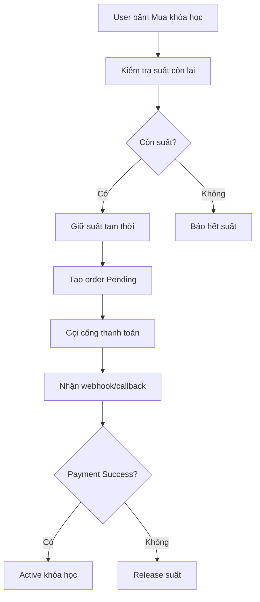
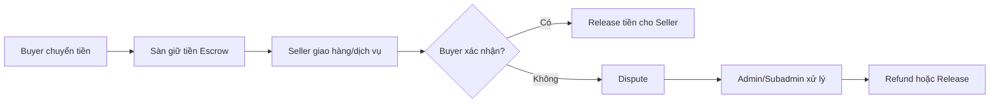

# Test Thanh Toán: Đừng Chỉ Bấm Pay


> Bug report,checkout-testing,Manual Testing,payment-gateway,payment-testing,qa,software-testing,testcase,tester

## User Thấy 1 Nút, QA Thấy 1 Mê Cung


Với user, thanh toán online thường chỉ là một nút: **“Thanh toán”**.

Bấm xong, họ kỳ vọng rất đơn giản:

- Tiền được xử lý đúng.
- Đơn hàng được ghi nhận.
- Khóa học được kích hoạt.
- Email xác nhận được gửi.
- Nếu lỗi, hệ thống nói rõ lỗi gì.

Nhưng với QA, sau nút đó là cả một mê cung.

Ví dụ user mua một khóa học T5Edu. Phía sau có thể đang xảy ra hàng loạt bước: tạo đơn, giữ suất ưu đãi, gọi cổng thanh toán, nhận webhook, cập nhật trạng thái đơn, kích hoạt khóa học, gửi email và ghi log đối soát.

| User nhìn thấy      | QA phải kiểm tra                          |
| ------------------- | ----------------------------------------- |
| Nút “Thanh toán”    | Order ID, số tiền, phương thức thanh toán |
| Màn hình thành công | Callback/webhook đã verified chưa         |
| Email xác nhận      | Khóa học đã active đúng user chưa         |
| Tiền bị trừ         | Đơn có thật sự chuyển sang Success không  |
| Loading vài giây    | Có timeout, retry, double-click không     |

Điểm khó của payment là: **UI phải đơn giản**, nhưng logic phía sau không được phép đơn giản hóa.

Theo tài liệu [Stripe Webhooks](https://docs.stripe.com/webhooks), webhook giúp hệ thống nhận sự kiện real-time, ví dụ payment thành công hoặc thất bại. Nói dễ hiểu: user có thể đã rời khỏi màn hình thanh toán, nhưng backend vẫn phải biết chính xác tiền đã đi đến đâu.

> QA không test một nút Pay. QA test sự khớp nhau giữa **tiền, đơn hàng, quyền truy cập và trạng thái hệ thống**.

## Checkout Cart: Case Khó Nằm Ở Chỗ “Cùng Lúc”


Luồng checkout cart dễ bị hiểu nhầm là chỉ cần test:

- Thêm vào giỏ hàng.
- Áp mã giảm giá(nếu có).
- Bấm thanh toán.
- Thấy success.

Nhưng case thật sự nguy hiểm thường nằm ở chữ **“cùng lúc”**.

Ví dụ: T5Edu có một chương trình ưu đãi, chỉ còn **1 suất cuối cùng**. User A và User B cùng bấm mua trong cùng một giây.

Câu hỏi QA cần đặt ra không phải là “có mua được không?”, mà là:

- Ai được giữ suất?
- Người còn lại thấy thông báo gì?
- Có ai bị trừ tiền oan không?
- Coupon có bị dùng 2 lần không?
- Order fail có release lại suất không?
- Nếu callback trả về trễ thì trạng thái đơn xử lý ra sao?



Một payment flow tốt cần có cơ chế chống xử lý trùng. Stripe gọi đây là [idempotency](https://docs.stripe.com/api/idempotent_requests): retry request nhưng không tạo giao dịch lặp.

Hoặc có thể nói: nếu user bấm chuông cửa 3 lần, chủ nhà chỉ nên mở cửa 1 lần, không phải giao 3 đơn hàng.

<table-testcase cols="4" rows="5" headers="ID|Mô tả|Input|Expected">
| 1 | Hai user cùng mua khi còn 1 suất | User A và B bấm Pay cùng lúc | Chỉ 1 order thành công, order còn lại bị chặn hoặc xử lý refund rõ ràng |
| 2 | User double-click Pay | Click nút Pay 2 lần liên tục | Không tạo 2 giao dịch |
| 3 | Coupon còn 1 lượt | Hai user cùng áp coupon | Chỉ 1 user dùng coupon thành công |
| 4 | Payment timeout | Gateway timeout nhưng tiền có thể đã trừ | Order chuyển sang chờ xác minh, không fail vội |
| 5 | Callback gửi lặp | Gateway gửi success 2 lần | Chỉ active khóa học 1 lần |
</table-testcase>

## Chuyển Khoản Đơn Hàng: Đừng Tin Client


Thanh toán chuyển khoản nhìn có vẻ đơn giản hơn payment gateway.

User chọn khóa học, thấy thông tin tài khoản ngân hàng, chuyển khoản, chờ hệ thống xác nhận. Nhưng đây là nơi rất dễ sinh lỗi vận hành.

Ví dụ user mua khóa học T5Edu giá **39.000đ**.

Các tình huống cần test:

| Case                          | Risk       | Expected                                                             |
| ----------------------------- | ---------- | -------------------------------------------------------------------- |
| Chuyển đúng tiền, đúng mã đơn | Thấp       | Đơn được xác nhận                                                    |
| Chuyển thiếu 1.000đ           | Trung bình | Không active tự động, đưa vào chờ xử lý                              |
| Chuyển sai nội dung           | Cao        | Giao dịch vào danh sách đối soát                                     |
| Gọi API upload bill giả       | Cao        | Không active chỉ dựa vào bill mà phải verify lại với cổng thanh toán |
| Chuyển 2 lần cho 1 đơn        | Cao        | Có log giao dịch thừa, không mất dấu tiền                            |
| Admin xác nhận nhầm           | Rất cao    | Có lịch sử duyệt, người duyệt, thời gian duyệt                       |

Điểm quan trọng: **bill không phải bằng chứng tuyệt đối**.

Nếu hệ thống tự động xác nhận, QA cần test rule match:

- Số tiền có khớp không?
- Mã đơn có khớp không?
- Tài khoản nhận có đúng không?
- Thời gian chuyển khoản có nằm trong hạn thanh toán không?
- Một giao dịch có bị map nhầm sang nhiều đơn không?

Nếu hệ thống xác nhận thủ công, QA phải test cả màn hình admin/subadmin:

- Admin có thấy đủ thông tin đối soát không?
- Có confirm nhầm đơn được không?
- Có undo hoặc ghi chú xử lý không?
- Có audit log không?

Với bank transfer, lỗi nguy hiểm không nằm ở màn hình user. Nó thường nằm ở **khâu đối soát phía sau**.

## Nạp Ví & OTC: Tiền Không Chỉ “Vào” Hoặc “Ra”


Nạp ví và OTC phức tạp hơn checkout thường, vì tiền có thể nằm ở nhiều trạng thái.

Không phải lúc nào cũng chỉ có:

- Thành công.
- Thất bại.

Thực tế có thể có:

| Loại số dư        | Ý nghĩa               | Risk nếu sai              |
| ----------------- | --------------------- | ------------------------- |
| Real balance      | Tiền đã xác nhận thật | Sai lệch tài chính        |
| Pending balance   | Tiền đang chờ xử lý   | User tưởng tiền dùng được |
| Available balance | Tiền được phép tiêu   | User mua vượt số dư       |
| Locked balance    | Tiền đang bị giữ      | Dispute hoặc refund sai   |

Ví dụ user nạp 1.000.000đ vào ví học tập. Gateway báo pending, nhưng UI lại cộng tiền vào available balance ngay.

Lúc này user có thể dùng số tiền đó để mua khóa học, trong khi giao dịch gốc chưa chắc thành công. Nếu payment fail sau đó, hệ thống sẽ bị âm ledger.

Với OTC hoặc escrow, case còn nhạy hơn:



QA cần test các câu hỏi:

- Buyer đã chuyển tiền nhưng seller chưa giao thì tiền ở đâu?
- Seller giao xong nhưng buyer không xác nhận thì xử lý thế nào?
- Admin release nhầm thì có rollback không?
- Dispute đang mở thì có cho rút tiền không?
- Một giao dịch có đủ ledger entry không?

Với ví và OTC, đừng chỉ nhìn số dư trên UI. Hãy hỏi backend: **ledger phía sau có khớp không?**

## Ma Trận Rủi Ro Payment: Test Chỗ Đốt Tiền Trước


Payment testing không nên bắt đầu bằng việc viết thật nhiều testcase.

Nên bắt đầu bằng câu hỏi: **lỗi nào đốt tiền nhanh nhất?**

Theo [OWASP Web Security Testing Guide](https://owasp.org/www-project-web-security-testing-guide/latest/4-Web_Application_Security_Testing/10-Business_Logic_Testing/10-Test-Payment-Functionality), payment functionality là vùng rất nhạy cảm vì lỗi có thể dẫn đến gian lận, mua hàng trái phép hoặc rò rỉ dữ liệu thanh toán.

Một ma trận đơn giản cho QA mới:

| Vùng rủi ro    | Ví dụ lỗi                           |   Severity | Business Impact | Ưu tiên |
| -------------- | ----------------------------------- | ---------: | --------------: | ------- |
| Tiền           | Trừ tiền 2 lần                      |        Cao |             Cao | P0      |
| Đơn hàng       | Payment success nhưng order pending |        Cao |             Cao | P0      |
| Quyền truy cập | Mua khóa học nhưng chưa active      |        Cao |             Cao | P0      |
| Bảo mật        | User sửa amount trên frontend       |    Rất cao |             Cao | P0      |
| UX             | Loading lâu làm user bấm lại        | Trung bình |             Cao | P1      |
| Tracking       | Sai event analytics                 |       Thấp |      Trung bình | P2      |

Công thức dễ nhớ:

```text
Payment Risk Score =
Mức ảnh hưởng tiền
× Số user bị ảnh hưởng
× Khả năng xảy ra
+ Rủi ro bảo mật
```

Đừng dành quá nhiều thời gian cho lỗi nhỏ như nút Pay lệch 2px, trong khi chưa test case **trừ tiền nhưng đơn vẫn Pending**.

Ngoài ra, checkout nhanh cũng ảnh hưởng business. Baymard ghi nhận tỷ lệ bỏ giỏ hàng trung bình khoảng 70% trong nghiên cứu checkout usability, còn báo cáo [Milliseconds Make Millions](https://web.dev/case-studies/milliseconds-make-millions) cho thấy cải thiện 0.1 giây trên mobile có thể tác động tích cực đến funnel mua hàng.

Nhưng nhanh không có nghĩa là bỏ verify.

Payment tốt là: **nhanh ở trải nghiệm, chặt ở backend**.

## Checklist QA Trước Khi Release Payment


Trước khi release tính năng thanh toán, QA có thể dùng checklist 4 lớp này.

| Lớp test   | Câu hỏi cần hỏi                                   |
| ---------- | ------------------------------------------------- |
| UX         | User có biết mình đang ở trạng thái nào không?    |
| Functional | Order, payment, invoice, access có đồng bộ không? |
| Security   | Callback có verify chữ ký/token không?            |
| Operation  | Có log, retry, refund, reconciliation không?      |

Checklist nhanh:

- Không active khóa học chỉ vì user quay về trang success.
- Không lấy amount cuối cùng từ frontend.
- Không để user bấm Pay nhiều lần tạo nhiều giao dịch.
- Không xử lý callback success nhiều lần.
- Không cộng ví khi giao dịch vẫn pending.
- Không tin ảnh bill nếu chưa có đối soát.
- Không bỏ qua log admin khi confirm thủ công.
- Không release OTC fund khi dispute còn mở.

<multiple-choice correct="C" select="single">
Trong payment testing, lỗi nào nguy hiểm nhất?
- A: Nút Pay lệch 2px
- B: Loading spinner hơi lâu
- C: User bị trừ tiền nhưng đơn hàng vẫn Pending
- D: Email xác nhận gửi chậm 5 giây
</multiple-choice>

Tóm lại, test thanh toán online không phải là test một nút bấm.

QA cần nhìn được 3 lớp:

- **User flow:** user có thanh toán dễ, nhanh, rõ ràng không?
- **System flow:** tiền, đơn, quyền truy cập, số dư có khớp không?
- **Risk flow:** nếu lỗi xảy ra, hệ thống có chống mất tiền, chống xử lý trùng và có đối soát không?

Nếu bạn đang test một tính năng payment trong sprint tới, hãy bắt đầu bằng case đau nhất: **tiền đã trừ nhưng đơn chưa thành công**. Từ case đó, lần ngược ra checkout, webhook, retry, admin, refund và ledger.

Bạn cũng có thể luyện thêm tư duy phân tích flow qua các bài thực chiến khác trên T5Edu hoặc bắt đầu với [khóa học Testing/QA cho người mới](/courses/testing-co-ban).

Còn bạn, nếu phải test payment hôm nay, bạn sẽ sợ nhất case nào: double-click, callback lỗi, chuyển khoản sai nội dung hay ví bị lệch số dư?

