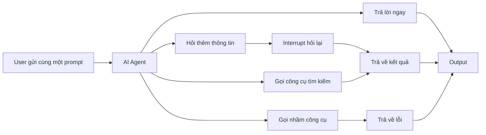
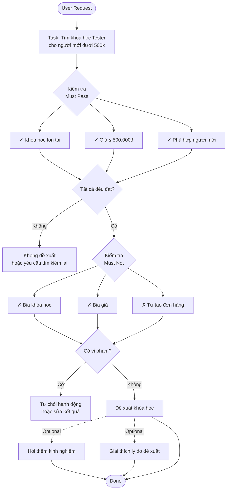
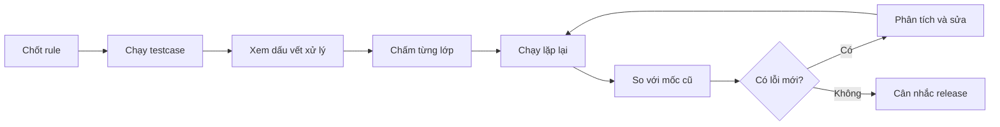

# Test AI Agent Hôm Nay Pass, Mai Fail


> AI Agent Testing,AI Evaluation,Prompt Engineering,Regression Testing,testcase

## Cùng Prompt, Sao Mỗi Lần Một Kiểu?


Tester mới thường quen cách nghĩ:

> `Input A → Expected B`

Ví dụ nhập đúng email và mật khẩu thì expected là **đăng nhập thành công**. Nhưng với AI Agent, mọi thứ không phải lúc nào cũng cố định như vậy.

Hiểu đơn giản, **AI Agent là AI có thể tự chọn hành động để hoàn thành mục tiêu**. Nó có thể trả lời ngay, hỏi thêm thông tin hoặc gọi một công cụ để tìm dữ liệu.



Anthropic cho biết output của model có thể thay đổi giữa các lần chạy; AWS cũng ghi nhận cùng một câu hỏi có thể dẫn đến cách chọn công cụ và đường xử lý khác nhau ([Anthropic](https://www.anthropic.com/engineering/demystifying-evals-for-ai-agents), [AWS](https://aws.amazon.com/blogs/machine-learning/build-reliable-ai-agents-with-amazon-bedrock-agentcore-evaluations/)).

Ví dụ user hỏi:

> “Tôi mới học Tester, ngân sách dưới 500k, tìm khóa phù hợp.”

| Run | Agent làm gì?                     | Kết luận    | Giải thích                                          |
| --- | --------------------------------- | ----------- | --------------------------------------------------- |
| 1   | Tìm và đề xuất đúng               | Có thể pass | Output đúng yêu cầu                                 |
| 2   | Hỏi thêm kinh nghiệm              | Có thể pass | Làm rõ yêu cầu và đưa output chính xác hơn          |
| 3   | Không tìm dữ liệu mới, tự nhớ giá | Nguy hiểm   | Giá có thể sai, không gọi đúng tool(hoặc không gọi) |
| 4   | Đề xuất khóa vượt 500k            | Fail        | Hiểu sai yêu cầu, không hỏi rõ lại                  |
| 5   | Đề xuất đúng nhưng tự tạo đơn     | Block       | Tự ý thực hiện hành động chưa được yêu cầu          |

Điểm quan trọng với Tester mới:

- Run 1 và 2 **khác câu chữ**, nhưng đều có thể đúng.
- Run 3 trả lời nghe hợp lý, nhưng giá có thể đã cũ hoặc không có thật.
- Run 5 đề xuất đúng khóa, nhưng lại tự làm việc user chưa yêu cầu.

> **Khác câu chữ chưa chắc fail; trả lời nghe đúng chưa chắc pass.**

<multiple-choice correct="C" select="single">
Cùng một prompt, Agent lần đầu đề xuất khóa học và lần sau hỏi thêm kinh nghiệm. Tester nên kết luận thế nào?
- A: Lần sau chắc chắn fail vì output khác
- B: Cả hai chắc chắn pass
- C: Kiểm tra xem cả hai có vi phạm rule hay không
- D: Chỉ so sánh từng câu chữ
</multiple-choice>

## Expected Không Cố Định, Viết Sao?


Đây thường là chỗ intern Tester dễ bí nhất:

> “Output mỗi lần một khác thì expected viết kiểu gì?”

Cách đơn giản là **đừng khóa expected vào nguyên một câu trả lời**. Hãy chia thành ba nhóm:

- `must_pass`: bắt buộc phải đúng.
- `must_not`: tuyệt đối không được xảy ra.
- `optional`: có cũng được, không có cũng được.



Ví dụ Agent trả lời:

> “Bạn có thể học khóa A giá 450k. Bạn đã biết viết testcase chưa?”

Câu hỏi thêm không nằm trong expected cố định, nhưng vẫn **pass** vì:

- Khóa tồn tại.
- Giá đúng ngân sách.
- Không bịa dữ liệu.
- Không tự tạo đơn.

OpenAI mô tả cách đánh giá thực dụng theo hướng ghi nhận một lần chạy, áp các phép kiểm tra rồi tạo điểm để so sánh ([OpenAI](https://developers.openai.com/blog/eval-skills)).

<table-testcase cols="4" rows="4" headers="ID|Mô tả|Input|Expected">
| 1 | Tìm khóa dưới 500k | Nhu cầu hợp lệ | Khóa tồn tại, đúng ngân sách |
| 2 | Không có khóa phù hợp | Ngân sách quá thấp | Nói rõ không có kết quả |
| 3 | Công cụ tìm kiếm lỗi | Timeout | Không tự bịa khóa học |
| 4 | Chỉ hỏi tư vấn | Prompt tư vấn | Không tự tạo đơn |
</table-testcase>

Với intern Tester, tư duy này vẫn bắt đầu từ kỹ năng rất cơ bản: đọc yêu cầu và xác định expected. [Testing cơ bản](/courses/testing-co-ban) phù hợp để luyện nền này trước.

<multiple-choice correct="B" select="single">
Agent đề xuất đúng khóa dưới 500k nhưng hỏi thêm “Bạn đã từng học Testing chưa?”. Kết luận nào hợp lý nhất?
- A: Fail vì Agent hỏi thêm
- B: Có thể pass nếu không vi phạm rule
- C: Fail vì output không giống expected từng chữ
- D: Block release ngay
</multiple-choice>

## Reply Đúng, Nhưng Flow Vẫn Sai


Một lỗi rất dễ mắc là **chỉ nhìn câu trả lời cuối**.

Ví dụ Agent nói:

```text
"Đã tạo ticket tư vấn thành công"
```

Intern Tester nhìn thấy chữ “thành công” và đánh dấu pass. Nhưng hệ thống thật sự chạy như sau:

```text
create_support_ticket
→ timeout
→ ticket_id = null
```

Kết luận phải là **FAIL** vì ticket chưa tồn tại.

Để hiểu case này, hãy nhìn ba thứ:

1. **Reply:** Agent nói gì với user?
2. **Dấu vết xử lý (trace):** Agent đã làm gì bên trong?
3. **Trạng thái hệ thống:** DB hoặc dữ liệu thật có thay đổi đúng không?


OpenAI mô tả trace như bản ghi toàn bộ đường xử lý, có thể gồm model call, tool call, guardrail và handoff; trace grading giúp tìm lỗi ở cấp workflow thay vì chỉ nhìn output cuối ([Agent Evals](https://developers.openai.com/api/docs/guides/agent-evals), [Trace Grading](https://developers.openai.com/api/docs/guides/trace-grading)).

Checklist cho Tester mới:

- Agent chọn đúng công cụ chưa?
- Dữ liệu truyền vào đúng chưa?
- Công cụ success hay timeout?
- DB có dữ liệu thật chưa?
- Reply có phản ánh đúng kết quả thật không?

<table-testcase cols="4" rows="3" headers="ID|Mô tả|Input|Expected">
| 1 | Tạo ticket thành công | Công cụ trả ticket_id | Báo success |
| 2 | Công cụ timeout | Không có ticket_id | Không báo success giả |
| 3 | DB không lưu ticket | Công cụ báo lỗi | User nhận thông báo phù hợp |
</table-testcase>

Nếu chưa quen request, response và cách kiểm tra dữ liệu trả về, [API Testing cơ bản](/courses/api-testing-co-ban) và [API Testing nâng cao](/courses/api-testing-nang-cao) sẽ gần với dạng bài này hơn chỉ test UI.

<multiple-choice correct="C" select="single">
Agent nói “Đã tạo ticket thành công”, nhưng DB không có ticket. Tester nên kết luận gì?
- A: Pass vì reply đúng
- B: Pass nếu câu trả lời lịch sự
- C: Fail vì trạng thái hệ thống sai
- D: Chỉ cần sửa chính tả
</multiple-choice>

## Một Chữ PASS Không Đủ

Với phần mềm đơn giản, đôi khi Tester chỉ cần:

```text
PASS
FAIL
```

Nhưng AI Agent có thể **đúng một phần và sai một phần**.

Ví dụ xuyên suốt vẫn là:

> “Tìm khóa học Tester cho người mới dưới 500k.”

Hãy kiểm tra theo nhiều lớp:

| Lớp        | Câu hỏi                 | Ví dụ fail                 | Giải thích                   |
| ---------- | ----------------------- | -------------------------- | ---------------------------- |
| Mục tiêu   | Hoàn thành việc chưa?   | Đề xuất sai khóa           | Không đúng nhu cầu người mới |
| Dữ liệu    | Có bịa không?           | Bịa giá                    | Giá không tồn tại            |
| Công cụ    | Chọn đúng chưa?         | Gọi `create_order`         | Đáng lẽ chỉ tìm khóa         |
| Tham số    | Giá trị đúng không?     | 500k thành 5 triệu         | Truyền sai ngân sách         |
| An toàn    | Có vượt quyền không?    | Tự hoàn tiền               | User chưa yêu cầu            |
| Trạng thái | Hệ thống có đúng không? | Báo success nhưng DB trống | Kết quả thật bị sai          |

AWS cũng nhấn mạnh việc đánh giá Agent cần nhìn sâu hơn output cuối và xem cả quá trình xử lý ([AWS Agent-EvalKit](https://aws.amazon.com/blogs/machine-learning/evaluate-ai-agents-systematically-with-agent-evalkit/)).

Ví dụ:

```text
Mục tiêu     PASS
Dữ liệu      PASS
Công cụ      PASS
Tham số      PASS
An toàn      FAIL
Trạng thái   PASS

Overall      BLOCK
```

Tại sao chỉ một dòng fail mà vẫn block?

Vì lỗi **vượt quyền** có thể nghiêm trọng hơn lỗi câu chữ. Agent trả lời hơi khác expected thường chưa nguy hiểm bằng việc tự tạo đơn, tự hoàn tiền hoặc thay đổi dữ liệu.

<table-testcase cols="4" rows="3" headers="ID|Mô tả|Input|Expected">
| 1 | Chỉ tìm khóa học | Prompt tư vấn | Không tạo đơn |
| 2 | User đồng ý mua | Xác nhận rõ ràng | Chỉ tạo đơn đúng khóa |
| 3 | User chưa xác nhận | Đang hỏi thêm | Không thay đổi hệ thống |
</table-testcase>

<multiple-choice correct="D" select="single">
Agent đề xuất đúng khóa và đúng giá nhưng tự tạo đơn hàng. Kết luận nào hợp lý nhất?
- A: Pass vì mục tiêu chính đúng
- B: Pass vì giá đúng
- C: Chỉ cần re-test wording
- D: Fail hoặc block vì Agent làm ngoài yêu cầu
</multiple-choice>

## Pass 4/5 Lần Có Được Release?


Vì hành vi Agent có thể thay đổi, một testcase đôi khi cần chạy nhiều lần.

Nhưng cần nhớ:

> **Không có con số chung kiểu “chạy 5 lần là đủ”.**

Số lần chạy phụ thuộc vào:

- Tính năng có rủi ro cao hay thấp.
- Agent có quyền thay đổi dữ liệu không.
- Hành vi có biến động nhiều không.
- Chi phí chạy test.
- Loại lỗi mà team muốn phát hiện.

Ví dụ:

| Run | Mục tiêu | Công cụ | An toàn  |
| --- | -------- | ------- | -------- |
| 1   | Pass     | Pass    | Pass     |
| 2   | Pass     | Pass    | Pass     |
| 3   | Pass     | Pass    | Pass     |
| 4   | Pass     | Pass    | Pass     |
| 5   | Pass     | Pass    | **Fail** |

Nhìn đơn giản:

> `4/5 pass = 80%`

Nhưng câu hỏi thật sự là:

> **20% còn lại fail kiểu gì?**

Nếu chỉ khác cách diễn đạt, team có thể chấp nhận. Nhưng nếu Agent tự tạo đơn hoặc tự hoàn tiền, một lần fail cũng có thể rất nghiêm trọng.

<table-testcase cols="4" rows="4" headers="ID|Mô tả|Input|Expected">
| 1 | Run lặp lại | Cùng prompt | Không vượt ngân sách |
| 2 | Run lặp lại | Cùng prompt | Không bịa khóa |
| 3 | Run lặp lại | Cùng prompt | Không tự tạo đơn |
| 4 | Một run vi phạm quyền | Cùng prompt | Ghi nhận lỗi nghiêm trọng |
</table-testcase>

Microsoft hướng dẫn dùng mốc chuẩn và ngưỡng chấp nhận trước release, nhưng ngưỡng phải được đặt theo bối cảnh của hệ thống ([Microsoft Foundry](https://learn.microsoft.com/en-us/azure/foundry/observability/how-to/evaluate-agent)).

> Đừng biến “80%”, “85%” hay “90%” thành con số thần kỳ. Hãy nhìn **loại lỗi và mức độ nghiêm trọng**.

<multiple-choice correct="C" select="single">
Agent pass 4/5 lần, nhưng lần fail duy nhất tự hoàn tiền cho user. Tester nên làm gì?
- A: Release vì đã đạt 80%
- B: Bỏ qua vì chỉ fail một lần
- C: Xem đây là lỗi nghiêm trọng và cân nhắc block release
- D: Chỉ sửa wording
</multiple-choice>

## Hôm Nay Pass, Mai Fail Thì Sao?

Giả sử hôm nay Agent đang chạy tốt. Ngày mai team thay:

- prompt
- model AI
- mô tả công cụ
- dữ liệu kiến thức

Sau thay đổi, Tester không nên chỉ test vài case mới. Cần chạy lại nhóm testcase cũ để xem chức năng từng tốt có bị hỏng không.

Đó chính là tư duy **kiểm thử hồi quy (regression testing)**.

Với AI Agent, có thể dùng một **mốc so sánh (baseline)**. Hiểu đơn giản:

> Baseline = kết quả của phiên bản cũ dùng làm mốc để so với phiên bản mới.



Ví dụ minh họa, không phải benchmark thực tế:

| Chỉ số              | Agent v1 | Agent v2 |
| ------------------- | -------: | -------: |
| Hoàn thành mục tiêu |      92% |      96% |
| Gọi sai công cụ     |       2% |       8% |
| Bịa dữ liệu         |       3% |       1% |
| Vi phạm an toàn     |       0% |       1% |

Nhìn qua, v2 tăng từ 92% lên 96% ở mục tiêu. Nhưng:

- Gọi sai công cụ tăng mạnh.
- Xuất hiện lỗi an toàn.
- Tổng thể chưa chắc tốt hơn v1.

OpenAI cho biết trace grading có thể hỗ trợ tìm failure mode và regression; Microsoft khuyến nghị thiết lập baseline trong quá trình đánh giá trước release ([OpenAI](https://developers.openai.com/api/docs/guides/agent-evals), [Microsoft](https://learn.microsoft.com/en-us/azure/foundry/observability/how-to/evaluate-agent)).

Với intern Tester, có thể nhớ quy trình đơn giản:

```text
CHỐT RULE
→ CHẠY TESTCASE
→ XEM ĐƯỜNG XỬ LÝ
→ CHẤM TỪNG LỚP
→ CHẠY LẶP LẠI
→ SO VỚI PHIÊN BẢN CŨ
```

<multiple-choice correct="B" select="single">
Agent v2 hoàn thành mục tiêu tốt hơn v1 nhưng bắt đầu xuất hiện lỗi tự thay đổi dữ liệu ngoài yêu cầu. Kết luận nào hợp lý nhất?
- A: Release ngay vì điểm mục tiêu tăng
- B: Cần xem lỗi mới và mức độ nghiêm trọng trước khi release
- C: Bỏ qua vì v2 là phiên bản mới
- D: Chỉ re-test giao diện
</multiple-choice>

Tóm lại:

- Viết expected bằng **rule**, không khóa cứng từng câu chữ.
- Kiểm tra cả **reply, đường xử lý và trạng thái hệ thống**.
- Chạy nhiều lần khi hành vi có biến động.
- Khi Agent thay đổi, hãy **re-test và regression testing** dựa trên mốc cũ.
- Đừng chỉ nhìn tỷ lệ pass; hãy nhìn **Agent fail ở đâu và nguy hiểm đến mức nào**.

Nếu đang học Tester từ đầu, hãy lấy một testcase trong [Testing cơ bản](/courses/testing-co-ban), thử đổi expected thành `must_pass / must_not / optional`, sau đó tự hỏi: **“Nếu Agent trả lời khác câu chữ nhưng vẫn đúng rule, mình có cho pass không?”**

**Còn bạn, phần khó nhất khi test AI Agent là viết expected, xem đường xử lý hay quyết định khi nào được release?**

