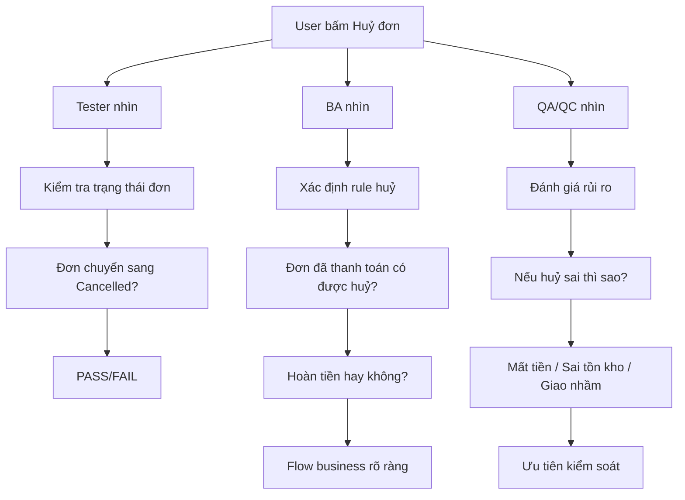
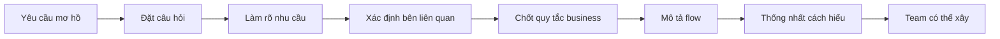
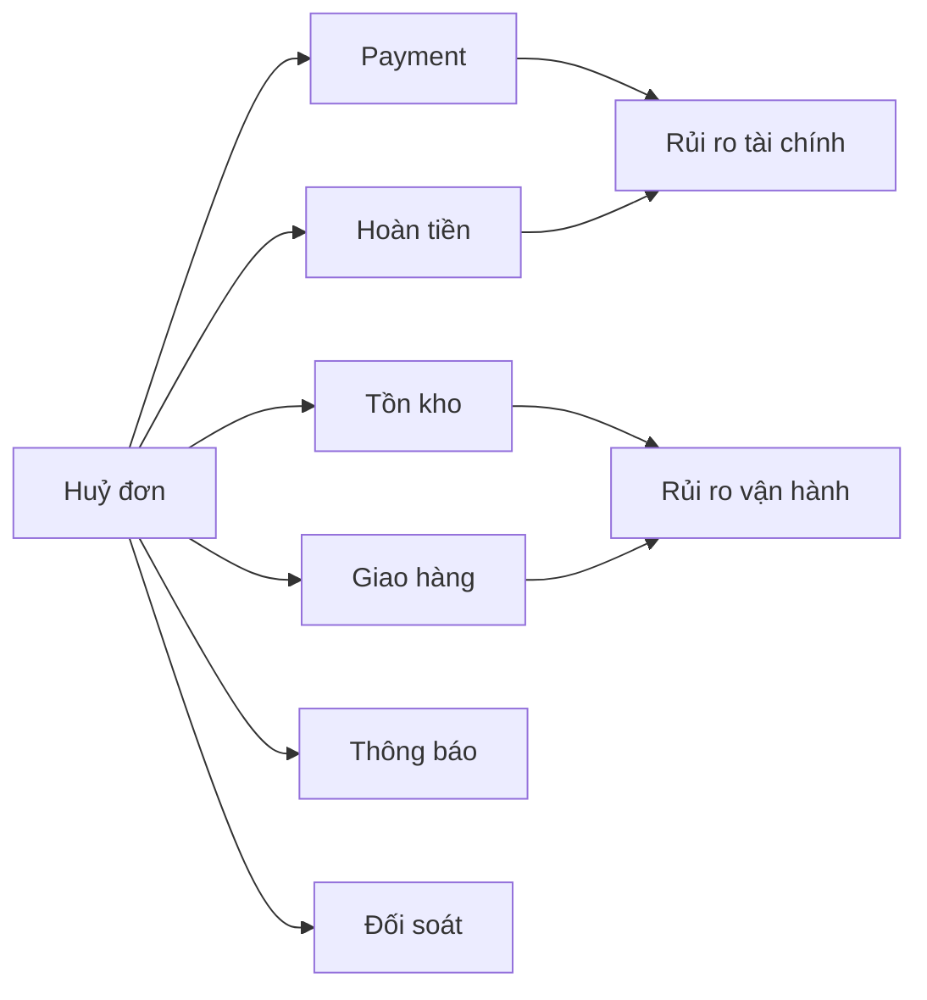
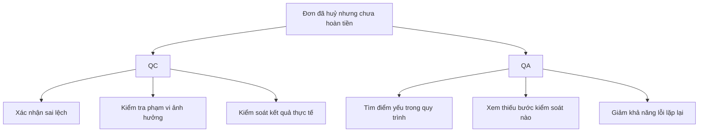
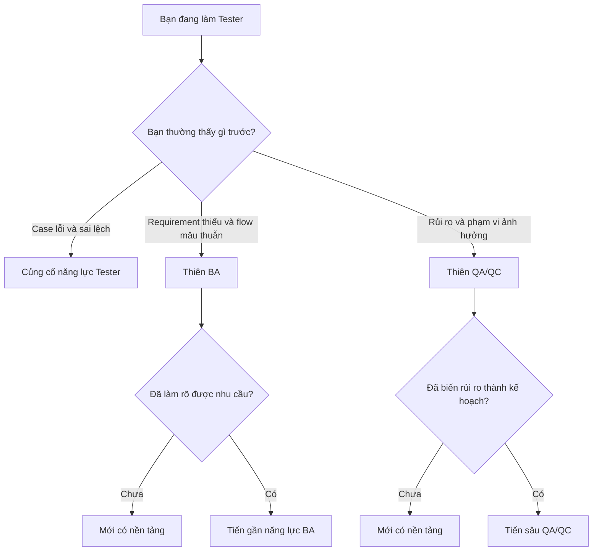

# Tester Không Phải Đích Đến?


> business-analysis,qa-qc,quality-management,software-testing,testing-career

## Một Feature, Ba Cách Nhìn


Team đưa cho bạn một yêu cầu nghe khá đơn giản:

> “Cho phép user huỷ đơn.”

Bạn có thể mở màn hình, bấm nút **Huỷ**, kiểm tra API, nhìn trạng thái done rồi kết luận PASS.

Nhưng cùng một feature, có ba cách hỏi rất khác nhau:

| Hướng nhìn | Câu hỏi cần đặt                    | Ý nghĩa                         |
| ---------- | ---------------------------------- | ------------------------------- |
| Tester     | Hệ thống có chạy đúng không?       | Kiểm tra hành vi và sai lệch    |
| BA         | Quy tắc huỷ đơn đã rõ chưa?        | Phân tích business và flow      |
| QA/QC      | Nếu huỷ sai thì ảnh hưởng tới đâu? | Nhìn rủi ro và phạm vi tác động |

Ví dụ cùng một feature “huỷ đơn”, nhưng mỗi hướng nhìn sẽ tập trung vào một flow khác nhau:



Cùng một hành động “bấm huỷ”, nhưng:

- Tester tập trung vào kết quả có đúng không
- BA tập trung vào rule và flow có rõ không
- QA/QC tập trung vào nếu sai thì hậu quả gì

Chỉ cần một nhánh bị bỏ sót, câu chuyện đã khác hoàn toàn. Điểm quan trọng là:

> **Tester không nhất thiết chỉ có một đường đi là test lâu hơn rồi lên Senior, Lead.**

Bạn có thể ngày càng mạnh về phân tích sản phẩm và tiến gần BA. Hoặc ngày càng mạnh về rủi ro, quy trình và kiểm soát chất lượng trong các vai trò QA hoặc QC.

**Lưu ý:** “điều kiện cần / điều kiện đủ” chỉ là **khung self-check năng lực**, không phải chuẩn tuyển dụng chính thức.

---

## Khi Nào Bạn Thực Sự Là Tester?

Biết viết testcase, report bug là tốt. Nhưng nếu chỉ dừng ở đó, bạn rất dễ PASS một feature quá sớm. Ví dụ như:

> User huỷ đơn báo thành công.

<table-testcase cols="4" rows="5" headers="ID|Kiểm tra|Kết quả|Kết luận">
| 1 | Nút Huỷ hoạt động | Đúng | PASS |
| 2 | Trạng thái đơn thành Đã huỷ | Đúng | PASS |
| 3 | Tiền đã thanh toán được xử lý đúng | Chưa kiểm tra | BLOCK |
| 4 | Tồn kho được cập nhật lại | Sai | FAIL |
| 5 | Đơn giao hàng bị dừng | Chưa kiểm tra | BLOCK |
</table-testcase>

Nếu chỉ nhìn dòng 1 và 2, feature có vẻ ổn, nhưng toàn flow thì chưa.


Theo ISTQB, Testing không chỉ có chạy testcase. Quá trình test còn gồm các hoạt động như lập kế hoạch, phân tích, thiết kế, chuẩn bị, thực thi, theo dõi và hoàn tất hoạt động test. [Xem ISTQB CTFL v4.0.1](https://istqb.org/wp-content/uploads/2024/11/ISTQB_CTFL_Syllabus_v4.0.1.pdf)

Một self-check đơn giản:

| Mức                   | Bạn làm được gì?                                     |
| --------------------- | ---------------------------------------------------- |
| Điều kiện cần         | Biết kiểm tra, viết case, phát hiện bug              |
| Tiến gần điều kiện đủ | Biết chọn đúng thứ cần kiểm tra và giải thích rủi ro |

Cùng thử xem bạn làm gì với case này:

<multiple-choice correct="C" select="single">
API huỷ đơn trả 200, UI báo thành công nhưng chưa kiểm tra hoàn tiền. Kết luận nào hợp lý nhất?
- A: PASS vì API trả 200
- B: PASS vì UI đúng
- C: Chưa đủ cơ sở kết luận
- D: FAIL ngay lập tức
</multiple-choice>

> **Biết test là nền tảng. Biết mình cần test gì và vì sao mới là bước tiếp theo.**

---

## Hay Soi Requirement: Bạn Có Nghiêng Sang BA?


Bạn nhận yêu cầu và ngay lập tức thấy thiếu hàng loạt câu hỏi:

> “User có thể huỷ đơn.”

- Ai được huỷ?
- Trạng thái nào được huỷ?
- Đã thanh toán thì sao?
- Voucher có trả lại không?
- Có được huỷ một phần không?
- Đơn đã giao cho shipper thì sao?

Đây là dấu hiệu tốt nếu bạn muốn đi hướng BA nhưng có vẻ chưa đủ:

> “Tôi hỏi requirement kỹ nên tôi làm BA được.”



Tester có thể phát hiện được các lỗi business ví dụ:

> “Voucher có trả lại không?”

Nhưng BA còn phải đi tiếp:

- Ai quyết định voucher có hoàn hay không?
- Voucher của hệ thống và voucher của shop có giống nhau?
- Rule nào áp dụng?
- Flow cũ bị ảnh hưởng không?
- Team nào cần xác nhận?

Theo IIBA, Business Analysis liên quan tới việc xác định nhu cầu và đề xuất giải pháp tạo giá trị cho các bên liên quan trong một bối cảnh cụ thể. [Xem định nghĩa của IIBA](https://www.iiba.org/knowledgehub/the-business-analysis-standard/2-understanding-business-analysis/2-1-defining-business-analysis/)

| Mức                   | Tester → BA                                                 |
| --------------------- | ----------------------------------------------------------- |
| Điều kiện cần         | Nhìn thấy requirement mơ hồ, thiếu rule, flow mâu thuẫn     |
| Tiến gần điều kiện đủ | Làm rõ nhu cầu, bên liên quan và cách team cần hiểu feature |

> **Tìm thấy chỗ thiếu là một chuyện. Biến chỗ mơ hồ thành thứ team có thể xây lại là chuyện khác.**

---

## Hay Nhìn Rủi Ro: Bạn Có Đi Theo QA/QC?


Release còn hai ngày và có 600 testcase cần chạy lại. Bạn không thể chạy hết.

```text
A. Cố chạy càng nhiều càng tốt
B. Chia đều testcase cho mọi người
C. Tìm khu vực nguy hiểm nhất nếu không test
```

Nếu bạn liên tục nghĩ tới câu C, bạn đang bắt đầu nhìn theo góc độ QA/QC.

<multiple-choice correct="C" select="single">
Release sắp tới hạn nhưng không thể chạy hết phần kiểm tra lại. Câu hỏi nào có giá trị nhất?
- A: Tester nào chạy nhanh nhất?
- B: Có thể bỏ toàn bộ testcase cũ không?
- C: Khu vực nào có rủi ro cao nhất nếu không test?
- D: Ai sẽ làm thêm giờ?
</multiple-choice>

Quay lại feature huỷ đơn:



Lúc này câu hỏi không còn là:

> “Đã chạy hết testcase chưa?”

Mà là:

> “Nếu không đủ thời gian, phần nào tuyệt đối không được bỏ?”

ISTQB Advanced Test Management có nội dung về quản lý hoạt động test và cách tiếp cận dựa trên rủi ro. [Xem ISTQB Advanced Test Management](https://istqb.org/certifications/certified-tester-advanced-level-test-management-ctal-tm-v3-0/)

| Mức                   | Tester → QA/QC                                        |
| --------------------- | ----------------------------------------------------- |
| Điều kiện cần         | Nhìn thấy rủi ro, luồng trọng yếu, lỗi lọt            |
| Tiến gần điều kiện đủ | Biến rủi ro thành ưu tiên, kế hoạch và cách kiểm soát |

> **Thấy rủi ro chưa đủ. Bạn còn phải biết xử lý rủi ro đó thế nào.**

---

## QA Khác QC Ra Sao?

Nhiều nơi thường gắn liền QA/QC với nhau. Nhìn lâu rất dễ tưởng đây là một role... Cũng không hẳn.


Theo ISO, QC thiên về kiểm tra sản phẩm hoặc dịch vụ thực tế. QA thiên về xem xét quy trình tạo ra hoặc cung cấp sản phẩm, dịch vụ. [Xem ISO về Quality Management](https://www.iso.org/quality-management)

Lấy đúng một bug:

> Đơn hiển thị “Đã huỷ” nhưng tiền chưa hoàn.

| Hướng | Câu hỏi                                   | Giải thích                                |
| ----- | ----------------------------------------- | ----------------------------------------- |
| QC    | Kết quả hiện tại sai ở đâu?               | Tập trung vào sản phẩm và kết quả thực tế |
| QA    | Vì sao quy trình cho phép lỗi này xảy ra? | Tập trung vào cơ chế tạo ra và ngăn lỗi   |



Đừng biến sơ đồ này thành luật cứng, mỗi công ty có thể đặt chức danh và chia trách nhiệm khác nhau, chỉ cần nhớ chỉ là:

> **QA và QC có liên quan, nhưng không nên gộp thành một khái niệm duy nhất.**

Vì vậy hướng đúng hơn Tester có thể là → QA hoặc QC

---

## Bạn Đang Thiếu Điều Kiện Nào?


Đừng hỏi ngay:

> “Tôi nên chuyển BA hay QA?”

Hỏi câu gần hơn:

> **Khi nhận một feature mới, bạn thường nhìn thấy gì trước?**

| Bạn thường nhìn thấy                    | Hướng nên self-check | Phần còn thiếu                            |
| --------------------------------------- | -------------------- | ----------------------------------------- |
| Case lỗi, sai lệch                      | Tester               | Phân tích sâu hơn rủi ro và bối cảnh      |
| Requirement thiếu, rule mơ hồ, flow sai | BA                   | Làm rõ nhu cầu và thống nhất giữa các bên |
| Rủi ro, phạm vi ảnh hưởng, release      | QA/QC                | Biến rủi ro thành kế hoạch và kiểm soát   |



Tóm lại:

- Làm Tester tốt hơn không có nghĩa chỉ chạy testcase nhanh hơn.
- Đi gần BA hơn không có nghĩa chỉ hỏi requirement nhiều hơn.
- Đi theo QA/QC không có nghĩa chỉ tìm nhiều bug hơn.
- QA và QC có liên quan nhưng không phải một khái niệm duy nhất.

Testing và Business Analysis có phạm vi năng lực khác nhau. Vì vậy trong khung của bài này, kinh nghiệm Tester là nền tảng chứ không tự động chứng minh bạn đã đủ năng lực BA. Đây là lập luận của bài, không phải kết luận nguyên văn từ ISTQB hay IIBA.

Nếu bạn còn yếu ở việc phân tích và chọn đúng thứ cần test, hãy củng cố lại nền tảng qua [Testing cơ bản](/courses/testing-co-ban) hoặc self-check thêm với [Thi thử ISTQB](/istqb).

Còn nếu hôm nay team đưa cho bạn một feature mới:

> **Bạn sẽ nhìn thấy bug trước, requirement thiếu trước, hay rủi ro trước?**

