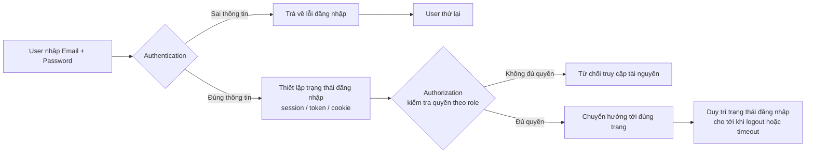
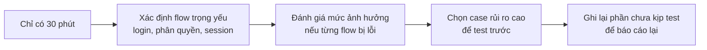
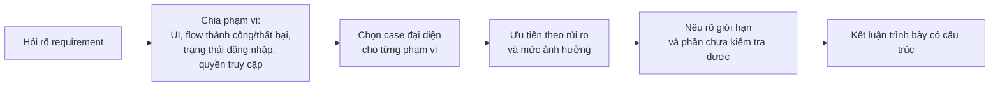

# Em Sẽ Test Form Login Này Thế Nào?

> intern-tester,login-testing,software-testing,test-analysis,tester-interview

## Câu Hỏi Này Không Phải Cuộc Thi Kể Testcase

Giả sử đề bài chỉ đưa ra một form gồm Email, Password và nút Login. Phản xạ thường thấy của nhiều ứng viên là liệt kê ngay các case quen thuộc:

- Email hợp lệ / không hợp lệ.
- Password đúng / sai.
- Bỏ trống cả hai field.
- Nhập ký tự đặc biệt.
- Bấm Login nhiều lần liên tiếp.

Những case này không sai, nhưng chúng để lộ một vấn đề: testcase đó đang được tạo ra dựa trên điều gì? Nếu đề bài chưa nói rõ tài khoản nào được phép đăng nhập, hệ thống xử lý tài khoản chưa xác thực ra sao, hay sau khi login thành công user sẽ được chuyển tới đâu, thì ứng viên buộc phải tự bổ sung rule bằng cách đoán và đó chính là lúc testcase bắt đầu lệch khỏi requirement thực tế.

Theo **ISTQB Foundation Level Syllabus v4.0.1**, testing gồm nhiều hoạt động chứ không chỉ có test execution. Trong đó, test analysis giúp xác định cần test gì, còn test design giúp chuyển các test condition thành testcase cụ thể. Nói cách khác, trước khi thiết kế testcase, cần biết rõ mình đang test cái gì và dựa trên rule nào.

[ISTQB Foundation Level Syllabus v4.0.1](https://istqb.org/wp-content/uploads/2024/11/ISTQB_CTFL_Syllabus_v4.0.1.pdf)

Vì vậy, một câu trả lời tốt thường không mở đầu bằng danh sách case, mà bằng một câu hỏi làm rõ phạm vi, kiểu như: *"Trước khi đi vào testcase cụ thể, em muốn làm rõ một số rule và phạm vi của form login."* Đây không phải cách né tránh đề bài. Nó cho thấy testcase cần bám vào requirement, thay vì dựa trên một bộ rule do ứng viên tự tưởng tượng ra.

<multiple-choice correct="C" select="single">
Interviewer chỉ đưa form Email, Password và nút Login. Việc nào nên làm trước?
- A: Đọc toàn bộ testcase nhớ được
- B: Giả định rule giống một website quen thuộc
- C: Làm rõ requirement và phạm vi
- D: Chỉ kiểm tra flow login thành công
</multiple-choice>

**Nói được nhiều case là một điểm cộng, nhưng biết vì sao mình chọn những case đó mới thực sự làm cho câu trả lời có logic.**

## Trước Khi Test, Bạn Cần Hỏi Gì?

Không cần biến buổi phỏng vấn thành một cuộc họp requirement kéo dài. Mục tiêu là chọn ra một số câu hỏi thực sự ảnh hưởng trực tiếp tới cách thiết kế testcase.

### Danh tính đăng nhập

- User đăng nhập bằng email, username hay cả hai?
- Một email có thể gắn với nhiều tài khoản không?
- Tài khoản có những trạng thái nào?
- Tài khoản chưa xác thực có được phép login không?
- Tài khoản bị vô hiệu hóa thì hệ thống xử lý ra sao?

Nếu chưa biết rõ các trạng thái tài khoản, sẽ rất khó xác định đầy đủ flow thành công lẫn flow bị từ chối.

### Khi đăng nhập thất bại

- Có giới hạn số lần thử sai hay không?
- User phải chờ, bị khóa hay gặp một cơ chế xác minh khác?
- Cơ chế phục hồi quyền đăng nhập là gì?
- Nội dung thông báo lỗi được yêu cầu như thế nào?

[OWASP WSTG](https://owasp.org/www-project-web-security-testing-guide/latest/4-Web_Application_Security_Testing/04-Authentication_Testing/03-Testing_for_Weak_Lock_Out_Mechanism) có phạm vi kiểm tra riêng cho cơ chế giới hạn đăng nhập sai, và mô tả nhiều cách triển khai khác nhau tùy sản phẩm. Vì vậy không nên tự đặt một con số cố địnchẳng hạn "khóa sau 5 lần saicho mọi hệ thống mà cần xác nhận lại với requirement thực tế.

### Sau khi login thành công

- User được chuyển tới trang nào?
- Trang đích có phụ thuộc vào role hay không?
- Nếu user đang mở một trang được bảo vệ trước đó, sau khi login có quay lại đúng trang đó không?
- Trạng thái đăng nhập được duy trì bằng cách nào?
- Khi hết hạn, hệ thống phản hồi ra sao?

### Remember me thực sự ghi nhớ điều gì?

Việc chỉ điền lại email ở lần đăng nhập sau và việc giữ user ở trạng thái đã đăng nhập là hai hành vi hoàn toàn khác nhau. Vì vậy cần hỏi:

- Remember me chỉ nhớ tài khoản hay duy trì cả trạng thái đăng nhập?
- Trạng thái đó được giữ trong bao lâu?
- Đóng browser rồi mở lại thì điều gì xảy ra?
- Logout có kết thúc luôn trạng thái đã ghi nhớ hay không?

[OWASP WSTG](https://owasp.org/www-project-web-security-testing-guide/latest/4-Web_Application_Security_Testing/04-Authentication_Testing/05-Testing_for_Vulnerable_Remember_Password) xếp Remember me vào phạm vi Authentication Testing, và hướng việc kiểm tra vào cơ chế duy trì trạng thái phía sau, chứ không chỉ dừng lại ở việc checkbox trên giao diện có được tick hay không.

| Khu vực              | Câu hỏi cần làm rõ                   | Vì sao ảnh hưởng tới test                       |
| --------------------- | ------------------------------------ | ------------------------------------------------ |
| Danh tính             | Login bằng email hay username?       | Quyết định data và validation                    |
| Trạng thái tài khoản  | Tài khoản nào được phép login?       | Quyết định flow được chấp nhận hoặc từ chối      |
| Đăng nhập sai         | Hệ thống giới hạn thử lại thế nào?   | Quyết định case về chờ, khóa hoặc xác minh       |
| Sau login             | User được chuyển tới đâu?            | Quyết định expected result                       |
| Remember me           | Nhớ tài khoản hay duy trì đăng nhập? | Quyết định cách kiểm tra khi đóng và mở browser  |
| Role                  | Mỗi role được truy cập gì?           | Quyết định phạm vi kiểm tra quyền                |

**Hỏi lại không phải là né đề bài. Hỏi đúng giúp tránh việc thiết kế testcase dựa trên giả định.**

## Login Không Chỉ Là Email, Password Và Nút Bấm

Form login chỉ là nơi user nhập thông tin, nhưng toàn bộ flow phía sau còn gồm nhiều bước khác mà tester cần nhìn thấy.

### Authentication

Authentication là bước xác minh user có đúng là danh tính họ khai báo hay không. Khi email hợp lệ và password đúng, danh tính của user được coi là đã xác thực.

### Authorization

Authorization trả lời một câu hỏi khác: danh tính đã được xác thực đó được phép truy cập những gì? Theo [Microsoft Learn](https://learn.microsoft.com/en-us/entra/identity-platform/authentication-vs-authorization), authentication là xác minh danh tính, còn authorization là xác định quyền truy cập tài nguyên hoặc chức nănhai khái niệm này cần được tách bạch rõ khi test. Vì vậy, một user thường đăng nhập thành công không đồng nghĩa với việc user đó được phép mở trang Admin.

### Trạng thái đăng nhập

Sau khi authentication thành công, hệ thống còn phải duy trì đúng trạng thái của user trong các request tiếp theo. Tùy kiến trúc, trạng thái này có thể liên quan tới session identifier, cookie, token hoặc một cơ chế khác. [OWASP WSTG](https://owasp.org/www-project-web-security-testing-guide/latest/4-Web_Application_Security_Testing/06-Session_Management_Testing/README) tách Session Management Testing thành một phạm vi kiểm tra riêng, bao gồm cách quản lý session, xử lý logout và xử lý timeout.

Vì vậy, các quan sát ở lớp UI không đủ để kết luận toàn bộ flow đã đúng:

| Quan sát trên UI | Điều đó chưa chắc đúng |
| --- | --- |
| UI đã chuyển trang | Toàn bộ login flow đã chạy đúng |
| Email và password hợp lệ | User có mọi quyền |
| Trang cũ vẫn hiển thị sau logout | Trạng thái đăng nhập vẫn còn hiệu lực |

Trường hợp cuối cùng đặc biệt dễ gây nhầm lẫn, vì trình duyệt có thể chỉ đang hiển thị lại một trang đã lưu trong cache. [OWASP WSTG](https://owasp.org/www-project-web-security-testing-guide/latest/4-Web_Application_Security_Testing/04-Authentication_Testing/06-Testing_for_Browser_Cache_Weaknesses) hướng dẫn rằng nếu nút Back chỉ hiển thị lại bản đã cache, tester nên chủ động reload trang từ server rồi mới đánh giá xem trạng thái cũ có còn thực sự truy cập được tài nguyên bảo vệ hay không.

**Form login chỉ là nơi user bắt đầu hành động. Tester cần nhìn thấy cả trạng thái phía sau hành động đó.**

## Chia Phạm Vi Test Form Login Như Thế Nào?

Thay vì cố nhớ và đọc ra một danh sách dài, có thể chia câu trả lời thành năm nhóm rõ ràng.

### 1. Giao diện và input

- Field và label hiển thị đúng.
- Password được che theo đúng thiết kế.
- Validation xuất hiện đúng vị trí.
- Nút Login có trạng thái loading phù hợp.
- Forgot password điều hướng đúng chỗ.
- Remember me hoạt động theo requirement.
- Khoảng trắng, định dạng và độ dài input được xử lý đúng rule.

Đây là lớp dễ thấy nhất nhưng không nên chiếm toàn bộ câu trả lời, vì nó chỉ là phần nổi của feature.

### 2. Flow thành công

Một flow thành công cần chứng minh cả một chuỗi: tài khoản hợp lệ được authentication thành công, trạng thái đăng nhập được thiết lập đúng, user được chuyển tới đúng trang, thông tin user hiển thị chính xác, và user truy cập được đúng những chức năng thuộc quyền của mình.

Không nên vội kết luận PASS chỉ vì giao diện đã chuyển trang. Ví dụ, UI có thể báo thành công nhưng khi refresh lại đưa user quay về màn hình Logitrường hợp này cho thấy điều hướng ban đầu đã chạy đúng, nhưng trạng thái đăng nhập phía sau lại chưa được duy trì đúng.

### 3. Flow thất bại

Các tình huống đại diện:

- Email hoặc username không hợp lệ.
- Password sai.
- Tài khoản không ở trạng thái được phép login.
- Request timeout.
- Server trả lỗi.
- Kết nối bị gián đoạn.
- Authentication thất bại nhưng UI lại hiển thị thành công.

Khi kiểm tra thông báo lỗi, không nên chỉ xem có xuất hiện một dòng chữ màu đỏ hay không, mà cần xem xét thêm:

- Nội dung có đủ rõ ràng với user không?
- Trạng thái giao diện có được reset đúng không?
- User có thể thử lại được không?
- Hệ thống có vô tình tạo nhầm trạng thái đăng nhập không?
- Phản hồi có làm lộ thông tin về việc tài khoản nào đang tồn tại hay không?

[OWASP WSTG](https://owasp.org/www-project-web-security-testing-guide/latest/4-Web_Application_Security_Testing/03-Identity_Management_Testing/04-Testing_for_Account_Enumeration_and_Guessable_User_Account) cảnh báo rằng sự khác biệt trong nội dung thông báo, HTTP status hoặc cách phản hồi có thể vô tình hỗ trợ việc dò tìm tài khoản tồn tại trong hệ thống. Tuy nhiên, một thông báo lỗi quá chung chung cũng có thể khiến trải nghiệm người dùng khó hiểu hơn, nên cách xử lý cuối cùng cần cân nhắc giữa mức độ rủi ro bảo mật và requirement thực tế của sản phẩm.

### 4. Trạng thái đăng nhập

- Refresh trang sau khi login.
- Mở một tab mới.
- Đóng rồi mở lại browser khi có dùng Remember me.
- Logout.
- Hết thời gian đăng nhập.
- Dùng lại trạng thái cũ sau khi đã logout.

Không nên tự đặt ra một con số cố định kiểu "session phải hết hạn sau X phút". [OWASP WSTG](https://owasp.org/www-project-web-security-testing-guide/latest/4-Web_Application_Security_Testing/06-Session_Management_Testing/07-Testing_Session_Timeout) cho rằng thời gian timeout hợp lý cần cân bằng giữa bảo mật và khả năng sử dụng, tùy vào mức độ nhạy cảm của từng ứng dụng, và việc hết hạn cũng cần được thực thi ở phía server chứ không chỉ dựa vào giao diện.

### 5. Quyền truy cập

- User truy cập đúng chức năng được cấp.
- User không có quyền bị từ chối đúng cách.
- Truy cập trực tiếp bằng URL vào một trang được bảo vệ được xử lý đúng.
- Trang đích sau login phù hợp với role của user.

<table-testcase cols="5" rows="8" headers="ID|Nhóm|Tình huống|Kết quả mong đợi|Ưu tiên">
| 1 | Flow chính | Tài khoản hợp lệ | Login thành công và thiết lập đúng trạng thái đăng nhập | Cao |
| 2 | Flow lỗi | Password sai | Từ chối login và phản hồi theo requirement | Cao |
| 3 | Trạng thái tài khoản | Tài khoản không được phép login | Từ chối theo rule | Cao |
| 4 | Quyền | User mở tài nguyên không thuộc role | Từ chối truy cập nếu hệ thống có phân quyền | Cao |
| 5 | Trạng thái đăng nhập | Refresh sau login | Hành vi đúng theo requirement | Cao |
| 6 | Remember me | Đóng rồi mở lại browser | Hành vi đúng theo rule của Remember me | Trung bình |
| 7 | Flow lỗi | Request timeout | Không hiển thị trạng thái login thành công giả | Cao |
| 8 | Logout | Dùng lại trạng thái đăng nhập cũ | Tài nguyên bảo vệ từ chối request nếu logout đã hoàn tất | Cao |
</table-testcase>

Bảng trên là ví dụ cho tình huống trong bài viết, không phải bộ testcase chuẩn cho mọi sản phẩm.

**Chia câu trả lời theo từng vùng như vậy giúp phần trình bày có cấu trúc rõ ràng và tránh bỏ quên những gì diễn ra phía sau giao diện.**

## Chỉ Có 30 Phút, Test Gì Trước?

Interviewer có thể tiếp tục hỏi thêm: "Nếu chỉ có 30 phút thì em sẽ ưu tiên test gì?" Một câu trả lời yếu thường chỉ đơn giản là cố chạy được càng nhiều testcase càng tốt, nhưng vấn đề nằm ở chỗ số lượng testcase không nói lên được những rủi ro quan trọng đã thực sự được kiểm tra hay chưa.

[ISTQB_CTFL_Syllabus_v4.0.1](https://istqb.org/wp-content/uploads/2024/11/ISTQB_CTFL_Syllabus_v4.0.1.pdf)

**ISTQB_CTFL_Syllabus_v4.0.1** mô tả việc ưu tiên hoá theo rủi ro là cách chạy trước những testcase bao phủ các rủi ro quan trọng nhất, dù mức ưu tiên cụ thể vẫn phụ thuộc vào bối cảnh của từng sản phẩm. Với form login, có thể sắp xếp thứ tự ưu tiên như sau:

1. User hợp lệ không thể login.
2. Thông tin không hợp lệ vẫn login được.
3. Tài khoản không được phép login vẫn truy cập được.
4. UI báo thành công nhưng trạng thái đăng nhập không tồn tại.
5. User truy cập được tài nguyên ngoài quyền hạn.
6. Logout hoàn tất trên UI nhưng trạng thái cũ vẫn truy cập được tài nguyên bảo vệ.
7. Login thất bại nhưng hệ thống lại vô tình thiết lập trạng thái đăng nhập.

<multiple-choice correct="C" select="single">
Chỉ còn 30 phút để kiểm tra form login. Cách ưu tiên nào hợp lý nhất?
- A: Kiểm tra màu sắc trước vì dễ hoàn thành
- B: Chạy ngẫu nhiên càng nhiều case càng tốt
- C: Kiểm tra flow trọng yếu và các lỗi có ảnh hưởng lớn trước
- D: Chỉ kiểm tra login thành công
</multiple-choice>

Không cần dựng một công thức risk score phức tạp ngay trong buổi phỏng vấn. Có thể giải thích ngắn gọn rằng mức độ ảnh hưởng nếu xảy ra lỗi, kết hợp với tần suất sử dụng và tầm quan trọng của flow đó, sẽ quyết định thứ tự ưu tiên khi test.

**Không cần chứng minh mình test được mọi thứ. Cần chứng minh mình biết phần nào không được phép bỏ qua.**

## Trả Lời Interviewer Thế Nào Cho Rõ?

Sau khi đã phân tích đủ, câu trả lời nên được gom lại thành một cấu trúc ngắn gọn, dễ theo dõi.

### Bước 1. Làm rõ requirement

- Danh tính dùng để login.
- Các trạng thái tài khoản.
- Cách xử lý đăng nhập sai.
- Hành vi của Remember me.
- Role và trang đích sau login.

### Bước 2. Nêu flow chính

Một user hợp lệ cần được xác thực, sau đó có đúng trạng thái đăng nhập, được chuyển tới đúng trang, và chỉ truy cập được đúng những chức năng thuộc quyền của mình.

### Bước 3. Chia phạm vi

Có thể dùng lại năm nhóm đã nêu ở trên:

1. Giao diện và input.
2. Flow thành công.
3. Flow thất bại.
4. Trạng thái đăng nhập.
5. Quyền truy cập.

### Bước 4. Đưa case đại diện

Không cần đọc hết toàn bộ testcase, chỉ cần chọn một vài case đủ để chứng minh mình đã nhìn thấy đủ các lớp của vấn đề:

- Password sai.
- Tài khoản không được phép login.
- UI báo thành công nhưng trạng thái đăng nhập không tồn tại.
- User truy cập tài nguyên ngoài role.
- Logout xong nhưng trạng thái cũ vẫn còn hiệu lực.

### Bước 5. Ưu tiên theo rủi ro

Nói rõ case nào cần test trước, và giải thích vì sao case đó được ưu tiên hơn những case còn lại.

### Bước 6. Nói rõ giới hạn

- Requirement chưa được cung cấp đầy đủ.
- Data chưa có sẵn.
- Phạm vi truy cập chưa đủ quyền.
- Những phần chưa thể kiểm tra hết trong thời gian cho phép.

### Câu trả lời mẫu

Gộp cả sáu bước lại, một câu trả lời mẫu có thể được diễn đạt như sau:

> "Trước tiên em sẽ làm rõ tài khoản dùng email hay username, các trạng thái tài khoản, cách xử lý khi đăng nhập sai, hành vi của Remember me, role và trang chuyển tới sau login.
>
> Sau đó em chia phạm vi thành giao diện và input, flow thành công, flow thất bại, trạng thái đăng nhập và quyền truy cập.
>
> Em ưu tiên kiểm tra user hợp lệ phải login được, thông tin không hợp lệ phải bị từ chối, trạng thái đăng nhập phải được thiết lập đúng và user chỉ truy cập được chức năng phù hợp với role.
>
> Em cũng kiểm tra các flow lỗi như password sai, tài khoản không được phép login, request timeout, logout và timeout theo requirement. Khi dự án cho phép, em kiểm tra thêm request, response và cơ chế duy trì trạng thái đăng nhập.
>
> Cuối cùng, em ghi lại những requirement còn thiếu, phần chưa có data và các rủi ro chưa thể kiểm tra."

Đây là một khung trình bày, không phải một script bắt buộc phải học thuộc lòng.

Interviewer hoàn toàn có thể đổi form login thành một tình huống khác:

- Đăng ký tài khoản.
- Checkout.
- Chuyển tiền.
- Upload file.
- Tìm kiếm.
- Đặt lịch.

Khi đó, tên gọi của các testcase sẽ thay đổi, nhưng cách suy nghĩ vẫn giữ nguyên: không vội liệt kê ngay, mà làm rõ requirement trước, nhìn feature như một flow hoàn chỉnh, chia phạm vi rõ ràng, chọn case đại diện, sắp xếp ưu tiên theo rủi ro, rồi mới trình bày câu trả lời có cấu trúc.

**Một Intern Tester tốt không phải là người nghĩ ra testcase nhanh nhất, mà là người biết vì sao testcase đó cần tồn tại.**

Nếu interviewer chỉ đưa Email, Password và nút Login, bạn sẽ bắt đầu bằng testcase hay bắt đầu bằng một câu hỏi?

Có thể củng cố cách phân tích và thiết kế testcase qua [Testing cơ bản](/courses/testing-co-ban), sau đó tự kiểm tra kiến thức nền với [Thi thử ISTQB](/istqb).
