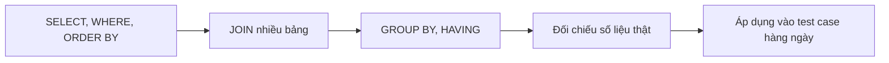

# Tester Học SQL Bắt Đầu Từ Đâu Cho Đúng?


> Database,qa,SQL,tester,testing

## Vì Sao Tester "Mù" SQL Sẽ Thiệt Thòi?

Dashboard test xanh lè, test case pass gần hết, release đúng lịch, nhưng tiền vẫn "bay" vì dữ liệu sai ở tầng dưới UI. Đây không phải chuyện hiếm, [Chúng ta đã từng mổ xẻ một case y hệt](/blogs/test-pass-tien-van-bay).

Không có SQL, bạn chỉ kiểm tra được cái UI cho bạn thấy. Có SQL, bạn tự vào database, gõ một câu query, và có bằng chứng rõ ràng ngay trước mắt.

Vài lợi ích thấy ngay:

- Tự verify dữ liệu test thay vì chờ backend xác nhận
- Report bug kèm bằng chứng SQL, tăng độ tin cậy
- Phát hiện lỗi ẩn mà UI không bao giờ hiển thị
- Rút ngắn thời gian điều tra lỗi từ hàng giờ xuống vài phút

> Tip: Bạn không cần giỏi SQL như DBA. Chỉ cần đủ để tự trả lời câu hỏi "dữ liệu này đúng hay sai?".


Một hệ thống có thể hiển thị đúng trên UI nhưng lưu sai dữ liệu bên dưới. Chẳng hạn:

- UI báo thanh toán thành công nhưng đơn hàng vẫn ở trạng thái `PENDING`
- Tổng tiền trên màn hình đúng nhưng số tiền lưu trong database bị lệch
- Người dùng đã bị trừ ví nhưng không được cấp quyền truy cập khóa học
- API trả về một order nhưng database lại tạo hai bản ghi
- Một order tồn tại nhưng không có dòng sản phẩm tương ứng
- Dữ liệu được lưu đúng giá trị nhưng liên kết nhầm sang người dùng khác

Đó là lý do Tester biết SQL có thể kiểm tra sâu hơn một bước. Thay vì chỉ hỏi “màn hình có đúng không?”, họ có thể tiếp tục hỏi “hệ thống thực sự đã lưu gì?”.

Khi kiểm thử một luồng quan trọng, bạn nên cố gắng đối chiếu ba lớp:

| Lớp kiểm tra | Câu hỏi cần trả lời |
|---|---|
| UI | Người dùng nhìn thấy kết quả gì? |
| API | Backend trả về trạng thái và dữ liệu gì? |
| Database | Hệ thống thực sự lưu những bản ghi nào? |

Nếu cả ba lớp nhất quán, bằng chứng để kết luận Pass sẽ đáng tin cậy hơn nhiều.

## Mô Hình Dữ Liệu Tester Hay Đụng Nhất: Users – Orders – Order Items

Hầu hết hệ thống thương mại điện tử, edtech hay fintech đều xoay quanh 3 bảng lõi này. Nắm được chúng, bạn đọc hiểu phần lớn schema thực tế.

<database-schema>

```dbml
Table users {
  id text [pk]
  name text
  email text [unique]
  role varchar
  wallet_balance double
  created_at timestamp
}

Table orders {
  id text [pk]
  user_id text [not null]
  amount double [not null]
  status varchar [not null]
  sepay_ref text
  created_at timestamp
  paid_at timestamp
}

Table order_items {
  id text [pk]
  order_id text [not null]
  item_type varchar [not null]
  course_id text
  lesson_id text
  unlock_scope varchar
  price double [not null]
}

Table courses {
  id text [pk]
  title text
  slug text [unique]
  price double
  published boolean
}

Table lessons {
  id text [pk]
  chapter_id text
  title text
  type varchar
  status varchar
}

Ref: orders.user_id > users.id
Ref: order_items.order_id > orders.id
Ref: order_items.course_id > courses.id
Ref: order_items.lesson_id > lessons.id
```

</database-schema>

| Bảng | Tester dùng để kiểm tra gì? |
|---|---|
| `users` | Đăng ký, trạng thái tài khoản, trùng email |
| `orders` | Đơn hàng có được lưu đúng, tổng tiền đúng không |
| `order_items` | Từng dòng sản phẩm, đối chiếu ngược ra tổng đơn |

Trong schema này:

- `orders.user_id` cho biết đơn hàng thuộc về người dùng nào
- `order_items.order_id` cho biết dòng sản phẩm thuộc đơn hàng nào
- `order_items.course_id` dùng khi người học mua cả khóa học
- `order_items.lesson_id` dùng khi người học mở khóa một bài riêng lẻ
- `orders.amount` là số tiền được lưu ở cấp đơn hàng
- `order_items.price` là giá của từng dòng sản phẩm

Nắm được khóa chính và khóa ngoại sẽ giúp bạn biết phải JOIN các bảng qua cột nào. Đừng JOIN bằng tên, email hoặc trạng thái nếu đã có ID dành riêng cho quan hệ.

Nếu bạn đang test song song cả API lẫn database, [khóa học API Testing cơ bản](/courses/api-testing-co-ban) sẽ giúp bạn nối được request/response với dữ liệu thực tế trong 3 bảng này.

### Đọc schema trước khi viết query

Tên cột không giống nhau ở mọi dự án. Tổng tiền đơn hàng có thể được đặt là `amount`, `total_amount`, `grand_total` hoặc một tên khác.

Thay vì đoán, hãy kiểm tra cấu trúc thật:

<sql-editor>
Cấu trúc các bảng chính
```sql
SELECT
    table_name,
    column_name,
    data_type
FROM information_schema.columns
WHERE table_schema = 'sql_lab'
  AND table_name IN ('users', 'orders', 'order_items')
ORDER BY table_name, ordinal_position;
```

Các trạng thái đơn hàng đang có
```sql
SELECT DISTINCT status
FROM orders
ORDER BY status;
```
</sql-editor>

Việc xem schema trước giúp bạn:

- Biết chính xác tên bảng và tên cột
- Xác định kiểu dữ liệu trước khi viết điều kiện
- Tìm đúng cột dùng để JOIN
- Không đoán giá trị enum hoặc trạng thái
- Phân biệt cột bắt buộc với cột có thể để trống

## Bộ Lệnh SQL Tester Cần Thành Thạo

Không cần học hết một cuốn giáo trình Database dày cộp. Tester chỉ cần nắm vững một nhóm lệnh nhỏ nhưng dùng lại liên tục mỗi ngày.

| Cần học ngay | Chưa cần vội |
|---|---|
| SELECT, WHERE, ORDER BY | Stored Procedure |
| JOIN (INNER, LEFT) | Trigger |
| GROUP BY, HAVING | Transaction phức tạp |
| LIKE, BETWEEN, IS NULL | Tối ưu performance query |

Ngoài ra, bạn nên làm quen với:

- `LIMIT`: Giới hạn số dòng khi khám phá dữ liệu
- `DISTINCT`: Xem những giá trị khác nhau đang tồn tại
- `COUNT`: Đếm bản ghi
- `SUM`: Tính tổng dữ liệu
- `COALESCE`: Thay thế giá trị `NULL`
- Alias với `AS`: Đặt tên kết quả dễ đọc hơn

### SELECT và WHERE

Ví dụ một câu query thực chiến để tìm đơn hàng có tổng tiền bất thường:

<sql-editor>
Đơn hàng có số tiền bất thường
```sql
SELECT
    id,
    user_id,
    amount,
    status,
    created_at
FROM orders
WHERE amount <= 0
ORDER BY created_at DESC
LIMIT 50;
```

Đơn hàng gần nhất
```sql
SELECT
    id,
    user_id,
    amount,
    status,
    created_at,
    paid_at
FROM orders
ORDER BY created_at DESC
LIMIT 20;
```
</sql-editor>

Thay vì dùng `SELECT *`, hãy chọn đúng những cột phục vụ mục tiêu kiểm thử. Kết quả sẽ dễ đọc hơn và người khác cũng hiểu được bạn đang kiểm tra điều gì.

### DISTINCT

Nếu chưa biết một cột trạng thái đang chứa những giá trị nào, hãy kiểm tra trước:

```sql
SELECT DISTINCT status
FROM orders
ORDER BY status;
```

Cách này hữu ích với:

- Trạng thái đơn hàng
- Trạng thái bài nộp
- Loại giao dịch ví
- Vai trò người dùng
- Loại nội dung được mua

### INNER JOIN và LEFT JOIN

Muốn xem đơn hàng cùng thông tin người mua:

```sql
SELECT
    o.id AS order_id,
    u.name AS user_name,
    u.email,
    o.amount,
    o.status,
    o.created_at
FROM orders AS o
JOIN users AS u
    ON u.id = o.user_id
ORDER BY o.created_at DESC
LIMIT 20;
```

Muốn tìm user chưa có đơn hàng:

```sql
SELECT
    u.id,
    u.name,
    u.email
FROM users AS u
LEFT JOIN orders AS o
    ON o.user_id = u.id
WHERE o.id IS NULL
ORDER BY u.created_at DESC
LIMIT 20;
```

Thử sức với câu hỏi nhanh này trước khi qua phần thực hành:

<multiple-choice correct="B" select="single">
JOIN nào trả về TẤT CẢ user, kể cả user chưa từng có đơn hàng nào?
- A: INNER JOIN
- B: LEFT JOIN
- C: CROSS JOIN
- D: SELF JOIN
</multiple-choice>

`INNER JOIN` chỉ trả về những dòng có dữ liệu khớp ở cả hai bảng. `LEFT JOIN` giữ lại toàn bộ dữ liệu từ bảng bên trái, kể cả khi bảng bên phải không có bản ghi tương ứng.

Với Tester, `LEFT JOIN` rất quan trọng vì nó giúp tìm dữ liệu bị thiếu. Nếu đang tìm order không có item mà dùng `INNER JOIN`, những order lỗi đó có thể bị loại khỏi kết quả.

### GROUP BY và HAVING

`WHERE` lọc dữ liệu trước khi nhóm. `HAVING` lọc kết quả sau khi đã `GROUP BY`.

Ví dụ tìm những người dùng có từ hai đơn hàng trở lên:

```sql
SELECT
    user_id,
    COUNT(*) AS order_count,
    SUM(amount) AS total_amount
FROM orders
GROUP BY user_id
HAVING COUNT(*) >= 2
ORDER BY order_count DESC
LIMIT 50;
```

<multiple-choice correct="C" select="single">
Mệnh đề nào dùng để lọc kết quả sau khi GROUP BY?
- A: WHERE
- B: ORDER BY
- C: HAVING
- D: LIMIT
</multiple-choice>

## Thực Hành: Đối Chiếu Tổng Tiền Đơn Hàng Có Đúng Không?

Đây là bài toán tester gặp gần như mỗi sprint có tính năng thanh toán [tương tự case test thanh toán từng phân tích](/blogs/test-thanh-toan-dung-chi-bam-pay): Số tiền hiển thị trên UI có thực sự khớp với tổng các dòng sản phẩm trong đơn không?

Query đối chiếu (reconciliation query), tự chạy thử bên dưới:

<code-runner lang="sql">

SELECT
    o.id AS order_id,
    o.amount AS stored_amount,
    COALESCE(SUM(oi.price), 0) AS calculated_amount,
    o.amount - COALESCE(SUM(oi.price), 0) AS difference
FROM orders AS o
LEFT JOIN order_items AS oi
    ON oi.order_id = o.id
GROUP BY
    o.id,
    o.amount
HAVING
    o.amount <> COALESCE(SUM(oi.price), 0)
ORDER BY
    ABS(o.amount - COALESCE(SUM(oi.price), 0)) DESC
LIMIT 50;

</code-runner>

Bất kỳ dòng nào query trả về đều là nghi phạm. Ghi lại thành test case rõ ràng, đừng chỉ nói "sai số tiền":

<table-testcase cols="4" rows="4" headers="ID|Mô tả|Input|Expected">
| 1 | Tổng đơn khớp với tổng dòng sản phẩm | order.amount = SUM(items.price) | difference = 0 |
| 2 | Tổng đơn lệch do thiếu 1 dòng sản phẩm | 1 order_item bị xoá nhầm | difference khác 0, cần điều tra |
| 3 | Đơn hàng không có dòng sản phẩm | Không tìm thấy order_item | calculated_amount = 0, cần điều tra |
| 4 | Đơn hàng có amount âm | amount = -50000 | Dữ liệu lỗi, cần fix ngay |
</table-testcase>

Query này sử dụng `LEFT JOIN` để không bỏ sót order không có item.

Nếu một order không có `order_items`, `SUM(oi.price)` sẽ trả về `NULL`. Hàm `COALESCE(..., 0)` chuyển giá trị đó thành `0` để phép đối chiếu vẫn hoạt động.

Cách đọc kết quả:

| Cột | Ý nghĩa |
|---|---|
| `stored_amount` | Số tiền lưu trong bảng `orders` |
| `calculated_amount` | Tổng giá từ các dòng `order_items` |
| `difference` | Khoảng chênh lệch giữa hai nguồn |
| `difference > 0` | Order lưu số tiền lớn hơn tổng item |
| `difference < 0` | Tổng item lớn hơn số tiền order |
| Không có dòng nào | Chưa phát hiện chênh lệch trong dữ liệu hiện tại |

Nếu query trả về danh sách dài, [cách điều tra root cause bug production](/blogs/dieu-tra-hien-truong-bug-production) sẽ giúp bạn khoanh vùng nhanh hơn thay vì report tràn lan.


### Kiểm tra order không có item

```sql
SELECT
    o.id,
    o.user_id,
    o.amount,
    o.status
FROM orders AS o
LEFT JOIN order_items AS oi
    ON oi.order_id = o.id
WHERE oi.id IS NULL
ORDER BY o.created_at DESC
LIMIT 50;
```

Query này nên trả về `0` dòng nếu mọi order đều có ít nhất một item hợp lệ.

### Kiểm tra trạng thái thanh toán

<sql-editor>
PAID nhưng thiếu paid_at
```sql
SELECT
    id,
    user_id,
    amount,
    sepay_ref,
    paid_at
FROM orders
WHERE status = 'PAID'
  AND paid_at IS NULL
LIMIT 50;
```

Chưa PAID nhưng đã có paid_at
```sql
SELECT
    id,
    user_id,
    amount,
    status,
    paid_at
FROM orders
WHERE status <> 'PAID'
  AND paid_at IS NOT NULL
LIMIT 50;
```

Order và payment log lệch số tiền
```sql
SELECT
    o.id AS order_id,
    o.amount AS order_amount,
    pl.amount_in AS paid_amount,
    o.amount - pl.amount_in AS difference
FROM orders AS o
JOIN payment_logs AS pl
    ON pl.related_order_id = o.id
WHERE o.amount <> pl.amount_in
ORDER BY ABS(o.amount - pl.amount_in) DESC
LIMIT 50;
```
</sql-editor>

Những query trên chuyển quy tắc nghiệp vụ thành điều kiện có thể kiểm tra:

| Quy tắc nghiệp vụ | Query vi phạm nên trả về |
|---|---|
| Order `PAID` phải có `paid_at` | 0 dòng |
| Order chưa `PAID` không được có `paid_at` | 0 dòng |
| Order phải có ít nhất một item | 0 dòng |
| Tiền nhận phải khớp với amount của order | 0 dòng |

> Query trả về 0 dòng không chứng minh toàn bộ hệ thống không có lỗi. Nó chỉ cho biết chưa tìm thấy dữ liệu vi phạm đúng điều kiện đang được kiểm tra.

### Viết bug report từ kết quả SQL

Thay vì chỉ ghi “sai tổng tiền”, hãy cung cấp:

- Order ID
- User ID hoặc email
- Giá trị hiển thị trên UI
- Giá trị API trả về
- `orders.amount`
- Tổng `order_items.price`
- Khoảng chênh lệch
- Trạng thái order
- Thời điểm xảy ra
- Query dùng để xác minh

Ví dụ:

> Order `order_123` đang ở trạng thái `PAID`. `orders.amount` là 540.000 đồng nhưng tổng `order_items.price` là 490.000 đồng, chênh lệch 50.000 đồng. Đính kèm request ID và reconciliation query để điều tra.

Một bug report như vậy giúp Developer biết ngay dữ liệu nào sai, sai ở đâu và kiểm tra lại bản sửa bằng cách nào.

## Lỗi Tester Hay Gặp Khi Học SQL (Và Cách Né)

Phần lớn Tester học SQL bị nản vì học sai cách: Học như đang đào tạo để làm DBA, không phải để test.

<grid-content>
So Sánh Cách Học SQL
```markdown
**❌ Học như Dev/DBA**

Lao vào Stored Procedure, Transaction, tối ưu Index ngay từ đầu. Kết quả: nản vì không đụng tới trong công việc thực tế.
```

```markdown
**✅ Học như Tester**

Ưu tiên SELECT, WHERE, JOIN, GROUP BY để tự verify dữ liệu trước khi report bug. Học tới đâu, dùng ngay tới đó.
```

```markdown
**Học theo nghiệp vụ**

Biến từng yêu cầu như “order PAID phải có paid_at” thành query tìm dữ liệu vi phạm. Vừa học SQL, vừa hiểu hệ thống.
```
</grid-content>

Một số lỗi khác Tester mới học SQL thường gặp:

- Dùng `SELECT *` cho mọi tình huống
- Không thêm `LIMIT` khi khám phá bảng lớn
- JOIN bằng cột không phải khóa
- Dùng `INNER JOIN` khi đang tìm dữ liệu bị thiếu
- Đoán tên cột mà không đọc schema
- Không xử lý giá trị `NULL`
- Chỉ quan tâm query có chạy mà không xác định kết quả mong đợi
- Thay đổi dữ liệu trước khi lưu bằng chứng
- Học cú pháp tách rời khỏi quy tắc nghiệp vụ

<dropdown-content>
Tester có cần học JOIN nâng cao không?
> Không bắt buộc ngay, nhưng nên biết ở mức cơ bản
```markdown
Với công việc test hàng ngày, bạn chỉ cần thành thạo **INNER JOIN** và **LEFT JOIN** để nối 2-3 bảng liên quan.

- Dùng **INNER JOIN** khi chỉ cần những bản ghi có quan hệ đầy đủ.
- Dùng **LEFT JOIN** khi cần giữ dữ liệu ở bảng chính và tìm quan hệ bị thiếu.
- Ưu tiên JOIN bằng khóa chính và khóa ngoại.
- Sau khi JOIN, kiểm tra xem số dòng có tăng bất thường do quan hệ một-nhiều hay không.

Các loại JOIN phức tạp hơn như SELF JOIN hay CROSS JOIN thường chỉ Dev hoặc Data Analyst mới cần dùng sâu.

Nếu schema công ty phức tạp, hãy nhờ Dev vẽ sơ đồ ERD thay vì tự đoán mối quan hệ giữa các bảng.
```
</dropdown-content>

<dropdown-content>
Làm sao biết một query kiểm thử đã đủ tốt?
> Query cần gắn với một quy tắc nghiệp vụ cụ thể
```markdown
Trước khi dùng query làm bằng chứng, hãy tự trả lời:

1. Query đang kiểm tra quy tắc nào?
2. Dòng nào được xem là dữ liệu vi phạm?
3. Query có bỏ sót dữ liệu thiếu quan hệ không?
4. Kết quả mong đợi là 0 dòng hay một tập dữ liệu cụ thể?
5. Người khác có thể chạy lại query và hiểu kết quả không?

Một query ngắn nhưng có mục tiêu rõ ràng thường giá trị hơn một query dài nhưng không xác định được điều kiện Pass/Fail.
```
</dropdown-content>

## Lộ Trình Học SQL Cho Tester + Lời Kết



| Giai đoạn | Nội dung | Mục tiêu |
|---|---|---|
| 1 | SELECT, WHERE, ORDER BY | Tự lọc dữ liệu cần kiểm tra |
| 2 | JOIN, khóa ngoại | Đọc hiểu quan hệ giữa các bảng |
| 3 | GROUP BY, HAVING | Đối chiếu số liệu tổng hợp |
| 4 | Reconciliation query | Report bug có bằng chứng cụ thể |

Để học đúng hướng, bạn có thể chia nhỏ thành lộ trình thực hành:

### Tuần 1: Đọc dữ liệu

- Viết `SELECT` với đúng cột cần kiểm tra
- Lọc bằng `WHERE`
- Sắp xếp bằng `ORDER BY`
- Giới hạn kết quả bằng `LIMIT`
- Làm quen với `NULL`

### Tuần 2: Đọc quan hệ

- Hiểu khóa chính và khóa ngoại
- Thực hành `INNER JOIN`
- Thực hành `LEFT JOIN`
- Tìm dữ liệu không có quan hệ
- Đối chiếu user với order

### Tuần 3: Kiểm tra dữ liệu tổng hợp

- Dùng `COUNT`
- Dùng `SUM`
- Nhóm dữ liệu với `GROUP BY`
- Lọc nhóm bằng `HAVING`
- Đối chiếu amount với tổng item

### Tuần 4: Gắn SQL với test case

- Chuyển quy tắc nghiệp vụ thành query
- Xác định kết quả Pass/Fail
- Lưu query vào test evidence
- Viết bug report kèm dữ liệu
- Dùng lại query cho regression test

Trong lúc chờ khóa **SQL Cơ Bản Cho Tester/QA** của T5Edu ra mắt, bạn có thể bắt đầu ngay với [khóa Testing cơ bản](/courses/testing-co-ban) để chắc nền tảng kiểm thử, hoặc đọc thêm [Lộ Trình Học Tester: Từ Zero Đến Chuyên Nghiệp](/blogs/lo-trinh-hoc-tester-tu-zero-den-chuyen-nghiep) và [7 ngày thử nghề Tester](/blogs/7-ngay-thu-nghe-tester) để định hình lộ trình tổng thể.

Vài điều cần nhớ:

- Tester không cần giỏi SQL như DBA, chỉ cần đủ để tự verify dữ liệu
- Ưu tiên SELECT, WHERE, JOIN, GROUP BY trước khi học thứ phức tạp hơn
- Đọc schema thật trước khi viết query
- Dùng `LEFT JOIN` khi cần tìm dữ liệu liên quan bị thiếu
- Xác định kết quả mong đợi trước khi chạy query
- Report bug kèm reconciliation query sẽ tăng độ tin cậy ngay lập tức
- Kết hợp UI, API và database để có bằng chứng kiểm thử đầy đủ

Nếu tuần sau bạn có đợt regression test cho tính năng thanh toán, hãy thử tự chạy 1 câu query đối chiếu tổng tiền trước khi report bug thay vì chỉ tin vào UI.

Còn bạn, hiện tại bạn đang gặp khó nhất ở JOIN hay ở việc tự tin đọc schema database?
