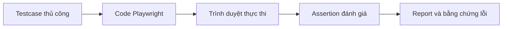
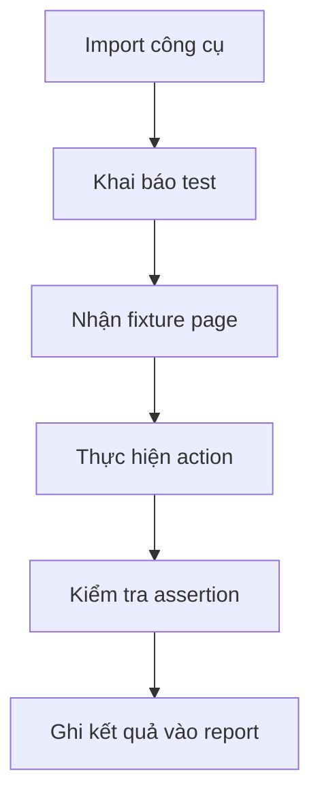

# Playwright với TypeScript cơ bản cho Tester


> AutomationTesting,JavaScriptChoTester,Playwright,QAAutomation,SetupPlaywright,TypeScript

> Hướng dẫn setup Playwright với TypeScript từ nền tảng JavaScript cơ bản đến test đầu tiên chạy được, giúp tester đọc hiểu code, tổ chức project và sử dụng Playwright đúng cách trong automation testing.

## Playwright là gì và được dùng để làm gì trong testing?

Playwright là framework kiểm thử end-to-end dành cho ứng dụng web hiện đại. Theo [tài liệu cài đặt chính thức của Playwright](https://playwright.dev/docs/intro), bộ công cụ này tích hợp sẵn test runner, assertion, cơ chế cô lập test, chạy song song và các công cụ hỗ trợ debug. Tester có thể chạy test trên Chromium, Firefox và WebKit ở chế độ headless hoặc mở trình duyệt để quan sát.

Trong công việc testing, Playwright thường được dùng để tự động hóa các luồng người dùng có thể quan sát được, chẳng hạn:

* Đăng nhập, đăng xuất và phân quyền.
* Tìm kiếm, lọc dữ liệu và phân trang.
* Thêm sản phẩm vào giỏ hàng và thanh toán.
* Điền form, upload file và kiểm tra thông báo.
* Kiểm tra cùng một luồng trên nhiều trình duyệt.
* Chạy regression test khi có phiên bản mới.
* Thu thập report, screenshot và trace khi test thất bại.

Một kịch bản manual test thường có các thành phần: điều kiện ban đầu, bước thực hiện, dữ liệu kiểm thử và kết quả mong đợi. Khi chuyển sang Playwright, tester không bỏ tư duy testcase. Tester chỉ biểu diễn các bước đó bằng code để máy có thể lặp lại chính xác.



Playwright không thay thế exploratory testing, phân tích rủi ro hay khả năng đặt câu hỏi của tester. Giá trị lớn nhất của framework là tự động hóa những kiểm tra lặp lại, giúp đội ngũ nhận phản hồi sớm hơn và dành thời gian cho các tình huống cần tư duy con người.

Việc học Playwright có lợi cho tester vì nó tạo ra một cầu nối rõ ràng giữa nghiệp vụ, giao diện và code. Khi đọc được một file test, tester có thể hiểu test đang chuẩn bị gì, thao tác ở đâu, chờ điều kiện nào và xác nhận kết quả nào. Đây cũng là nền tảng để phối hợp tốt hơn với developer, tham gia review automation test và phát triển theo hướng QA Automation hoặc SDET.

![Wide 3:1 educational process diagram explaining how a manual testcase becomes an automated Playwright result. Layout: four horizontal bento blocks from left to right. Left section: a checklist document labeled 'Testcase'. Center-left section: a TypeScript code editor labeled 'Code Playwright'. Center-right section: a browser window with a locator target labeled 'Trình duyệt'. Right section: a report card with pass and fail rows labeled 'Kết quả'. A solid T5Edu Blue arrow connects Testcase to Code Playwright, Code Playwright to Trình duyệt, and Trình duyệt to Kết quả. A dashed Amber feedback arrow returns from Kết quả to Testcase to represent improvement. Exact Vietnamese labels: 'Testcase', 'Code Playwright', 'Trình duyệt', 'Kết quả'. Minimalist flat vector UI design, premium professional EdTech editorial artwork, clean bento-grid composition with strong negative space, Paper White and Zinc-50 background #fafafa, Zinc-900 content #18181b, T5Edu Blue accent #1a73e8, Amber highlights #f59e0b, subtle one-pixel borders and restrained liquid-glass layers, simple flat icons and clean connector lines, no people, no faces, no hands, no 3D, no glossy plastic, no photorealism, no dramatic lighting, no purple, no violet, no pink, no neon, no logo, no watermark.](/api/uploads/1785112041521-u68ckaeq-image.png)

## JavaScript và TypeScript: tester cần biết gì để đọc code Playwright?

JavaScript là ngôn ngữ lập trình phổ biến trên web và cũng có thể chạy ngoài trình duyệt thông qua môi trường như Node.js. [MDN mô tả JavaScript](https://developer.mozilla.org/en-US/docs/Web/JavaScript) là một ngôn ngữ động, hỗ trợ nhiều cách tổ chức chương trình và được dùng trong cả môi trường trình duyệt lẫn ngoài trình duyệt.

TypeScript phát triển trực tiếp từ JavaScript. Theo [trang chính thức của TypeScript](https://www.typescriptlang.org/), TypeScript bổ sung cú pháp kiểu dữ liệu để editor có thể phát hiện lỗi sớm hơn, sau đó code được chuyển thành JavaScript để thực thi. Vì vậy, tester không cần xem JavaScript và TypeScript là hai ngôn ngữ hoàn toàn tách biệt.

<grid-content>
JavaScript và TypeScript trong automation testing
> Hai lớp kiến thức liên kết trực tiếp với nhau khi viết Playwright.
```markdown
**JavaScript**

Cung cấp cú pháp cốt lõi như biến, object, array, function, điều kiện, module và `async/await`. Đây là phần quyết định code thực hiện hành động gì.

````

```markdown
**TypeScript**

Bổ sung kiểu dữ liệu, interface và khả năng kiểm tra ngay trong editor. Đây là phần giúp code dễ đọc, dễ gợi ý và giảm lỗi khi project lớn dần.
````

</grid-content>

### Các thành phần JavaScript cần nắm

Tester mới chưa cần học toàn bộ JavaScript trước khi bắt đầu Playwright. Hãy tập trung vào những thành phần xuất hiện thường xuyên trong file test:

| Thành phần    | Ví dụ                                     | Ý nghĩa khi đọc test              |
| ------------- | ----------------------------------------- | --------------------------------- |
| Biến          | `const email = 'tester@example.com'`      | Lưu dữ liệu dùng trong test       |
| Object        | `{ email, password }`                     | Gom dữ liệu có nhiều thuộc tính   |
| Array         | `['chromium', 'firefox']`                 | Danh sách dữ liệu hoặc môi trường |
| Function      | `function buildUser()`                    | Đóng gói logic có thể tái sử dụng |
| Import        | `import { test } from '@playwright/test'` | Lấy công cụ từ module khác        |
| Điều kiện     | `if (status === 'FAILED')`                | Chạy logic theo trạng thái        |
| `async/await` | `await page.goto(url)`                    | Chờ thao tác bất đồng bộ hoàn tất |

<code-runner lang="js">
const account = {
  email: "tester@example.com",
  role: "QA"
};

function describeAccount(user) {
return `${user.role}: ${user.email}`;
}

console.log(describeAccount(account)); </code-runner>

Đoạn code trên tạo một object `account`, truyền object đó vào function và trả về chuỗi mô tả. Khi đọc Playwright, bạn sẽ gặp cùng một kiểu tư duy: tạo dữ liệu, truyền dữ liệu vào action và dùng kết quả cho assertion.

### TypeScript bổ sung điều gì?

TypeScript cho phép mô tả rõ kiểu dữ liệu mà function mong đợi. Điều này hữu ích khi một test dùng nhiều loại account, trạng thái hoặc dữ liệu API.

<code-runner lang="ts" readonly>
type UserRole = "ADMIN" | "QA" | "CUSTOMER";

interface TestAccount {
email: string;
role: UserRole;
active: boolean;
}

function canRunLoginTest(account: TestAccount): boolean {
return account.active && account.email.includes("@");
}

const account: TestAccount = {
email: "[tester@example.com](mailto:tester@example.com)",
role: "QA",
active: true
};

console.log(canRunLoginTest(account)); </code-runner>

Trong ví dụ này, editor có thể cảnh báo nếu `role` nhận một giá trị không hợp lệ hoặc `active` bị truyền thành chuỗi. Đây là lý do TypeScript đặc biệt hữu ích khi automation project có nhiều file, page object, fixture và test data.

Playwright [hỗ trợ TypeScript trực tiếp](https://playwright.dev/docs/test-typescript): bạn có thể viết file `.ts`, Playwright sẽ chuyển đổi và chạy code. Tuy nhiên, Playwright không thay thế hoàn toàn bước type-check. Khi project phát triển, nên chạy thêm TypeScript compiler với `npx tsc --noEmit` để phát hiện lỗi kiểu dữ liệu trước khi chạy test.

### Vì sao `async/await` xuất hiện gần như ở mọi test?

Tương tác với trình duyệt cần thời gian: mở trang, tìm element, click, gửi request hoặc chờ UI cập nhật. JavaScript xử lý các công việc này theo cơ chế bất đồng bộ. Từ khóa `await` giúp code chờ một Promise hoàn tất trước khi chuyển sang bước kế tiếp; [MDN giải thích `async/await`](https://developer.mozilla.org/en-US/docs/Web/JavaScript/Reference/Statements/async_function) là cú pháp giúp code bất đồng bộ dễ đọc hơn.

```typescript
test('ví dụ', async ({ page }) => {
  await page.goto('https://example.com');
  await page.getByRole('button', { name: 'Đăng nhập' }).click();
});
```

Nếu quên `await`, bước sau có thể chạy khi bước trước chưa hoàn tất. Đây là một trong những lỗi cơ bản nhất khi người mới đọc hoặc chỉnh sửa code Playwright.

<multiple-choice correct="B" select="single">
Vì sao action Playwright thường đi cùng từ khóa `await`?
- A: Để đổi JavaScript thành HTML
- B: Để chờ thao tác bất đồng bộ hoàn tất trước khi chạy bước tiếp theo
- C: Để tạo locator CSS tự động
- D: Để test luôn chạy ở chế độ headed
</multiple-choice>

![Wide 3:1 educational diagram explaining the relationship between JavaScript, TypeScript and Playwright code. Layout: three large horizontal blocks. Left section: a JavaScript card with icons for variables, functions, objects and async operations labeled 'Nền tảng JavaScript'. Center section: a TypeScript card adding type badges and editor checks labeled 'Kiểu dữ liệu'. Right section: a Playwright test file controlling a browser labeled 'Test tự động'. A solid T5Edu Blue arrow connects JavaScript to TypeScript and TypeScript to Playwright. A thin Amber annotation line points from the type badges to an error warning in the editor. Exact Vietnamese labels: 'Nền tảng JavaScript', 'Kiểu dữ liệu', 'Test tự động'. Minimalist flat vector UI design, premium professional EdTech editorial artwork, clean bento-grid composition with strong negative space, Paper White and Zinc-50 background #fafafa, Zinc-900 content #18181b, T5Edu Blue accent #1a73e8, Amber highlights #f59e0b, subtle one-pixel borders and restrained liquid-glass layers, simple flat icons and clean connector lines, no people, no faces, no hands, no 3D, no glossy plastic, no photorealism, no dramatic lighting, no purple, no violet, no pink, no neon, no logo, no watermark.](/api/uploads/1785112081172-slu5z5uw-image.png)

## Cách cài đặt và khởi tạo dự án Playwright với TypeScript

Để setup Playwright với TypeScript, bạn cần Node.js, npm và một trình soạn thảo code. Có thể dùng VS Code vì hệ sinh thái extension và khả năng debug thuận tiện, nhưng đây không phải yêu cầu bắt buộc.

### Bước 1: Cài Node.js bản LTS

Tải Node.js từ [trang download chính thức](https://nodejs.org/en/download). Sau khi cài, mở terminal và kiểm tra:

```bash
node -v
npm -v
```

Nếu cả hai lệnh trả về phiên bản, môi trường Node.js đã sẵn sàng. Nên ưu tiên nhánh LTS thay vì bản Current khi mới học hoặc dùng cho project của đội nhóm.

### Bước 2: Tạo thư mục project

```bash
mkdir playwright-typescript-starter
cd playwright-typescript-starter
```

Tên thư mục có thể thay đổi theo dự án. Nên dùng chữ thường và dấu gạch ngang để tên dễ đọc trên terminal, Git và CI.

### Bước 3: Khởi tạo Playwright

```bash
npm init playwright@latest
```

Theo [hướng dẫn cài đặt Playwright](https://playwright.dev/docs/intro), trình khởi tạo sẽ hỏi một số lựa chọn. Với tester mới, có thể chọn:

* Ngôn ngữ: **TypeScript**.
* Thư mục test: giữ mặc định `tests`.
* GitHub Actions: chọn **Yes** nếu muốn có sẵn workflow CI.
* Cài browser: chọn **Yes**.

Sau khi hoàn tất, project thường có các thành phần chính:

```text
playwright-typescript-starter/
├── tests/
│   └── example.spec.ts
├── playwright.config.ts
├── package.json
└── package-lock.json
```

### Bước 4: Chạy test mẫu

```bash
npx playwright test
```

Playwright mặc định có thể chạy test ở chế độ headless. Để quan sát trình duyệt:

```bash
npx playwright test --headed
```

Để mở giao diện hỗ trợ chạy và debug:

```bash
npx playwright test --ui
```

Để xem HTML report sau khi chạy:

```bash
npx playwright show-report
```

<dropdown-content>
Một số lỗi setup thường gặp
> Kiểm tra theo thứ tự thay vì xóa project và cài lại ngay.
````markdown
**Browser chưa được cài**

Chạy:

```bash
npx playwright install
```

**Linux hoặc CI thiếu system dependencies**

Chạy:

```bash
npx playwright install --with-deps
```

**Terminal không nhận `node` hoặc `npm`**

Đóng và mở lại terminal, sau đó kiểm tra biến môi trường. Nếu vẫn lỗi, cài lại Node.js từ nguồn chính thức.

**Test không được tìm thấy**

Kiểm tra file có hậu tố `.spec.ts` hoặc `.test.ts`, đồng thời nằm trong thư mục `testDir` được khai báo trong `playwright.config.ts`.

`````
</dropdown-content>

Một project được xem là khởi tạo thành công khi `npx playwright test` hoàn tất, terminal hiển thị kết quả và report có thể mở được. Ở giai đoạn này, chưa cần tùy chỉnh nhiều config. Mục tiêu đầu tiên là giữ môi trường đơn giản và xác nhận vòng lặp viết test, chạy test, đọc lỗi đã hoạt động.

![Wide 3:1 educational setup diagram explaining how to initialize a Playwright TypeScript project. Layout: four sequential bento blocks from left to right. Left section: a Node.js package icon labeled 'Node.js LTS'. Center-left section: a terminal with the command npm init playwright at latest labeled 'Khởi tạo dự án'. Center-right section: three browser tiles labeled 'Cài trình duyệt'. Right section: a terminal result with a passed check labeled 'Chạy test'. Solid T5Edu Blue arrows connect all four blocks in order. A small dashed Amber line from the browser tiles to the terminal indicates browser dependencies. Exact Vietnamese labels: 'Node.js LTS', 'Khởi tạo dự án', 'Cài trình duyệt', 'Chạy test'. Minimalist flat vector UI design, premium professional EdTech editorial artwork, clean bento-grid composition with strong negative space, Paper White and Zinc-50 background #fafafa, Zinc-900 content #18181b, T5Edu Blue accent #1a73e8, Amber highlights #f59e0b, subtle one-pixel borders and restrained liquid-glass layers, simple flat icons and clean connector lines, no people, no faces, no hands, no 3D, no glossy plastic, no photorealism, no dramatic lighting, no purple, no violet, no pink, no neon, no logo, no watermark.](/api/uploads/1785112117079-bh9tr4s4-image.png)

## Cách đọc cấu trúc project và một file Playwright cơ bản

Người mới thường nhìn thấy nhiều file và nghĩ rằng phải hiểu tất cả trước khi viết test. Thực tế, bạn chỉ cần nắm vai trò của ba khu vực chính.

| Khu vực | Vai trò |
| --- | --- |
| `tests/` | Chứa các kịch bản kiểm thử |
| `playwright.config.ts` | Cấu hình browser, timeout, report, retry và thư mục test |
| `package.json` | Khai báo dependency và script của project |

### Đọc `playwright.config.ts`

File config giúp toàn bộ test dùng chung một số thiết lập. Ví dụ tối giản:

```typescript
import { defineConfig, devices } from '@playwright/test';

export default defineConfig({
  testDir: './tests',
  reporter: 'html',
  retries: process.env.CI ? 2 : 0,

  use: {
    baseURL: 'https://demo.playwright.dev',
    trace: 'on-first-retry',
    screenshot: 'only-on-failure',
  },

  projects: [
    {
      name: 'chromium',
      use: { ...devices['Desktop Chrome'] },
    },
  ],
});
```

Ý nghĩa của từng phần:

- `testDir`: nơi Playwright tìm file test.
- `reporter`: loại báo cáo được tạo sau khi chạy.
- `retries`: thử chạy lại test thất bại trên CI để có thêm dữ liệu debug.
- `baseURL`: URL gốc để test không phải lặp lại domain.
- `trace`: ghi trace ở lần retry đầu tiên để hỗ trợ debug.
- `screenshot`: chụp ảnh khi test thất bại.
- `projects`: danh sách browser hoặc thiết bị cần chạy.

Khi mới học, chạy một browser giúp vòng lặp nhanh và dễ debug. Khi luồng test đã ổn định, có thể bổ sung Firefox và WebKit để kiểm tra khả năng tương thích.

### Đọc một file test theo thứ tự

```typescript
import { test, expect } from '@playwright/test';

test('trang TodoMVC mở thành công', async ({ page }) => {
  await page.goto('/todomvc/');

  await expect(page).toHaveTitle(/TodoMVC/);
});
```

Hãy đọc từ trên xuống:

1. `import`: lấy `test` và `expect` từ Playwright.
2. `test(...)`: khai báo một kịch bản và tên kịch bản.
3. `async ({ page })`: nhận fixture `page`, đại diện cho một tab trình duyệt.
4. `page.goto(...)`: mở URL.
5. `expect(...)`: kiểm tra kết quả mong đợi.

Playwright cung cấp fixture `page` cho từng test, giúp test có môi trường trình duyệt riêng. Tư duy này rất quan trọng: test nên tự chuẩn bị trạng thái của nó và không dựa vào test chạy trước.



<multiple-choice correct="C" select="single">
Trong một file Playwright, `expect` được dùng để làm gì?
- A: Cài browser
- B: Tạo thư mục tests
- C: So sánh kết quả thực tế với kết quả mong đợi
- D: Khởi động Node.js
</multiple-choice>

![Wide 3:1 educational architecture diagram explaining the basic Playwright project structure. Layout: a project folder tree on the left, a central configuration panel, and a test execution panel on the right. Left section: folder nodes for package.json, playwright.config.ts and tests. Center section: config cards for browser, base URL and report labeled 'Cấu hình'. Right section: a test file flowing into a browser and report labeled 'Kịch bản test' and 'Lệnh chạy'. Solid T5Edu Blue connector lines map playwright.config.ts to the browser settings and tests to execution. A dashed Amber line connects package.json to installed dependencies. Exact Vietnamese labels: 'Cấu hình', 'Kịch bản test', 'Lệnh chạy'. Minimalist flat vector UI design, premium professional EdTech editorial artwork, clean bento-grid composition with strong negative space, Paper White and Zinc-50 background #fafafa, Zinc-900 content #18181b, T5Edu Blue accent #1a73e8, Amber highlights #f59e0b, subtle one-pixel borders and restrained liquid-glass layers, simple flat icons and clean connector lines, no people, no faces, no hands, no 3D, no glossy plastic, no photorealism, no dramatic lighting, no purple, no violet, no pink, no neon, no logo, no watermark.](/api/uploads/1785112150591-g6l3bg8c-image.png)

## Viết test Playwright đầu tiên bằng TypeScript

Ví dụ dưới đây kiểm tra chức năng thêm công việc trên trang TodoMVC demo của Playwright. Kịch bản có thể mô tả bằng ngôn ngữ testing như sau:

<table-testcase cols="4" rows="2" headers="ID|Mô tả|Bước chính|Expected">
| TC01 | Thêm một công việc hợp lệ | Nhập nội dung và nhấn Enter | Công việc xuất hiện trong danh sách |
| TC02 | Hoàn thành một công việc | Chọn checkbox của công việc | Công việc chuyển sang trạng thái completed |
</table-testcase>

Tạo file `tests/todo.spec.ts`:

```typescript
import { test, expect } from '@playwright/test';

test.describe('TodoMVC', () => {
  test.beforeEach(async ({ page }) => {
    await page.goto('/todomvc/');
  });

  test('thêm một công việc mới', async ({ page }) => {
    // Arrange: chuẩn bị dữ liệu và locator
    const todoName = 'Học Playwright';
    const todoInput = page.getByPlaceholder('What needs to be done?');

    // Act: thực hiện hành động
    await todoInput.fill(todoName);
    await todoInput.press('Enter');

    // Assert: kiểm tra kết quả
    const todoItem = page
      .getByRole('listitem')
      .filter({ hasText: todoName });

    await expect(todoItem).toBeVisible();
    await expect(todoItem).toContainText(todoName);
  });
});
```

### Hiểu từng khối code

`test.describe()` dùng để nhóm các test cùng chức năng. `test.beforeEach()` chạy trước mỗi test trong nhóm, phù hợp với bước mở trang hoặc chuẩn bị trạng thái chung.

`page.getByPlaceholder()` là locator tìm ô nhập dựa trên placeholder mà người dùng nhìn thấy. Sau đó `fill()` nhập nội dung và `press('Enter')` mô phỏng phím Enter.

`getByRole('listitem')` tìm phần tử theo vai trò hiển thị. `filter({ hasText: todoName })` thu hẹp kết quả đến item chứa dữ liệu vừa thêm. Cuối cùng, `expect` xác nhận item xuất hiện và chứa đúng nội dung.

Theo [tài liệu locators của Playwright](https://playwright.dev/docs/locators), nên ưu tiên locator phản ánh cách người dùng hoặc công nghệ hỗ trợ tiếp cận nhìn thấy giao diện, chẳng hạn `getByRole`, `getByLabel`, `getByText` và `getByPlaceholder`.

### Chạy riêng test vừa tạo

```bash
npx playwright test tests/todo.spec.ts
```

Chạy và quan sát trình duyệt:

```bash
npx playwright test tests/todo.spec.ts --headed
```

Debug từng bước:

```bash
npx playwright test tests/todo.spec.ts --debug
```

Bạn cũng có thể dùng [Playwright Codegen](https://playwright.dev/docs/codegen) để ghi lại thao tác và tạo code ban đầu:

```bash
npx playwright codegen https://demo.playwright.dev/todomvc/
```

Codegen phù hợp để học locator và tạo bản nháp. Tuy nhiên, code được sinh ra vẫn cần tester review, đặt lại tên biến, loại bỏ bước thừa và bổ sung assertion theo đúng mục tiêu testcase.

![Wide 3:1 educational diagram explaining the anatomy of a basic Playwright test. Layout: three equal horizontal blocks. Left section: a browser navigation card labeled 'Mở trang'. Center section: an input field and Enter key action labeled 'Thao tác'. Right section: a visible todo item with a check badge labeled 'Kiểm tra'. Solid T5Edu Blue arrows connect Mở trang to Thao tác and Thao tác to Kiểm tra. A dashed Amber line links the expected result text to the assertion badge. Exact Vietnamese labels: 'Mở trang', 'Thao tác', 'Kiểm tra'. Minimalist flat vector UI design, premium professional EdTech editorial artwork, clean bento-grid composition with strong negative space, Paper White and Zinc-50 background #fafafa, Zinc-900 content #18181b, T5Edu Blue accent #1a73e8, Amber highlights #f59e0b, subtle one-pixel borders and restrained liquid-glass layers, simple flat icons and clean connector lines, no people, no faces, no hands, no 3D, no glossy plastic, no photorealism, no dramatic lighting, no purple, no violet, no pink, no neon, no logo, no watermark.](/api/uploads/1785112500434-dbzst96s-image.png)

## Sử dụng Playwright tối ưu để test dễ đọc và ít flaky

Một test chạy được chưa chắc đã là một test tốt. Mục tiêu dài hạn là tạo test ổn định, dễ hiểu và dễ bảo trì khi sản phẩm thay đổi.

### Ưu tiên locator gần với hành vi người dùng

Thứ tự tham khảo cho người mới:

1. `getByRole()` cho button, link, heading, checkbox.
2. `getByLabel()` cho input có label.
3. `getByPlaceholder()` cho ô nhập có placeholder rõ ràng.
4. `getByText()` cho nội dung người dùng nhìn thấy.
5. `getByTestId()` khi đội phát triển thống nhất test contract.
6. CSS hoặc XPath chỉ khi các lựa chọn trên không phù hợp.

Playwright khuyến nghị ưu tiên thuộc tính hướng đến người dùng thay vì cấu trúc DOM dễ thay đổi. Một selector CSS dài có thể gãy chỉ vì developer đổi class hoặc bọc thêm một thẻ `div`, dù hành vi người dùng không thay đổi.

```typescript
// Nên ưu tiên
await page.getByRole('button', { name: 'Đăng nhập' }).click();

// Dễ gãy khi cấu trúc hoặc class thay đổi
await page.locator('div.form > button.btn-primary:nth-child(2)').click();
```

### Tận dụng auto-waiting, không chờ cứng

Trước khi click, Playwright tự kiểm tra các điều kiện như element có hiển thị, ổn định, nhận được event và đang enabled. [Tài liệu auto-waiting](https://playwright.dev/docs/actionability) cũng cho biết các assertion dành cho locator có khả năng tự retry đến khi điều kiện đạt hoặc hết timeout.

Vì vậy, tránh anti-pattern:

```typescript
await page.waitForTimeout(3000);
```

Thay vào đó, chờ một tín hiệu có ý nghĩa:

```typescript
await expect(page.getByRole('heading', { name: 'Dashboard' }))
  .toBeVisible();

await page.waitForURL('**/dashboard');
```

Chờ cứng làm test chậm khi hệ thống phản hồi nhanh và vẫn có thể thất bại khi hệ thống phản hồi chậm hơn thời gian đã đặt.

### Giữ mỗi test độc lập

Theo [best practices của Playwright](https://playwright.dev/docs/best-practices), mỗi test nên có dữ liệu, cookie, local storage và trạng thái riêng. Không nên viết test B chỉ chạy được sau khi test A hoàn tất.

Cách tổ chức tốt hơn:

- Dùng `beforeEach` cho bước chuẩn bị lặp lại.
- Tạo dữ liệu qua API nếu thao tác UI không phải mục tiêu kiểm thử.
- Dùng fixture hoặc setup project cho authentication khi project lớn hơn.
- Xóa hoặc cô lập dữ liệu test để tránh ảnh hưởng lần chạy sau.
- Đặt tên test theo hành vi và expected result.

### Tách action và assertion rõ ràng

Một test dễ đọc thường có ba phần:

- **Arrange**: chuẩn bị dữ liệu, trạng thái và locator.
- **Act**: thực hiện thao tác.
- **Assert**: kiểm tra kết quả.

Không cần viết comment cho mọi dòng, nhưng cấu trúc phải giúp người khác nhìn vào và hiểu test đang chứng minh điều gì.

### Chạy type-check cùng với test

Playwright có thể chạy file TypeScript nhưng không tự đảm bảo mọi lỗi kiểu dữ liệu đều chặn test. Khi project có `tsconfig.json`, hãy thêm bước:

```bash
npx tsc --noEmit
npx playwright test
```

Trên CI, hai lệnh này nên là hai bước riêng để lỗi TypeScript và lỗi test được báo cáo rõ ràng.

### Debug bằng đúng công cụ

- `--ui`: xem danh sách test, từng action và trạng thái theo thời gian.
- `--debug`: mở Playwright Inspector và chạy từng bước.
- HTML report: xem passed, failed, skipped và attachment.
- Trace Viewer: xem timeline, DOM snapshot, network và action sau khi test chạy.

[Tài liệu Trace Viewer](https://playwright.dev/docs/trace-viewer) mô tả trace là công cụ phù hợp để điều tra test thất bại, đặc biệt trên CI. Cấu hình `trace: 'on-first-retry'` thường cân bằng tốt giữa khả năng debug và chi phí lưu dữ liệu.

<dropdown-content>
Ba anti-pattern người mới nên tránh
> Các lỗi này thường làm suite test chậm, khó đọc hoặc thiếu ổn định.
````markdown
**Dùng `waitForTimeout()` để chữa test flaky**

Hãy tìm điều kiện thật sự cần chờ: URL, response, trạng thái element hoặc assertion.

**Dùng selector phụ thuộc sâu vào DOM**

Ưu tiên role, label, text hoặc test id đã thống nhất.

**Viết một test quá dài cho toàn bộ hệ thống**

Tách theo hành vi nghiệp vụ có giá trị. Khi test lỗi, người đọc cần biết chính xác chức năng nào đang có vấn đề.
`````

</dropdown-content>

Học Playwright mang lại lợi ích vượt ra ngoài việc “biết một framework”. Tester sẽ luyện được cách mô hình hóa testcase thành code, đọc luồng bất đồng bộ, hiểu browser interaction, phân tích report và đưa automation vào CI. Đây là các kỹ năng có thể tiếp tục mở rộng sang API testing, network mocking, visual regression, authentication state và kiến trúc Page Object Model.

![Wide 3:1 comparison diagram explaining stable versus brittle Playwright practices. Layout: two large columns with a narrow center divider. Left column labeled 'Ổn định' contains three checked cards: role-based locator, auto-waiting assertion and isolated test. Right column labeled 'Dễ flaky' contains three crossed cards: long CSS selector, fixed timeout and dependency on a previous test. Solid T5Edu Blue check lines connect the stable cards to a passed report at the bottom. Dashed Amber warning lines connect the brittle cards to a failed report. Exact Vietnamese labels: 'Ổn định', 'Dễ flaky', 'Locator theo vai trò', 'Auto-wait', 'Test độc lập', 'CSS dài', 'Chờ cứng', 'Phụ thuộc test trước'. Minimalist flat vector UI design, premium professional EdTech editorial artwork, clean bento-grid composition with strong negative space, Paper White and Zinc-50 background #fafafa, Zinc-900 content #18181b, T5Edu Blue accent #1a73e8, Amber highlights #f59e0b, subtle one-pixel borders and restrained liquid-glass layers, simple flat icons and clean connector lines, no people, no faces, no hands, no 3D, no glossy plastic, no photorealism, no dramatic lighting, no purple, no violet, no pink, no neon, no logo, no watermark.](/api/uploads/1785112592383-9bmi8e2t-image.png)

## Tổng kết

* JavaScript cung cấp cú pháp và tư duy thực thi; TypeScript bổ sung kiểu dữ liệu để code Playwright dễ đọc và an toàn hơn.
* Một dự án cơ bản có thể được khởi tạo bằng `npm init playwright@latest`, sau đó chạy với `npx playwright test`.
* Khi đọc test, hãy tìm lần lượt phần chuẩn bị, action, locator và assertion.
* Playwright hữu ích cho regression, cross-browser testing, debug trên CI và tự động hóa các luồng web lặp lại, nhưng vẫn cần tư duy testcase và phân tích rủi ro của tester.

Nếu đang bắt đầu automation testing, hãy tạo một repository nhỏ, tự viết ba kịch bản cho cùng một chức năng và luyện cách đọc report khi cố ý làm một assertion thất bại.

Bạn đã có thể tự giải thích từng dòng trong một file Playwright cơ bản và sửa nó để kiểm tra một luồng nghiệp vụ của sản phẩm mình chưa?

![Wide 3:1 educational roadmap summarizing the beginner Playwright learning path. Layout: four milestone blocks from left to right on a clean horizontal track. First block: code reading icon labeled 'Biết đọc code'. Second block: project folder and terminal labeled 'Tự setup'. Third block: browser test and assertion labeled 'Viết test'. Fourth block: trace timeline and CI report labeled 'Debug và mở rộng'. Solid T5Edu Blue arrows connect all milestones in order. Small Amber checkpoint diamonds sit between milestones to represent practice. Exact Vietnamese labels: 'Biết đọc code', 'Tự setup', 'Viết test', 'Debug và mở rộng'. Minimalist flat vector UI design, premium professional EdTech editorial artwork, clean bento-grid composition with strong negative space, Paper White and Zinc-50 background #fafafa, Zinc-900 content #18181b, T5Edu Blue accent #1a73e8, Amber highlights #f59e0b, subtle one-pixel borders and restrained liquid-glass layers, simple flat icons and clean connector lines, no people, no faces, no hands, no 3D, no glossy plastic, no photorealism, no dramatic lighting, no purple, no violet, no pink, no neon, no logo, no watermark.](/api/uploads/1785112615287-mye5je22-image.png)

