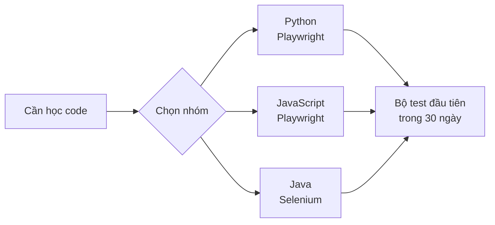

# Lộ trình Automation Testing cho Manual Tester


> automation_testing,manual_to_automation,Playwright,selenium

> Lộ trình học automation testing cho manual tester trong 30 ngày: nên học gì, theo thứ tự nào, ngôn ngữ và công cụ nào, giúp bạn viết được bộ test tự động đầu tiên dù chưa từng code.

## Automation testing giải quyết bài toán gì mà manual testing không làm được

Hãy tưởng tượng một tình huống quen thuộc: mỗi lần ứng dụng được phát hành bản mới, bạn phải đăng nhập, kiểm tra giỏ hàng, thanh toán thử một đơn và kiểm lại trang cá nhân. Lần đầu tiên làm bằng tay mất 20 phút. Nếu có 50 kịch bản như vậy, một lần hồi quy (regression) tốn cả một ngày làm việc. Và dự án ra phiên bản mỗi tuần, nghĩa là tester phải lặp lại công việc giống hệt nhau hàng trăm lần mỗi quý.

Đó chính xác là khoảng trống mà automation testing lấp vào. Định nghĩa đơn giản nhất: automation testing dùng code để thực thi lại các kịch bản kiểm thử một cách tự động, nhanh hơn và nhất quán hơn manual testing. Bảng dưới đây so sánh hai cách tiếp cận trên cùng một tình huống hồi quy 50 kịch bản:

| Tiêu chí                           | Manual testing                             | Automation testing                            |
| ---------------------------------- | ------------------------------------------ | --------------------------------------------- |
| Thời gian chạy 50 kịch bản hồi quy | Gần 1 ngày làm việc                        | 20–40 phút, chạy qua đêm hoặc song song       |
| Chi phí khi chạy lại lần thứ 100   | Vẫn bằng lần thứ 1                         | Gần như bằng 0                                |
| Độ chính xác giữa các lần chạy     | Phụ thuộc sự tập trung của người thực hiện | Giống hệt nhau ở mọi lần chạy                 |
| Chi phí ban đầu                    | Thấp, chỉ cần kiến thức nghiệp vụ          | Cao hơn: cần thời gian học code và dựng khung |
| Khả năng phát hiện lỗi UI tinh tế  | Tốt, tester nhìn ra ngay                   | Hạn chế nếu chỉ so khớp văn bản               |

> Automation không thay thế manual testing. Nó thay thế phần việc lặp lại, để tester dành thời gian cho exploratory testing, nơi máy móc vẫn yếu.

Kết luận thực tế: nếu bạn đã nắm vững tư duy kiểm thử ở mảng manual, việc học automation là nâng cấp kỹ năng, không phải bắt đầu lại từ đầu. Kinh nghiệm viết testcase, hiểu nghiệp vụ và biết lỗi thường nằm ở đâu chính là lợi thế lớn nhất khi bạn chuyển sang automation.

Nếu tư duy kiểm thử nền tảng của bạn chưa vững, khóa học [Testing cơ bản](/courses/testing-co-ban) (miễn phí, 107 bài, 11 chương) là điểm khởi phát hợp lý trước khi bước vào học code cho automation. Ngoài ra, nếu công ty mục tiêu của bạn yêu cầu Java, khóa [Java cho QA engineer](/courses/java-cho-qa-engineer) đi thẳng vào Java theo đúng bối cảnh kiểm thử, còn [Git và Github](/courses/git-va-github) (miễn phí) giúp bạn quản lý code test như một engineer thực thụ.

## Nên học ngôn ngữ gì cho automation testing và vì sao

Câu hỏi phổ biến nhất từ manual tester là: "Học Java, Python hay JavaScript?". Câu trả lời phụ thuộc vào target job chứ không phụ thuộc vào độ khó ngôn ngữ. Ba nhóm phổ biến nhất hiện nay được tổng hợp như sau:

| Nhóm                | Ngôn ngữ + công cụ                 | Ưu điểm chính                                                                                 | Ai nên chọn                                      |
| ------------------- | ---------------------------------- | --------------------------------------------------------------------------------------------- | ------------------------------------------------ |
| Nhóm tốc độ bắt đầu | Python + Playwright/Selenium       | Cú pháp gần với tiếng Anh, setup 10 phút, tài liệu tiếng Việt nhiều                           | Tester chưa từng code, chuyển ngành phi kỹ thuật |
| Nhóm web hiện đại   | JavaScript/TypeScript + Playwright | Playwright được các team web JS ưa chuộng nhất hiện nay, chạy nhanh, hỗ trợ nhiều trình duyệt | Tester làm việc với team dùng React/Vue/Node     |
| Nhóm enterprise     | Java + Selenium/TestNG             | Số lượng job lớn nhất tại các ngân hàng và tập đoàn viễn thông                                | Tester nhắm vào thị trường tuyển dụng quy mô lớn |

Nếu không có data rõ ràng về công ty mục tiêu, Python là lựa chọn an toàn nhất để bắt đầu: bạn có thể viết kịch bản đầu tiên trong tuần học thứ nhất thay vì tuần thứ ba.



Bất kể chọn nhóm nào, bạn chỉ cần nắm sáu core concept trước khi đụng đến công cụ kiểm thử: biến và kiểu dữ liệu, hàm, câu lệnh điều kiện (if/else), vòng lặp, danh sách/dictionary, và khái niệm đối tượng (object) ở mức đọc hiểu.

<multiple-choice correct="B" select="single">
Bạn chưa từng code và muốn bắt đầu automation testing nhanh nhất. Lựa chọn nào phù hợp nhất?
- A: Java + Selenium vì đây là chuẩn của các tập đoàn lớn
- B: Python + Playwright vì cú pháp đơn giản và dựng được kịch bản nhanh
- C: Học C++ trước để hiểu sâu về bộ nhớ
- D: Bỏ qua lập trình, học ngay công cụ record-and-playback
</multiple-choice>

## Lộ trình 30 ngày: từ manual tester đến bộ test tự động đầu tiên

Lộ trình dưới đây giả định bạn dành 1–2 giờ mỗi ngày và đã có tư duy kiểm thử cơ bản. Mục tiêu cụ thể sau 30 ngày: một bộ 10 kịch bản tự động chạy được trên trang demo công khai, xuất báo cáo kết quả dạng bảng. Lộ trình tổng thể này khớp với bức tranh chuyển từ zero sang chuyên nghiệp mà bài [Lộ Trình Học Tester: Từ Zero Đến Chuyên Nghiệp](/blogs/lo-trinh-hoc-tester-tu-zero-den-chuyen-nghiep) đã phác thảo, trong đó automation tester là một trong các ngã rẽ chính sau khi vững foundation.

| Tuần   | Trọng tâm                         | Kết quả cần đạt được                             |
| ------ | --------------------------------- | ------------------------------------------------ |
| Tuần 1 | Lập trình Python cơ bản           | Viết được hàm, vòng lặp, đọc hiểu error message  |
| Tuần 2 | Selenium/Playwright + locator     | Tự động điền form, click, đọc kết quả trên trang |
| Tuần 3 | Cấu trúc test + Page Object Model | Chuyển code rời rạc thành hàm test có tổ chức    |
| Tuần 4 | 10 kịch bản hoàn chỉnh + báo cáo  | Bộ test chạy trọn vẹn, xuất được báo cáo kết quả |

Hai kỹ năng quan trọng nhất trong tuần 2 và 3 là **định vị phần tử (locator)** và **cơ chế chờ (wait)**. Locator xác định "bấm vào nút nào" (qua ID, CSS Selector hoặc XPath), còn wait xử lý "chờ trang tải xong chưa". Đây là hai nguyên nhân phổ biến nhất khiến kịch bản bị false failure.

<grid-content>
Hai kỹ năng xương sống của automation testing
> Locator và wait quyết định kịch bản của bạn chạy ổn định hay liên tục lỗi sai.
```markdown
**Locator**

Cách script tìm đúng nút, ô input trên trang. Ưu tiên thứ tự: ID hoặc data attribute > CSS Selector > XPath. Locator ổn định là locator không bị gãy khi trang chỉ thay đổi màu sắc hay bố cục.
```

```markdown
**Wait**

Cách script đợi phần tử xuất hiện trước khi interact. Có hai loại chính: implicit wait (chờ ngầm toàn cục, nên hạn chế) và explicit wait (chờ điều kiện cụ thể cho từng phần tử, nên dùng). Lỗi sai phổ biến nhất của người mới là kịch bản chạy nhanh hơn trang tải.
```

</grid-content>

![Wide 3:1 educational diagram explaining a 30-day automation testing roadmap divided into four weekly milestones. Layout: four equal rounded rectangles arranged in a horizontal row from left to right, each containing a week number badge, a flat icon, and a short Vietnamese label, connected by solid T5Edu Blue arrows pointing right between consecutive cards. Card 1: a flat code-bracket icon, badge 'Tuần 1', label 'Python cơ bản'. Card 2: a flat magnifying-glass-over-webpage icon, badge 'Tuần 2', label 'Locator và Wait'. Card 3: a flat stacked-layers icon representing Page Object Model, badge 'Tuần 3', label 'Cấu trúc test'. Card 4: a flat checklist icon with a small amber checkmark, badge 'Tuần 4', label '10 kịch bản hoàn chỉnh'. Under the fourth card, a small amber pill-shaped flag labeled 'Kết quả: bộ test chạy được'. Minimalist flat vector UI design, premium professional EdTech editorial artwork, clean bento-grid composition with strong negative space, Paper White and Zinc-50 background #fafafa, Zinc-900 content #18181b, T5Edu Blue accent #1a73e8, Amber highlights #f59e0b, subtle one-pixel borders and restrained liquid-glass layers, simple flat icons and clean connector lines, no people, no faces, no hands, no 3D, no glossy plastic, no photorealism, no dramatic lighting, no purple, no violet, no pink, no neon, no logo, no watermark](/api/uploads/1786505770124-cvzj9rdk-image.png)

## Viết kịch bản automation testing đầu tiên: ví dụ cụ thể kiểm thử trang đăng nhập

Hãy nhìn một kịch bản cụ thể trước để bạn biết đích đến trông như thế nào. Kịch bản này kiểm tra màn hình đăng nhập của một trang thương mại điện tử demo (ví dụ trang demo chính thức của Playwright): đăng nhập thành công khi nhập đúng thông tin.

<code-runner lang="python" disable="true" readonly="true">
from playwright.sync_api import sync_playwright


def test_login_success():
    with sync_playwright() as p:
        browser = p.chromium.launch(headless=True)
        page = browser.new_page()
        page.goto("https://www.saucedemo.com/")
        page.fill("#user-name", "standard_user")
        page.fill("#password", "secret_sauce")
        page.click("input[type='submit']")
        page.wait_for_selector(".inventory_list")
        assert page.locator(".inventory_list").count() > 0
        browser.close()


test_login_success()
print("Test PASSED: đăng nhập thành công và danh sách sản phẩm hiện ra")
</code-runner>

Từ kịch bản trên, bạn có thể thiết kế bộ testcase dạng bảng như khi kiểm thử thủ công, chỉ khác ở chỗ bước thực thi giờ do script đảm nhận:

<table-testcase cols="4" rows="3" headers="ID|Tình huống|Input|Kết quả mong đợi">
| TC01 | Đăng nhập đúng | Username và password hợp lệ | Chuyển vào trang sản phẩm |
| TC02 | Sai mật khẩu | Password không đúng | Hiện thông báo lỗi đỏ |
| TC03 | Tài khoản bị khóa | Username đã bị khóa | Không vào được, có thông báo |
</table-testcase>

Lưu ý quan trọng: kịch bản trên dùng `headless=True` để chạy ngầm không hiển thị trình duyệt, phù hợp khi chạy hàng loạt. Khi viết test đầu tiên, bạn có thể tạm bỏ cờ này để xem trình duyệt hoạt động và dễ học hơn.

<dropdown-content>
Vì sao Page Object Model quan trọng ngay từ tuần 3?
> Khi số kịch bản tăng từ 5 lên 50, thay đổi nhỏ trên giao diện (đổi ID của ô nhập liệu chẳng hạn) sẽ khiến hàng loạt file phải sửa nếu locator được viết rải khắp nơi.
```markdown
Page Object Model giải quyết vấn đề này bằng cách tách mô tả giao diện khỏi logic kiểm thử. Mỗi màn hình được đóng gói thành một đối tượng riêng, nơi chứa toàn bộ locator của màn hình đó. Khi giao diện thay đổi, bạn chỉ sửa một file duy nhất.

Cấu trúc tối thiểu như sau:

- `pages/login_page.py`: định nghĩa locator và các hành động của màn hình đăng nhập.

- `tests/test_login.py`: gọi các hành động của `LoginPage` để viết kịch bản.

Đây là mẫu thiết kế được khuyến nghị chính thức trong tài liệu của Playwright và Selenium, và là tiêu chí thường gặp trong phỏng vấn automation tester.
```
</dropdown-content>

## Những lỗi phổ biến khi học automation testing và cách tránh

Thống kê trải nghiệm từ các cộng đồng QA cho thấy người học automation thường không bỏ cuộc vì code khó, mà vì ba nguyên nhân lặp đi lặp lại. Hiểu trước ba nguyên nhân này giúp tester đi nhanh hơn đáng kể.

| Lỗi phổ biến | Biểu hiện | Cách tránh cụ thể |
| :--- | :--- | :--- |
| Học dàn trải nhiều công cụ cùng lúc | Một tháng học Selenium, Cypress, Appium, JMeter nhưng không viết được kịch bản hoàn chỉnh | Chọn đúng một bộ (ngôn ngữ + framework) và dùng nó cho toàn bộ 30 ngày |
| Không đọc thông báo lỗi | Stack trace hiện ra nhưng tester bỏ qua, thử sửa ngẫu nhiên | Luyện thói quen đọc 3–5 dòng lỗi đầu tiên trước khi tra cứu |
| Chỉ xem video, không tự gõ | Cảm giác hiểu bài khi xem nhưng không viết được khi mở editor | Quy tắc 30 phút học lý thuyết đi kèm 30 phút tự gõ và chạy thử |

Một nguyên tắc nữa cần giữ: **không theo đuổi độ phủ test coverage cao ngay từ đầu**. Một bộ 10 kịch bản chạy ổn định, được bảo trì tốt có giá trị thực tế lớn hơn một bộ 200 kịch bản thường xuyên báo lỗi sai (false failure).

<multiple-choice correct="C" select="single">
Kịch bản tự động của bạn liên tục báo lỗi sai dù chức năng vẫn hoạt động bình thường. Nguyên nhân nào phổ biến nhất?
- A: Ngôn ngữ lập trình đã chọn không phù hợp
- B: Máy tính cấu hình quá yếu
- C: Locator không ổn định hoặc thiếu cơ chế chờ đủ trước khi tương tác
- D: Người dùng đã nhập sai dữ liệu
</multiple-choice>

## Câu hỏi thường gặp khi bắt đầu automation testing

<dropdown-content>
Không biết code có học được automation testing không?
> Có, nhưng cần thừa nhận lộ trình sẽ dài hơn. Bạn phải dành 2–4 tuần đầu cho lập trình cơ bản trước khi chạm vào công cụ kiểm thử. Đó là lý do bảng lộ trình 30 ngày trên dành toàn bộ tuần 1 cho Python cơ bản.
```markdown
Việc bạn đã quen với tư duy testcase (điều kiện, input, expected result) giúp bước chuyển này nhanh hơn người hoàn toàn mới với công nghệ. Nhiều tester chuyển ngành thành công chỉ bằng cách học mỗi tối 1–2 giờ trong ba tháng.
```
</dropdown-content>

<dropdown-content>
Selenium và Playwright khác nhau như thế nào?
> Cả hai đều là framework điều khiển trình duyệt, nhưng Playwright được Microsoft phát triển gần đây hơn và xử lý tốt các tình huống web hiện đại.

```markdown
So sánh nhanh cho người mới:

- Selenium: community lớn nhất, số lượng job tuyển nhiều nhất, hỗ trợ Java/Python/C#/JS, nhưng cài đặt và cấu hình driver phức tạp hơn.

- Playwright: cài nhanh hơn, tự tải driver, hỗ trợ wait thông minh mặc định, chạy được trên Chromium/Firefox/WebKit. Nhược điểm duy nhất hiện nay là số lượng job (chủ yếu ở các công ty web hiện đại) vẫn ít hơn Selenium một chút.

Nếu công ty bạn đang dùng Selenium, học Selenium. Nếu tự học để mở rộng cơ hội, Playwright với Python hoặc JavaScript là lựa chọn tiết kiệm thời gian nhất.
```
</dropdown-content>

<dropdown-content>
Lương automation tester so với manual tester thế nào?

> Mức chênh lệch cụ thể phụ thuộc vào công ty và khu vực, nên không nên ghi con số tuyệt đối. Tuy nhiên, mô hình chung trên thị trường là: mức cứng (senior) của automation tester thường cao hơn manual tester cùng năm kinh nghiệm do yêu cầu thêm kỹ năng lập trình.

```markdown
Điều quan trọng hơn mức lương trung bình: automation tester có trần phát triển cao hơn, ví dụ hướng tới vị trí SDET (Software Development Engineer in Test) hoặc lead QA. Đây chính là động lực thực tế khiến nhiều manual tester chấp nhận dành ba tháng để học.

```
</dropdown-content>

## Tổng kết

- Automation testing thay thế phần việc lặp lại của manual testing, không thay thế tư duy kiểm thử. Kinh nghiệm testcase hiện tại của bạn vẫn là tài sản lớn nhất.

- Chọn một bộ công cụ duy nhất (khuyến nghị Python + Playwright nếu chưa có định hướng công ty) và gắn bó đủ 30 ngày để viết được bộ test đầu tiên.

- Hai kỹ năng quyết định độ ổn định của kịch bản là locator và cơ chế chờ; cấu trúc Page Object Model là bước không thể bỏ qua khi kịch bản vượt quá vài chục.

- Nếu bạn muốn học sâu theo từng bước, hãy thử lộ trình thực hành trong bài [Playwright với TypeScript cơ bản cho Tester](/blogs/playwright-voi-typescript-co-ban-cho-tester) hoặc khóa học automation trên [T5Edu](/courses). Một nền tảng kiểm thử tổng quát như [API Testing cơ bản](/courses/api-testing-co-ban) (miễn phí) cũng đáng học song song vì automation API thường được đưa vào CI/CD sớm hơn UI automation.

- Theo bạn, kịch bản nào trong hệ thống hiện tại của bạn tốn nhiều thời gian chạy lại nhất và đáng được tự động hóa trước tiên?

