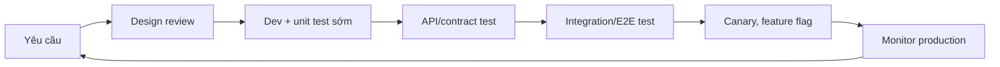

# Shift-Left Và Shift-Right Testing: Hiểu Đúng Để Không "Dịch" Sợ
> shift-left,shift-right,software-testing,qa-engineer,devops

![Square 1:1 editorial cover for an article titled 'Shift-Left Và Shift-Right Testing'. The visual must communicate testing stretched across both ends of the software development lifecycle directly. Composition: a clean horizontal timeline strip across the middle of the frame, with requirement and design blocks on the left end, testing and release in the middle, and production monitoring on the right end. A large magnifying glass icon with an arrow pointing left marks the left end, labeled 'Shift-Left', and another magnifying glass with an arrow pointing right marks the right end, labeled 'Shift-Right'. Exact Vietnamese labels: 'Shift-Left', 'Shift-Right', 'Production'. Visual relationships: two Amber arrows push the magnifying icons outward from the center toward both ends of the timeline. Minimalist flat vector UI design, premium professional EdTech editorial artwork, clean bento-grid composition with strong negative space, Paper White and Zinc-50 background #fafafa, Zinc-900 content #18181b, T5Edu Blue accent #1a73e8, Amber highlights #f59e0b, subtle one-pixel borders and restrained liquid-glass layers, simple flat icons and geometric shapes, no people, no faces, no hands, no 3D, no glossy plastic, no photorealism, no dramatic lighting, no purple, no violet, no pink, no neon, no logo, no watermark.](IMAGE_PLACEHOLDER_COVER)

## "Shift" nghĩa là dịch chuyển cái gì?

Khi mới nghe shift-left testing và shift-right testing, phản xạ tự nhiên của nhiều Tester là dịch theo nghĩa đen: dịch chuyển sang trái, dịch chuyển sang phải. Nhưng dịch chuyển cái gì, so với cái gì, và vì sao phải dịch khi công việc hiện tại vẫn đang chạy ổn?

Câu trả lời nằm ở cách hình dung toàn bộ vòng đời phát triển phần mềm như một đường thẳng. Bên trái là các hoạt động đầu như planning, design và phân tích yêu cầu. Ở giữa là development và testing truyền thống. Bên phải là release, production và vận hành. Shift ở đây có nghĩa là đưa hoạt động kiểm thử ra khỏi giai đoạn testing truyền thống, trải đều ra cả hai đầu của vòng đời. Xu hướng này được xem là một trong những xu hướng nổi bật của ngành testing giai đoạn 2025, 2026 theo nhận định của [Xray](https://www.getxray.app/blog/top-5-software-testing-trends-2026). Điều quan trọng nhất với người làm nghề là mỗi Tester sẽ phải thay đổi gì trong công việc hàng ngày, và đó là trọng tâm của bài viết này.

Nếu bạn đang ở giai đoạn đầu hành trình, bài [Lộ Trình Học Tester: Từ Zero Đến Chuyên Nghiệp](/blogs/lo-trinh-hoc-tester-tu-zero-den-chuyen-nghiep) sẽ giúp đặt hai khái niệm này vào đúng vị trí trong bức tranh nghề nghiệp tổng thể.

<multiple-choice correct="B" select="single">
Shift-left testing chủ yếu đưa hoạt động kiểm thử diễn ra ở giai đoạn nào?
- A: Sau khi sản phẩm đã phát hành ra production
- B: Sớm hơn trong quy trình, ngay cả khi chưa có dòng code nào
- C: Chỉ trong giai đoạn system test cuối sprint
- D: Chỉ khi có incident từ người dùng thật
</multiple-choice>

## Shift-Left Testing là gì và vì sao "sớm" lại rẻ hơn?

Shift-left testing là thực hành đưa kiểm thử lên sớm hơn trong quy trình phát triển, thậm chí trước khi có bất kỳ dòng code nào, theo định nghĩa của [Dynatrace](https://www.dynatrace.com/news/blog/what-is-shift-left-and-what-is-shift-right/). Thay vì chờ developer giao build rồi mới test, tester tham gia từ khâu phân tích yêu cầu, viết acceptance criteria, review thiết kế và chạy các kỹ thuật kiểm thử tĩnh ngay từ đầu.

Nguyên tắc kinh tế kinh điển trong software engineering là chi phí sửa một defect tăng theo cấp số nhân theo thời gian phát hiện. Một lỗi thiết kế được tìm thấy ở khâu yêu cầu có thể chỉ tốn 30 phút để sửa. Cùng lỗi đó lọt vào production có thể tốn hàng tuần để debug, hotfix, di chuyển dữ liệu và xử lý thiệt hại uy tín với khách hàng. [Dynatrace](https://www.dynatrace.com/news/blog/what-is-shift-left-and-what-is-shift-right/) tổng hợp các lợi ích của shift-left thành bốn điểm: phát hiện bug sớm nên dễ và rẻ hơn để sửa, rút ngắn time-to-market nhờ vòng feedback nhanh, giảm chi phí tổng thể và tăng sự hợp tác giữa tester, developer và stakeholder.

Đối với một Tester theo hướng shift-left, công việc hàng ngày sẽ có thêm các hoạt động sau:

| Hoạt động | Mô tả | Kỹ năng cần có |
|---|---|---|
| Static testing | Review requirement, tài liệu thiết kế, code mà không cần chạy | Tư duy phân tích, kỹ năng review |
| Viết acceptance criteria sớm | Cùng BA/PO định nghĩa điều kiện "done" trước khi dev bắt đầu | Phân tích nghiệp vụ |
| Review code | Tìm edge case, logic lỗi ngay trong PR | Đọc hiểu code cơ bản |
| Unit/API test sớm | Dev viết test ngay khi có API spec, tester hỗ trợ review | Kiến thức API testing |
| Security review sớm | Rà rủi ro bảo mật từ giai đoạn thiết kế | Kiến thức security cơ bản |

[Software Engineering Institute của CMU](https://www.sei.cmu.edu/blog/four-types-of-shift-left-testing/) phân loại shift-left testing thành các dạng khác nhau và nhấn mạnh vai trò của continuous testing thông qua chu kỳ sprint ngắn trong mô hình Agile/DevOps. Điều này nghĩa là shift-left không phải một kỹ thuật test đơn lẻ, mà là một triết lý tổ chức quy trình.

Khi tester nắm API testing, một trong những hoạt động shift-left tự nhiên nhất là xác thực behavior của API ngay khi endpoint vừa tồn tại, thay vì chờ tới lúc system test cuối sprint. Hai khóa học [API Testing cơ bản](/courses/api-testing-co-ban) (miễn phí) và [API Testing nâng cao](/courses/api-testing-nang-cao) là lộ trình phù hợp để xây nền tảng từ đầu.

<dropdown-content>
Lầm tưởng phổ biến nhất về shift-left là gì?
> Lầm tưởng lớn nhất là "shift-left nghĩa là dev làm hết việc của tester". Sự thật là shift-left đòi hỏi tester tham gia sớm hơn và sâu hơn, chứ không phải biến mất khỏi quy trình.
```markdown
Developer viết unit test sớm hơn, nhưng ai phân tích requirement, viết test scenario, thiết kế dữ liệu và chạy exploratory test? Vẫn là tester, chỉ ở giai đoạn sớm hơn.

Một số team hiểu sai shift-left thành "tự động hóa hết mọi thứ và bỏ manual test", dẫn đến việc có hàng nghìn script nhưng vẫn lọt defect nghiêm trọng vì không ai suy nghĩ như người dùng thật.
```
</dropdown-content>

## Shift-Right Testing là gì?

Shift-right testing là thực hành kiểm thử, đánh giá chất lượng và performance ngay trong môi trường production, dưới điều kiện sử dụng thật, theo [Dynatrace](https://www.dynatrace.com/news/blog/what-is-shift-left-and-what-is-shift-right/). Nghe có vẻ nguy hiểm vì test trên production, nhưng thực chất shift-right là kiểm soát môi trường thật một cách có kỷ luật: đưa tính năng ra với một nhóm nhỏ user, quan sát, đo lường và rollback nếu có vấn đề.

Lý do shift-right tồn tại nằm ở một thực tế khó chối cãi: dù QA environment được dựng công phu đến đâu, nó vẫn không thể tái hiện hoàn toàn lưu lượng user thật đột biến, dữ liệu thật bẩn và lệch, hành vi user bất ngờ, mạng chập chờn trên thiết bị thật và hàng trăm tích hợp với hệ thống bên ngoài. Câu trả lời cuối cùng cho câu hỏi phần mềm có hoạt động tốt không chỉ có ở production. [Dynatrace](https://www.dynatrace.com/news/blog/what-is-shift-left-and-what-is-shift-right/) liệt kê các lợi ích của shift-right: feedback thật từ người dùng thật, vòng lặp feedback liên tục, coverage rộng hơn nhờ kịch bản thế giới thật, khả năng quan sát hành vi hệ thống thật và tư duy lấy khách hàng làm trung tâm.

### Các kỹ thuật shift-right phổ biến

| Kỹ thuật | Mô tả | Vai trò của Tester/QA |
|---|---|---|
| A/B testing | Đưa hai phiên bản cho hai nhóm user, so sánh phản ứng thật | Thiết kế experiment, phân tích kết quả |
| Synthetic monitoring | Script giả lập hành vi user chạy định kỳ trên production | Viết và giám sát script giám sát |
| Chaos engineering | Cố tình phá hệ thống (tắt service, chập mạng) để kiểm tra khả năng phục hồi | Thiết kế thí nghiệm, quan sát hành vi |
| Canary release | Rollout tính năng cho nhóm nhỏ trước khi bung toàn bộ | Giám sát lỗi, metrics trước khi full rollout |
| Blue-green deployment | Hai môi trường production song song, chuyển user dần dần | Verify môi trường mới trước khi switch |
| Feature flag | Bật tắt tính năng theo từng nhóm user | Quản lý điều kiện bật/tắt theo rủi ro |

Chaos engineering đáng chú ý nhất về mặt tư duy. Thay vì cố gắng đoán trước mọi failure mode, team chủ động phá hệ thống một cách kiểm soát trong production để học cách nó phản ứng với disruption, đúng như cách tiếp cận mà [Dynatrace](https://www.dynatrace.com/news/blog/what-is-shift-left-and-what-is-shift-right/) mô tả. Đây là bước nhảy từ mindset "test để chứng minh đúng" sang "test để hiểu sai như thế nào".

Không ít người cho rằng shift-right là việc của SRE/DevOps. Thực tế QA đóng vai trò ngày càng lớn: thiết kế monitoring scenario, định nghĩa thế nào là thành công cho một feature flag, phân tích dữ liệu hành vi user sau release và phối hợp rollback khi tín hiệu xấu. Bài viết [Test Pass, Tiền Vẫn Bay](/blogs/test-pass-tien-van-bay) đi vào chính vấn đề này từ góc độ kinh doanh: dashboard test xanh lè nhưng conversion tụt và refund tăng chính là minh chứng cho thấy kiểm thử dừng ở QA environment là chưa đủ.

<grid-content>
Khi nào nên dùng kỹ thuật shift-right nào?
> Chọn kỹ thuật theo mức độ rủi ro của thay đổi và khả năng rollback của hệ thống.
```markdown
**Tính năng nhỏ, rủi ro thấp**

Feature flag và canary release cho phép bật tính năng dần cho từng nhóm user và tắt ngay nếu tín hiệu xấu.
```
```markdown
**Cần so sánh hiệu quả thật**

A/B testing đo phản ứng thực của hai nhóm user, phù hợp khi quyết định dựa trên dữ liệu hành vi.
```
```markdown
**Cần kiểm tra độ bền hệ thống**

Chaos engineering và synthetic monitoring chủ động kiểm chứng khả năng chịu tải và phục hồi trong điều kiện thật.
```
```markdown
**Release lớn, không thể rollback nhanh**

Blue-green deployment giữ môi trường cũ chạy song song để chuyển người dùng một cách an toàn.
```
</grid-content>

## Kết hợp hai phía: vòng lặp chất lượng liên tục

Điều thú vị của xu hướng 2026 là hai khái niệm này không còn đứng riêng lẻ. [Xray](https://www.getxray.app/blog/top-5-software-testing-trends-2026) nhận định continuous quality with shift-left and shift-right là một trong năm xu hướng định hình testing, nơi testing xảy ra liên tục, từng miếng nhỏ, suốt vòng đời sản phẩm. Developer bắt lỗi nhỏ từ sớm, tester giám sát dữ liệu production để xem tính năng hoạt động thế nào ngoài đời thật, và vận hành feed ngược insight về planning. Kết hợp cả hai, team có một vòng lặp khép kín:



Điểm mấu chốt được Xray nhấn mạnh: với kiểm thử liên tục, team sẽ đối mặt với lượng alert, dashboard và log khổng lồ. Thách thức không phải là thu thập thêm thông tin mà là biết tín hiệu nào thực sự quan trọng, và đây vẫn là chỗ người QA giàu kinh nghiệm tỏa sáng.

## Tester cần chuẩn bị gì để đi theo cả hai phía?

Với shift-left, bạn cần giỏi lên ở khâu phân tích: đọc hiểu yêu cầu và thiết kế, viết acceptance criteria sắc nét, review code ở mức cơ bản và hiểu API đủ để tham gia kiểm thử từ giai đoạn spec. Đây là các kỹ năng kinh điển nhưng được dùng sớm hơn, không phải kỹ năng xa lạ.

Với shift-right, bạn cần hiểu về observability: đọc logs, metrics, trace, thiết kế synthetic monitor và hiểu cách một canary release hay feature flag hoạt động. Nếu muốn bắt đầu thực hành với hệ thống thật, các khóa học [SQL dành cho QA engineer](/courses/sql-danh-cho-qa-engineer) và [Java cho QA engineer](/courses/java-cho-qa-engineer) giúp bạn đủ sức đọc dữ liệu production và hiểu code sản phẩm, nền tảng cần thiết cho cả hai phía.

Về mặt công cụ, cả hai phía đều đang được AI hỗ trợ mạnh. Shift-left hưởng lợi từ AI sinh test case từ requirement và AI code review, còn shift-right hưởng lợi từ AI observability và phát hiện bất thường trong production monitoring. Bài viết [Ứng Dụng AI Trong Testing](/blogs/ung-dung-ai-trong-testing) phân tích chi tiết về AI trong testing, bao gồm predictive test selection (thuộc shift-left) và AIOps monitoring (thuộc shift-right), giúp nối liền hai mảnh ghép này.

![Wide 3:1 educational comparison diagram contrasting shift-left and shift-right testing practices. Layout: a horizontal split into two halves. Left half titled 'Shift-Left': three stacked blocks from top to bottom labeled 'Phân tích yêu cầu', 'Acceptance criteria', 'Review sớm', connected by solid T5Edu Blue arrows flowing leftward. Right half titled 'Shift-Right': three stacked blocks labeled 'Canary release', 'Monitor production', 'Chaos engineering', connected by solid T5Edu Blue arrows flowing rightward. A dashed Amber connector line links the two halves through a central block labeled 'Quality vòng tròn kín'. Exact Vietnamese labels: 'Shift-Left', 'Shift-Right', 'Phân tích yêu cầu', 'Acceptance criteria', 'Review sớm', 'Canary release', 'Monitor production', 'Chaos engineering', 'Quality vòng tròn kín'. Minimalist flat vector UI design, premium professional EdTech editorial artwork, clean bento-grid composition with strong negative space, Paper White and Zinc-50 background #fafafa, Zinc-900 content #18181b, T5Edu Blue accent #1a73e8, Amber highlights #f59e0b, subtle one-pixel borders and restrained liquid-glass layers, simple flat icons and clean connector lines, no people, no faces, no hands, no 3D, no glossy plastic, no photorealism, no dramatic lighting, no purple, no violet, no pink, no neon, no logo, no watermark.](IMAGE_PLACEHOLDER_SLOT_0)

## Tổng kết

Shift-left và shift-right không phải là hai lựa chọn hoặc hoặc, mà là hai đầu của cùng một triết lý: chất lượng là trách nhiệm liên tục của cả vòng đời, không phải của một giai đoạn test đơn lẻ. Shift-left đưa kiểm thử lên sớm để sửa lỗi khi còn rẻ, shift-right đưa kiểm thử vào production để bắt những gì không môi trường nào giả lập được. Tester trong kỷ nguyên này không mất việc vì hai xu hướng này, mà ngược lại, người nắm cả hai đầu sẽ trở thành mắt xích không thể thiếu trong vòng lặp chất lượng liên tục.

- Shift-left là kiểm thử sớm: static testing, acceptance criteria sớm, review code, API test ngay khi có spec.
- Shift-right là kiểm thử trong production: A/B testing, synthetic monitoring, canary release, chaos engineering, feature flag.
- Hai phía kết hợp thành vòng lặp chất lượng liên tục; thách thức lớn nhất là phân biệt tín hiệu quan trọng giữa hàng núi alert và log.

Nếu bạn là người mới và muốn bắt đầu với tư duy đúng ngay từ đầu, bài [7 ngày thử nghề Tester](/blogs/7-ngay-thu-nghe-tester) là một cách hiệu quả để xác nhận mình có phù hợp với nghề trước khi đầu tư dài hạn vào các kỹ năng nâng cao. Trước khi áp dụng vào dự án hiện tại, hãy tự hỏi: giai đoạn nào trong quy trình của team bạn đang tốn nhiều chi phí sửa lỗi nhất, và kỹ thuật shift-left hay shift-right nào có thể cắt giảm nó?
